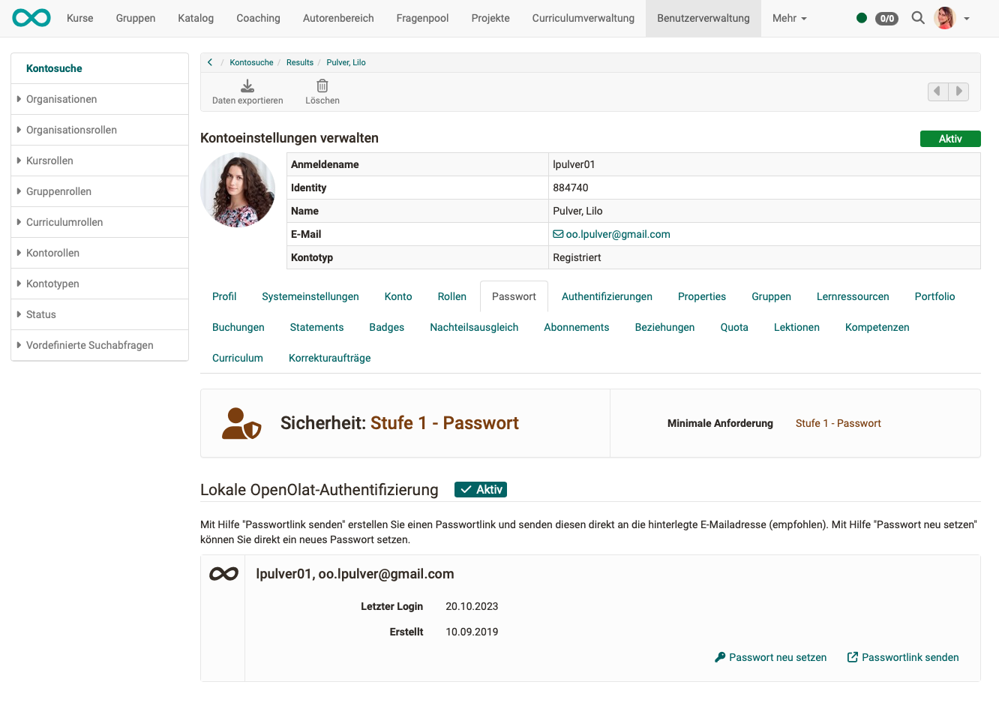

# Passwort

!!! info "Hinweis"

    Wurde die Sicherheitsstufe 2 gewählt (nur Passkey), dann ist kein Passwort-Setzen mehr möglich.

## Passwort selbst ändern

Alle Benutzer:innen von OpenOlat können ihr Passwort jederzeit selbst ändern.
Gehen Sie dazu in das persönliche Menü. 
**Persönliches Menü > Abschnitt "Konfiguration" > Passwort**

Mehr dazu [hier](../personal_menu/Password.de.md).

## Passwortvergabe durch Benutzerverwalter:innen

Es kommt oft vor, dass jemand sein Passwort vergessen hat und um die Vergabe einen neuen Passwortes bittet.
Wenn Sie die Rolle eines/einer Benutzerverwalter:in haben oder Administrator:in sind, können Sie Passwörter neu setzen: 
**Benutzerverwaltung > Benutzer wählen > Tab "Passwort"**

{ class=" shadow lightbox" }

## Passwortvergabe durch

tbd
