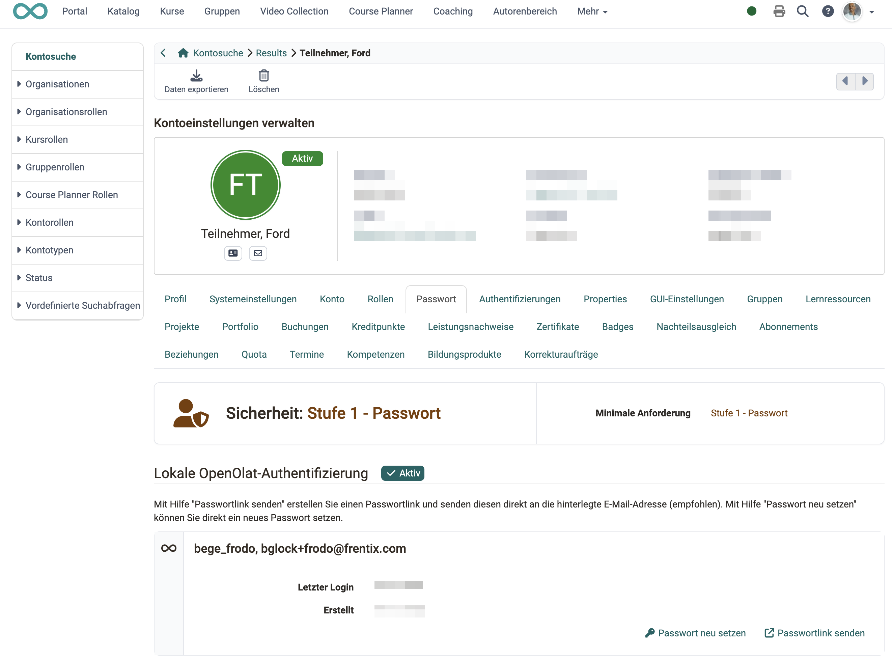

# Passwort

!!! note "Hinweis"

    Wurde die Sicherheitsstufe 2 gewählt (nur Passkey), dann ist kein Passwort-Setzen mehr möglich.

## Passwort selbst ändern

Alle Benutzer:innen von OpenOlat können ihre bestehenden Passwörter jederzeit selbst ändern.
Gehen Sie dazu in das persönliche Menü. 
`Persönliches Menü > Abschnitt "Konfiguration" > Passwort`

!!! note "Persönliche Konfiguration: Passwort"
    Details zur Passwortänderung im persönlichen Menü. 
    [Persönliche Konfiguration: Passwort](../personal_menu/Password.de.md)

## Passwortvergabe durch Benutzerverwalter:innen

Es kommt oft vor, dass jemand sein Passwort vergessen hat und um die Vergabe eines neuen Passwortes bittet. Wenn Sie die Rolle eines/einer Benutzerverwalter:in haben oder Administrator:in sind, können Sie Passwörter neu setzen: 
`Benutzerverwaltung > Benutzer wählen > Tab "Passwort"`

!!! note "Screenshot veraltet"
    Bildschirmfoto zeigt noch den Tab «Passwort» vor OO-9139 (fehlende Info-Meldung zum Einladungslink, fehlende Aktion "Einladungslink deaktivieren", alte Button-Beschriftungen). Aktualisierung ausstehend.

{ class=" shadow lightbox" }

