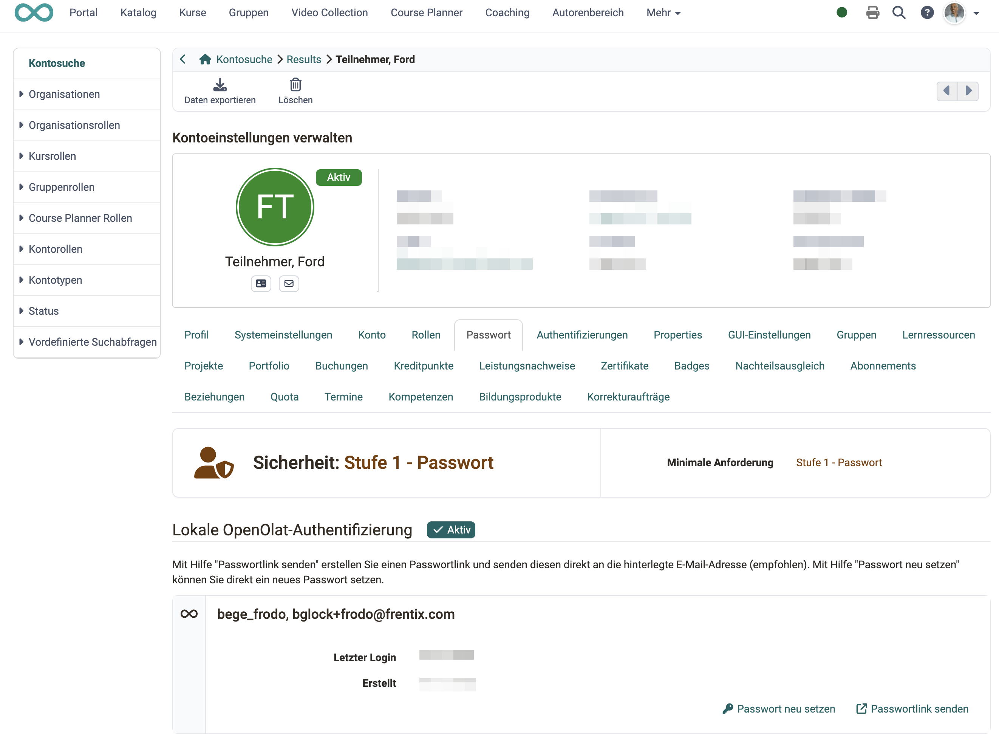

# Passwort {: #password}

!!! note "Hinweis"

    Wird die [Sicherheitsstufe](Security_levels.de.md) 2 gewählt (nur Passkey), dann ist kein Passwort-Setzen mehr möglich.

## Passwort selbst ändern

Alle Benutzer:innen von OpenOlat können ihre bestehenden Passwörter jederzeit selbst ändern.
Gehen Sie dazu in das persönliche Menü. 
`Persönliches Menü > Abschnitt "Konfiguration" > Passwort`

!!! note "Persönliche Konfiguration: Passwort"
    Details zur Passwortänderung im persönlichen Menü. 
    [Persönliche Konfiguration: Passwort](../personal_menu/Password.de.md)

## Passwortvergabe durch Benutzerverwalter:innen

Es kommt oft vor, dass jemand das Passwort vergessen hat und um ein neues Passwort bittet. Wenn Sie die Rolle Benutzerverwalter:in oder Administrator:in haben, können Sie Passwörter neu setzen: 
`Benutzerverwaltung > Benutzer wählen > Tab "Passwort"`

Der Tab zeigt die aktuelle Sicherheitsstufe des Kontos und bietet zwei Wege für ein neues Passwort: Mit "Passwortlink senden" schicken Sie einen Link zum Setzen eines neuen Passworts an die hinterlegte E-Mail-Adresse (empfohlen). Mit "Passwort neu setzen" vergeben Sie das neue Passwort direkt.

{ class="shadow lightbox" }

## Weiterführende Informationen {: #further_information}

[Sicherheitsstufen >](Security_levels.de.md) 
[Persönliche Konfiguration: Passwort >](../personal_menu/Password.de.md) 
[Passkey >](Passkey.de.md) 
[Login-Seite >](Login_Page.de.md)

[Zum Seitenanfang ^](#password)
