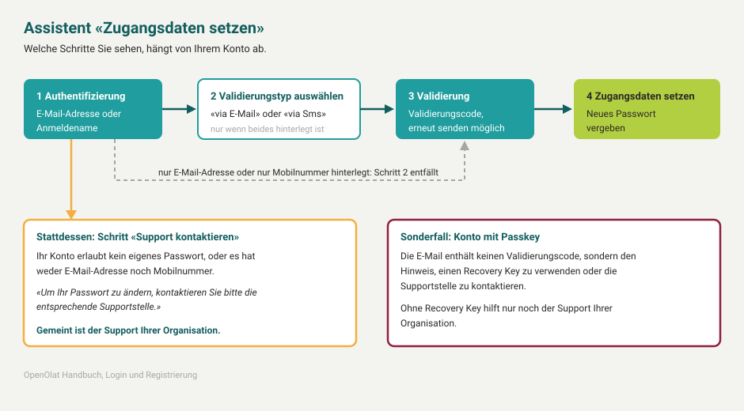
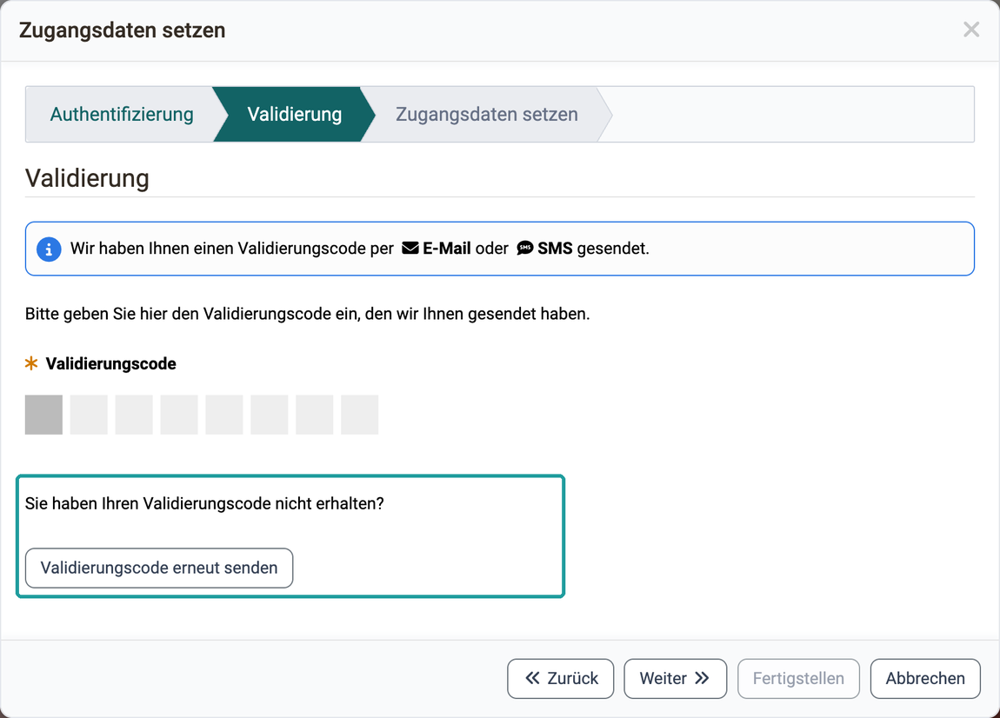

# Passwort {: #password}

!!! note "Hinweis"

    Wird die [Sicherheitsstufe](Security_levels.de.md) 2 gewählt (nur Passkey), dann ist kein Passwort-Setzen mehr möglich.

## Passwort selbst ändern

Alle Benutzer:innen von OpenOlat können ihre bestehenden Passwörter jederzeit selbst ändern.
Gehen Sie dazu in das persönliche Menü. 
`Persönliches Menü > Abschnitt "Konfiguration" > Passwort`

!!! note "Persönliche Konfiguration: Passwort"
    Details zur Passwortänderung im persönlichen Menü. 
    [Persönliche Konfiguration: Passwort](../personal_menu/Password.de.md)

## Passwort selbst zurücksetzen [:octicons-tag-16:{ title="ab Release 20.0 (OO-8189)" }](https://track.frentix.com/issue/OO-8189) {: #reset_password}

Haben Sie Ihr Passwort vergessen, setzen Sie sich selbst ein neues, sofern Ihre Organisation das erlaubt und an Ihrem Konto eine E-Mail-Adresse hinterlegt ist. Den Weg dorthin öffnet der Link "Passwort vergessen?" im Bereich "Brauchen Sie Hilfe?" unterhalb der Anmeldung auf der [Login-Seite](Login_Page.de.md#forgot_password). Sehen Sie den Bereich nicht, klicken Sie zuerst auf "Mit Konto anmelden". Der Assistent heisst "Zugangsdaten setzen".

{ class="shadow lightbox" }

1. **Authentifizierung**: Geben Sie im Feld "E-Mail-Adresse oder Anmeldename" eine der beiden Angaben ein.
2. **Validierungstyp auswählen**: Wählen Sie "via E-Mail" oder "via Sms". Diesen Schritt sehen Sie nur, wenn an Ihrem Konto sowohl eine E-Mail-Adresse als auch eine Mobilnummer hinterlegt ist und Ihre Organisation das Zurücksetzen per SMS freigegeben hat. Ist nur eines von beiden hinterlegt, führt der Assistent direkt weiter.
3. **Validierung**: Tragen Sie den 8-stelligen Code in das Feld "Validierungscode" ein. Kommt keine Nachricht an, verwenden Sie den Button "Validierungscode erneut senden" unter "Sie haben Ihren Validierungscode nicht erhalten?". Alle früher gesendeten Codes werden damit ungültig.
4. **Zugangsdaten setzen**: Vergeben Sie das neue Passwort. Welche Regeln dafür gelten, steht im Schritt selbst.

{ class="shadow lightbox" }

Statt der Schritte 2 bis 4 zeigt der Assistent den Schritt "Support kontaktieren", wenn Ihr Konto das Setzen eines Passworts nicht erlaubt oder weder eine E-Mail-Adresse noch eine nutzbare Mobilnummer (siehe Schritt 2) hinterlegt ist. Der Text dort lautet "Um Ihr Passwort zu ändern, kontaktieren Sie bitte die entsprechende Supportstelle." Gemeint ist die Stelle, die Ihnen den Zugang zu OpenOlat gegeben hat: Ihre Schule, Ihre Hochschule, Ihre Unternehmung, Ihre Verwaltung, Ihr Weiterbildungsanbieter oder deren IT- und Studienadministration.

Verwenden Sie für Ihr Konto einen Passkey, trägt die E-Mail den Betreff "Schlüssel für neues OpenOlat-Passwort" und enthält keinen Validierungscode, sondern den Hinweis, Ihre Recovery Keys zu verwenden oder die Supportstelle zu kontaktieren. Recovery Keys sind die Ersatzcodes, die OpenOlat Ihnen beim Einrichten des Passkeys angezeigt hat, siehe [Passkey](Passkey.de.md).

## Passwortvergabe durch Benutzerverwalter:innen

Es kommt oft vor, dass jemand das Passwort vergessen hat und um ein neues Passwort bittet. Wenn Sie die Rolle Benutzerverwalter:in oder Administrator:in haben, können Sie Passwörter neu setzen: 
`Benutzerverwaltung > Benutzer wählen > Tab "Passwort"`

Der Tab zeigt die aktuelle Sicherheitsstufe des Kontos und bietet zwei Wege für ein neues Passwort: Mit "Passwortlink senden" schicken Sie einen Link zum Setzen eines neuen Passworts an die hinterlegte E-Mail-Adresse (empfohlen). Mit "Passwort neu setzen" vergeben Sie das neue Passwort direkt.

{ class="shadow lightbox" }

## Weiterführende Informationen {: #further_information}

[Sicherheitsstufen >](Security_levels.de.md) 
[Persönliche Konfiguration: Passwort >](../personal_menu/Password.de.md) 
[Passkey >](Passkey.de.md) 
[Login-Seite >](Login_Page.de.md)

[Zum Seitenanfang ^](#password)
