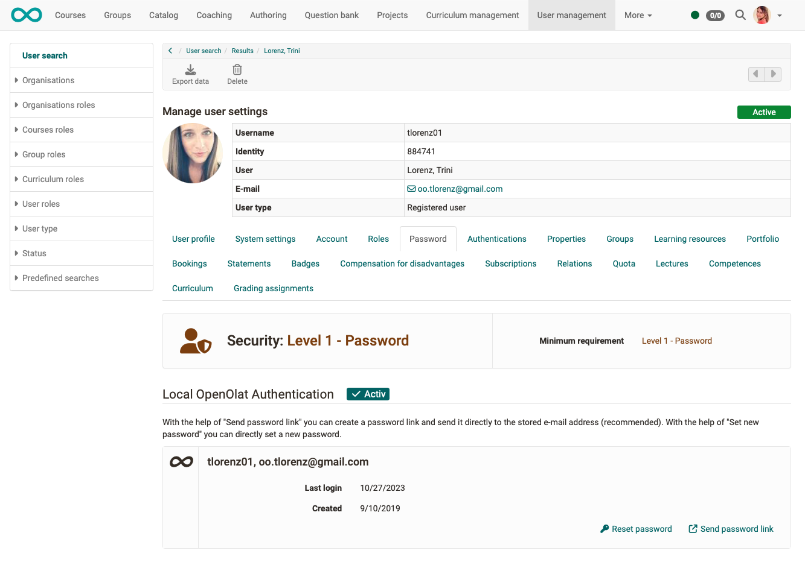

# Password

!!! info "Note"

    If security level 2 was selected (passkey only), then password setting is no longer possible.

## Change the password yourself

All users of OpenOlat can change their existing passwords at any time. To do this, go to the personal menu. 
**Personal Menu > Section "Configuration" > Password**

More about setting your password you can find [here](../personal_menu/Password.md).

## Password assignment by user manager

It often happens that someone has forgotten his/her password and asks for a new one to be assigned. If you have the role of a user manager or administrator, you can reset passwords: 
**User management > select a user > tab password**

{ class=" shadow lightbox" }

## Password assignment by

tbd