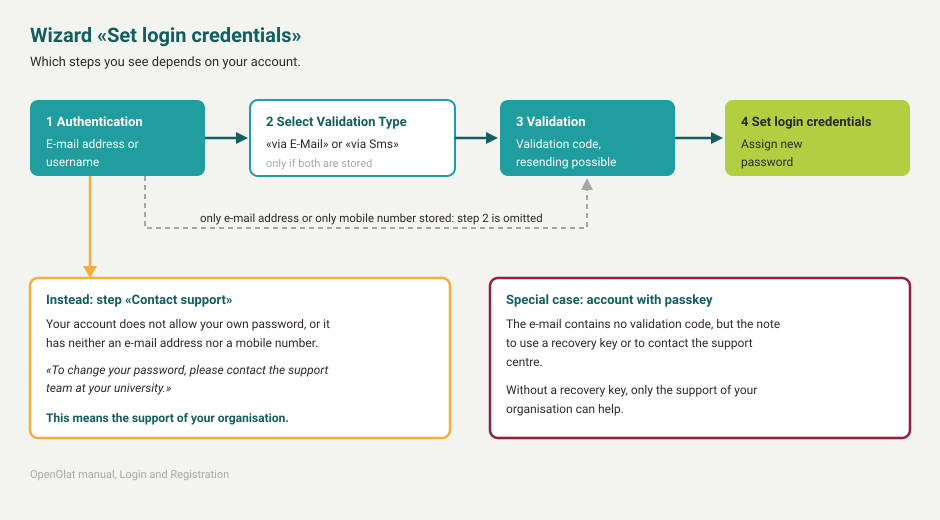
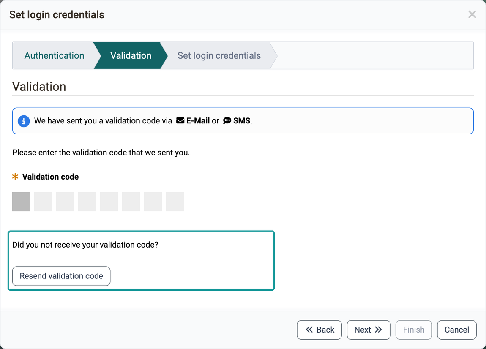

# Password {: #password}

!!! note "Note"

    If [security level](Security_levels.md) 2 is selected (passkey only), then setting a password is no longer possible.

## Change the password yourself

All users of OpenOlat can change their existing passwords at any time.
To do this, go to the personal menu. 
`Personal Menu > Section "Configuration" > Password`

!!! note "Personal Configuration: Password"
    Details on changing the password in the personal menu. 
    [Personal Configuration: Password](../personal_menu/Password.md)

## Reset the password yourself [:octicons-tag-16:{ title="from Release 20.0 (OO-8189)" }](https://track.frentix.com/issue/OO-8189) {: #reset_password}

If you have forgotten your password, you set a new one yourself, provided that your organisation allows this and an e-mail address is stored on your account. The way there is opened by the link "Forgot password?" in the area "Do you need help?" below the login on the [login page](Login_Page.md#forgot_password). If you do not see the area, click "Login with account" first. The wizard is called "Set login credentials".

{ class="shadow lightbox" }

1. **Authentication**: Enter one of the two details in the field "E-mail address or username".
2. **Select Validation Type**: Select "via E-Mail" or "via Sms". You only see this step if both an e-mail address and a mobile number are stored on your account and your organisation has released the reset by SMS. If only one of the two is stored, the wizard leads you on directly.
3. **Validation**: Enter the 8-digit code in the field "Validation code". If no message arrives, use the button "Resend validation code" below "Did you not receive your validation code?". All previously sent codes then become invalid.
4. **Set login credentials**: Assign the new password. The rules that apply are stated in the step itself.

{ class="shadow lightbox" }

Instead of steps 2 to 4, the wizard shows the step "Contact support" if your account does not allow a password to be set or if neither an e-mail address nor a usable mobile number (see step 2) is stored. The text there reads "To change your password, please contact the support team at your university." This means the body that gave you the access to OpenOlat: your school, university, company, public administration or training provider, or their IT and student administration.

If you use a passkey for your account, the e-mail has the subject "Key for new OpenOlat password" and contains no validation code, but the note to use your recovery keys or to contact the support centre. Recovery keys are the replacement codes that OpenOlat showed you when you set up the passkey, see [Passkey](Passkey.md).

## Password assignment by user managers

It often happens that someone has forgotten the password and asks for a new one. If you have the role user manager or administrator, you can reset passwords: 
`User management > select user > tab "Password"`

The tab shows the current security level of the account and offers two ways to a new password: With "Send password link" you send a link for setting a new password to the stored e-mail address (recommended). With "Reset password" you set the new password directly.

{ class="shadow lightbox" }

## Further information {: #further_information}

[Security Levels >](Security_levels.md) 
[Personal Configuration: Password >](../personal_menu/Password.md) 
[Passkey >](Passkey.md) 
[Login Page >](Login_Page.md)

[To the top of the page ^](#password)
