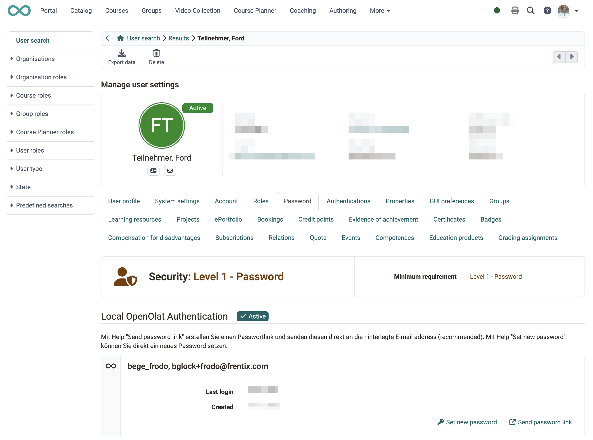

# Password {: #password}

!!! note "Note"

    If [security level](Security_levels.md) 2 is selected (passkey only), then setting a password is no longer possible.

## Change the password yourself

All users of OpenOlat can change their existing passwords at any time.
To do this, go to the personal menu. 
`Personal Menu > Section "Configuration" > Password`

!!! note "Personal Configuration: Password"
    Details on changing the password in the personal menu. 
    [Personal Configuration: Password](../personal_menu/Password.md)

## Password assignment by user managers

It often happens that someone has forgotten the password and asks for a new one. If you have the role user manager or administrator, you can reset passwords: 
`User management > select user > tab "Password"`

The tab shows the current security level of the account and offers two ways to a new password: With "Send password link" you send a link for setting a new password to the stored e-mail address (recommended). With "Reset password" you set the new password directly.

{ class="shadow lightbox" }

## Further information {: #further_information}

[Security Levels >](Security_levels.md) 
[Personal Configuration: Password >](../personal_menu/Password.md) 
[Passkey >](Passkey.md) 
[Login Page >](Login_Page.md)

[To the top of the page ^](#password)
