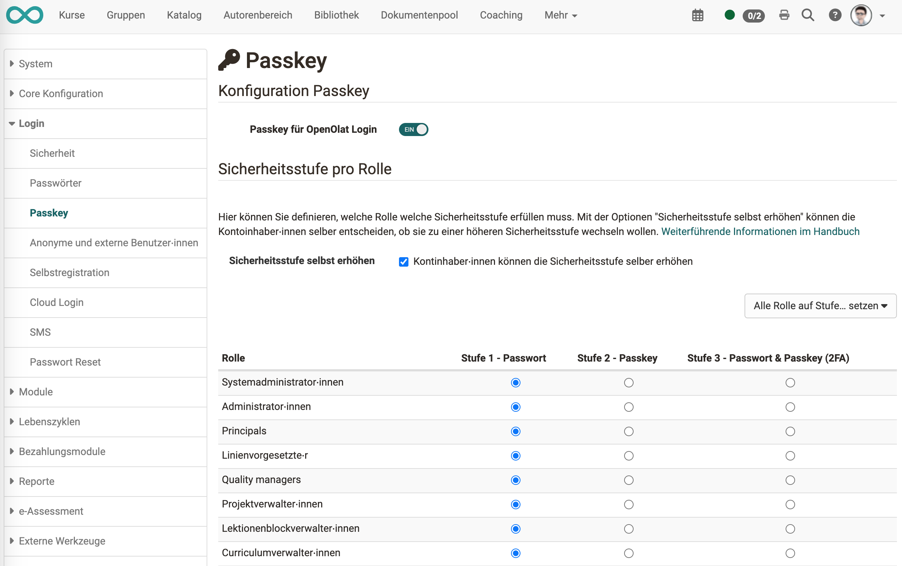
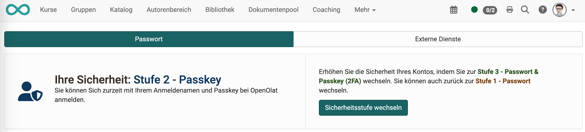

# Sicherheitsstufen {: #security_levels}

## Welche Sicherheitsstufen gibt es? [:octicons-tag-16:{ title="ab Release 18.1 (OO-7180)" }](https://track.frentix.com/issue/OO-7180) {: #levels}

[Passkey](Passkey.de.md) ist Teil eines dreistufigen Sicherheitskonzeptes in OpenOlat:

**Stufe 1 - Passwort**: Anmeldung nur mit Passwort 
**Stufe 2 - Passkey**: Anmeldung nur mit Passkey 
**Stufe 3 - Passwort & Passkey (2FA)**: Anmeldung mit Passwort und Passkey (2-Faktor-Authentifizierung)

Zusätzlich kann die Administration den [One Time Code](One_Time_Code.de.md) aktivieren. Benutzer:innen ohne hinterlegten Passkey bestätigen ihre Anmeldung dann mit einem Bestätigungscode per E-Mail. [:octicons-tag-16:{ title="ab Release 21.0 (OO-9509)" }](https://track.frentix.com/issue/OO-9509)

## Durch Administrator:innen gesetzte Sicherheitsstufen {: #admin_levels}

Für manche Rollen macht eine höhere Sicherheitsstufe Sinn, z.B. für Benutzerverwalter:innen oder Administrator:innen. In OpenOlat kann deshalb für jede Rolle separat eine minimal erforderliche Sicherheitsstufe eingestellt werden. Administrator:innen legen die Stufe pro Rolle in der System-Administration fest unter: 
`Administration > Login > Password und Authentifizierung > Tab "Authentifizierung"`

Mit dem Button "Alle Rolle auf Stufe… setzen" lässt sich eine Stufe für alle Rollen gleichzeitig übernehmen.

{ class="shadow lightbox" }

## Sicherheitsstufen wechseln {: #change_level}

Administrator:innen können mit der Option "Sicherheitsstufe selbständig erhöhen" die Erlaubnis erteilen, dass Benutzer:innen ihre Sicherheitsstufe selbst bestimmen.

Die Umstellung erfolgt mit dem Button "Sicherheitsstufe wechseln" unter: 
`Persönliches Menü > Passwort`

{ class="shadow lightbox" }

Wird für das Höherstufen ein Passkey benötigt, können die Benutzer:innen den Passkey selbst generieren, ebenfalls unter `Persönliches Menü > Passwort`.

Wenn Benutzer:innen ihre Sicherheitsstufe selbst ändern dürfen, ist prinzipiell ein Erhöhen oder Herunterstufen möglich. Ob ein Herunterstufen möglich ist, hängt aber von der Vorgabe der Administrator:innen ab.

Die minimale Stufe wird von Administrator:innen gesetzt. Wenn z.B. Stufe 2 für die Rolle Benutzerverwalter:in vorgeschrieben wird, kann eine Benutzerverwalter:in nicht auf Stufe 1 (nur Passwort) herunterstufen, sondern nur zwischen Stufe 2 (nur Passkey) und Stufe 3 (2-Faktor-Authentifizierung) wählen.

## Weiterführende Informationen {: #further_information}

[Passkey >](Passkey.de.md) 
[One Time Code >](One_Time_Code.de.md)

[Zum Seitenanfang ^](#security_levels)
