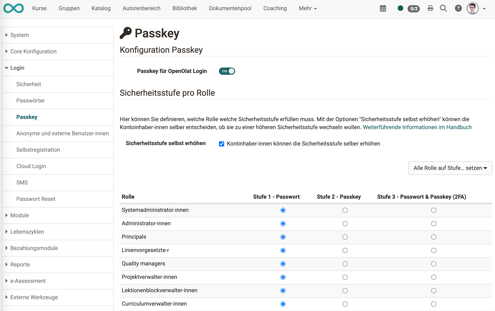
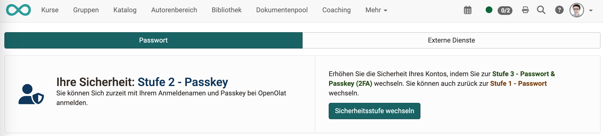

# Security Levels

## Which security levels are available?

Passkey is part of a three-step safety concept in OpenOlat:

**Step 1: only Password** 
**Step 2: only Passkey** 
**Step 3: Passkey + Password** 

## Security levels set by an administrator

For some roles a higher security level makes sense, e.g. for user administrators or administrators. In OpenOlat, a minimum required security level can therefore be set separately for each role.

{ class=" shadow lightbox" }

## Change of a security level

Administrators can grant permission for users to set their own security level when logging in.

The change can be made **in the personal menu** under **"Password"**.

{ class=" shadow lightbox" }

If a passkey is required for upgrading, users can generate the passkey themselves. (Also in the personal menu under **"Password"**.)

If users are allowed to change their security level themselves, it is possible to increase or decrease the security level. Whether a downgrade is possible, however, depends on the default of the administrator.

The minimum level is set by the administrator. If, for example, level 2 is specified for the role of user administrator, a user administrator cannot downgrade to level 1 (password only), but can only choose between level 2 (passkey only) and level 3 (2-factor authentication).

