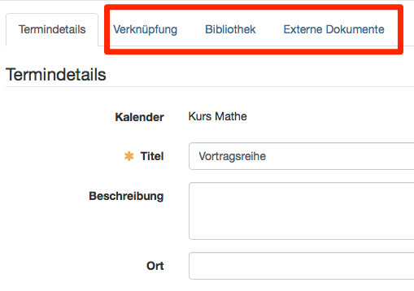
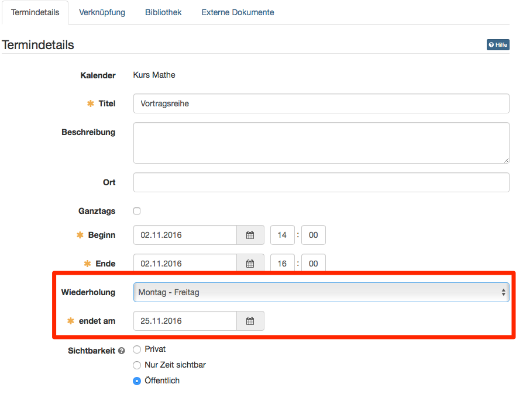
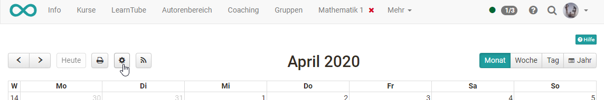
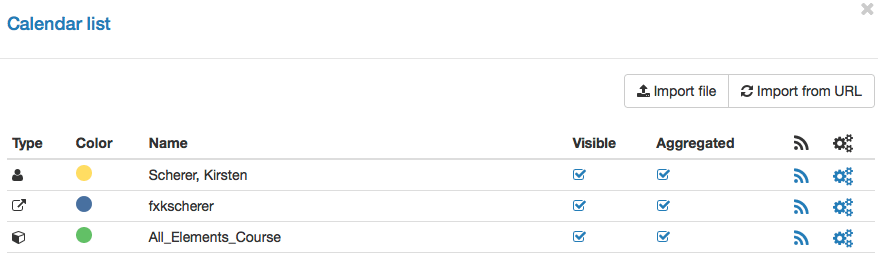

# Kalender

Kalender in OpenOlat

Die Kalenderfunktion steht Ihnen an verschiedenen Orten zur Verfügung

  * in der [Gruppe](Gruppen.html): Zugriff auf den Gruppenkalender sowie eventuell externe importierte Kalender.
  * im Kurs: Zugriff auf Kurstermine sowie Zugriff auf alle Kalender von eingebundenen Gruppen. Kalender können sowohl im Kursrun als auch in der Toolbar eingebunden sein.
  * im [persönlichen Menü](../../pages/viewpage.action%EF%B9%96pageId=108593349.html): Übersicht über die Termine aller ihrer Gruppen und Kurse.

Kurskalender, wie Gruppenkalender, werden automatisch in die Kalenderliste
Ihres [persönlichen
Kalenders](../../pages/viewpage.action%EF%B9%96pageId=5767254.html#Pers%C3%B6nlichesMen%C3%BC-
_pers_kalender) aufgenommen und Termine des Kurses werden dort angezeigt.

  * 1 Kalender 
    * 1.1Kalender in OpenOlat
    * 1.2Termin erstellen / bearbeiten
    * 1.3Wiederholung (Serientermine)
    * 1.4Sichtbarkeit
    * 1.5Kalenderliste (im Bereich Persönliche Werkzeuge)
    * 1.6Kalender integrieren

## Termin erstellen / bearbeiten

Um einen neuen Termin hinzuzufügen, klicken Sie in das entsprechende
Kalenderfeld. Wenn Sie Mitglied in Gruppen sind, treffen Sie erst oben im
Kalender Pulldown-Menu die Auswahl, in welchem Kalender (persönlicher Kalender
oder Gruppenkalender) Sie einen Termin erstellen möchten. Termine können
nachträglich editiert oder wieder gelöscht werden, indem man auf den Termin
und anschliessend auf die Schaltfläche "Editieren" klickt. Ein Termin kann
auch mit Drag&Drop verschoben werden.

Zu den "Termindetails" gehören verbindlich ein Titel sowie ein Start- und
Enddatum. Darüber hinaus kann eine Beschreibung hinzugefügt, eine
Wiederholungsoption sowie die Art der Sichtbarkeit definiert werden. Sie
können auch für unterschiedliche Kalender unterschiedliche Farben verwenden.

  

Verknüpfungen zu Kurselementen, Einträgen in der Bibliothek oder die
Verlinkung zu externen Dokumenten können erst in einem **zweiten Schritt**
hinzugefügt werden, in dem Sie einen bestehenden Eintrag editieren.

Verknüpfungen zu Kursbausteinen können nur im Kurskalender erstellt werden.
Bei den anderen Kalendern erscheint der Kommentar: _Keine Verknüpfung
möglich._

Warnung

Die Schaltfläche „Termin löschen“ in den Termindetails löscht den Termin
endgültig. Der Termin kann nicht wieder hergestellt werden!

  

## Wiederholung (Serientermine)

In den Termindetails kann unter "Wiederholung" die gewünschte Frequenz von
Serienterminen ausgewählt werden. Anschliessend muss ein Datum gewählt werden,
welches das Ende der Serie definiert.

Auch Serientermine können bearbeitet werden. Nach dem Speichern der Anpassung
kann ausgewählt werden, ob die Änderung für alle Termine der Serie oder nur
für den aufgerufenen Termin gilt. Wenn alle Termine geändert werden sollen,
werden diese Termine geändert, welche zuvor nicht individuell angepasst
wurden.

## Sichtbarkeit

Legen Sie hier fest, wer den Kalendereintrag sehen darf.

Je nach Kalenderart (Persönlicher Kalender, Gruppenkalender, Kurskalender)
unterscheiden sich die Auswirkungen der drei Sichtbarkeitsstufen „Privat“,
„Nur Zeit sichtbar“ und „Öffentlich“:

  
| Persönlicher Kalender| Gruppenkalender| Kurskalender  
---|---|---|---  
  
 **Privat**

|  Nur der Ersteller darf den Kalendereintrag sehen, da der Kalender dieser
Person zugewiesen wurde.| Nur Mitglieder der Gruppe, der dieser Kalender
zugewiesen wurde, dürfen den Kalendereintrag sehen.| Nur Mitglieder des
Kurses, der dieser Kalender zugewiesen wurde, dürfen den Kalendereintrag
sehen.  
  
 **Nur Zeit sichtbar**

|

Da nur der Ersteller und niemand anderes seinen Eintrag sehen kann, haben
diese Einstellungen in diesem Kontext keinen Effekt.

| Alle Gruppen- bzw. Kursmitglieder sehen den Eintrag mit allen Angaben.
Zusätzlich können alle OpenOlat-Benutzer oder Gäste mit Zugriff auf die
Gruppe/den Kurs die Zeit des Eintrags aber keine weiteren Angaben sehen.  
  
 **Öffentlich**

|  Alle Gruppen- bzw. Kursmitglieder sehen den Eintrag mit allen Angaben.
Zusätzlich können alle OpenOlat-Benutzer oder Gäste mit Zugriff auf die
Gruppe/den Kurs alle Angaben des Eintrags sehen.  
  
### Gruppenkalender in Verbindung mit Kurskalendern:

In einem Gruppenkalender sehen die Gruppenteilnehmenden alle Einträge der
Gruppenmitglieder, egal ob die Termine privat oder öffentlich gesetzt sind.
Ist die Gruppe einem Kurs zugeordnet, werden dort für die Gruppenteilnehmer
folgende Einträge angezeigt: Öffentliche Einträge der Gruppe, die eigenen
Gruppenkalendereinträge des jeweiligen Gruppenmitglieds sowie die
kurspezifischen Kalendereinträge. Personen die nicht Mitglied der Gruppe sind,
sehen im Kurs die Kalendereinträge der anderen Gruppen nicht. Sind einem Kurs
also mehrere Gruppen zugeordnet, sehen die Mitglieder also nur die eigenen
Gruppenkalendereinträge, aber nicht die der anderen Gruppen.

## Kalenderliste (im Bereich Persönliche Werkzeuge)

Über die Schaltfläche „Einstellungen“ öffnet sich die Kalenderliste, in der
Sie die einzelnen Kalender ein- und ausblenden und angeben, welcher Kalender
in welcher Farbe angezeigt werden soll.

In der Kalenderliste finden Sie alle in ihren aktuellen Kalender (Gruppe, Kurs
oder persönlich) eingebundenen weiteren Kalender. Klicken Sie auf die Farbe um
eine andere Farbe auszuwählen. Über die Spalten " **Sichtbar** " und "
**Aggregiert** " bestimmen Sie ob der ausgewählte Kalender angezeigt werden
soll, bzw. ob er in den aggregierten Kalenderfeed integriert wird.

Der aggregierte Kalender ist ein Sammelfeed, der alle Kalender und dessen
Termine enthält, auf die Sie Zugriff haben. Sie können diesen Feed von anderen
Anwendungen aus verwenden, um alle Ihre OpenOlat-Termine dort einzufügen oder
anzuzeigen. Dies erspart Ihnen die Arbeit, jeden Kalender einzeln einfügen zu
müssen (siehe Kalender integrieren unten). Über das Zahnradsymbol in der Liste
können Sie ferner Dateien und Kalender importieren sowie die Termine eines
kompletten Kalenders zurücksetzen.  

  

Wenn Ihr Kalender trotz eingetragener Termine leer erscheint bzw. bestimmte
Termine nicht angezeigt werden, ist der gewünschte Kalender möglicherweise in
der Kalenderliste nicht ausgewählt.

## Kalender integrieren

Über iCal (einem Standard zur Verwaltung von Terminen), können Sie die
verschiedenen OpenOlat-Kalender in einen anderen Kalender wie z.B. den Google-
Kalender integrieren. Klicken Sie dazu das iCal Icon
entweder
in der Kalenderansicht oder in der entsprechenden Zeile der Kalenderliste, und
kopieren Sie den iCal Link. Andere Kalender wie beispielsweise aus dem System
PerformX lassen sich auf diese Art auch in den OpenOlat-Kalender als managed
Kalender integrieren. Managed Termine werden mit einem Schloss-Symbol
gekennzeichnet.

Wenn Sie in Ihrer OpenOlat Instanz keinen Kursbaustein "Kalender" finden
können, so wurde dies systemweit von einem Administrator ausgeschaltet.

