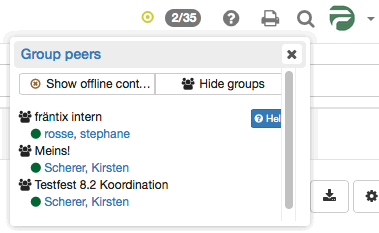

# Chat

Instant Messaging (IM) allows the exchange of messages with persons in real
time--commonly known as "chat". Information on the availability of potential
chat partners is important. You get this information by means of a group peers
list. To begin chatting with one of the available contacts, click on that
contact and the chat will be started in a chat window. If a contact is not
available, messages will be saved and delivered when the user logs in the next
time.  In the OpenOlat Chat you can exchange messages with other OpenOlat
users in real time.

  

  

  

  * 1Your Messaging Status
  * 2Sending Messages
  * 3Receiving messages
  * 4Manage group list contacts
  * 5Join a group/course chat
  * 6Settings
  * 7Chat logs

  

## Your Messaging Status

Available: Select this status to receive chat messages immediately. You are
signaling that you are open for discussion;

Please do not disturb: Select this status when you are busy and you do not
want to be disturbed by opening chat windows. You are signaling that although
you are online you do not want to answer to requests immediately.

Not available: Select this status when you do not want to be contacted by
other users. For other users you seem not to be online at all. You will still
get sent messages and you can also reply immediately if you like to.

By clicking on the round symbol you can change your Instant Messaging status.
That way you can show other OpenOlat users if you would like to chat or not.
While taking a test your status will automatically show the status "Please do
not disturb." Only after that test you will be able to chat again.

If you basically want to have a status other than "Available" after logging
in, you can change this in the personal menu → Settings → Instant Messaging
(see "Settings" below).

  

## Sending Messages

By clicking on the two digits (xx/xx) on the top right of the menu bar next to
the Instant Messaging status symbol (e.g. green dot) a list will pop up. There
you will see all members of your groups logged on at that time. To start a
chat you just have to click on the name of the one you would like to chat
with. By selecting a name a new chat window will be opened.  You can also send
messages to offline users. After the next login, the respective user will
receive your message as they will appear as a small envelope to the left of
the chat icon.

You will not see the two digits though if the direct chat with group peers has
been disabled by a system administrator. Completing the following steps, you
will still be able to send messages to other users. Search for the user either
via the OpenOlat search or in your personal menu in the menu item "Other
users". A click on the name opens the visiting card of this user. Below the
profile image you will find a link to contact that user via chat. If that
specific user has disabled the chat in his settings though, there will be no
contact link available.

Of course, this approach also works with the enabled chat in order to contact
OpenOlat users that are not in your group peer list.

Popular emoticons such as smiling, winking, cool, suprised or kissing are
supported, as well as thumbs up ( + ) and down ( - )

## Receiving messages

Messages can be received in two ways: In case your Instant Message status is
"Available" a chat window will open upon receiving a new message. If your
status is "Please do not disturb" or "Not available", messages will appear as
a small envelope on the left next to the chat icon that can be found on the
top right of the menu bar.

When clicking on that small letter a chat window will open containing your
message. In case the chat window is already open, all new messages will be
displayed there.

In case you receive a message while being offline, the message will be stored.
The next time you log on, it will appear as small blinking letter next to the
chat icon.

## Manage group list contacts

Contacts can be added or removed via the OpenOlat groups. Provided that you
are the coach of a group you can invite or disinvite coaches or participants
to your group. These persons will then appear on your group list of the
OpenOlat chat if the group members display setting is properly configured.
Group coaches are displayed in the contact list in bold face.How the members
display settings can be modified is described in the [group
administration](Group+Administration.html#GroupAdministration-
_gruppensystem_members).

## Join a group/course chat

Links to chat rooms are found at different places in OpenOlat (e.g.
group/course). Click on the link _Start chat_. A new window will be opened and
you can start your group/course chat. If a chat history is available you can
display it to learn what the discussion is about and what has already been
said. Messages to a chat room are sent to all persons in that room. A list of
all participants will be displayed next to your chat window. If you want to
participate anonymously you can select a nick name. Chat participants will
then not see your real identity. This option must be enabled by the system
amdinistrator. It might not be available on your system. If you want to exit
the chat room, just close that window.

## Settings {: #settings}

In the tab "Instant Messaging" you can specify whether other users should be
able to contact you. If you do not wish to receive messages from other users,
turn off this feature. The contact link in the card is then removed. In that
case, you can only receive messages from your direct group peers.

 **Default status after login:**

Here you can choose between 3 settings to be activated after your next login.
If you want to change your current status you can do this by means of the
status symbol in the top right corner. The status selected here will be
reactivated upon your next login.

## Chat logs

To view chat logs, open the chat window of the desired chat partner. In the
top half of the window, select the time period for the protocol. You can view
the chat transcript of the last day, the last week or last month.

  

