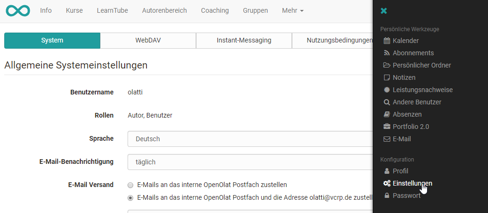
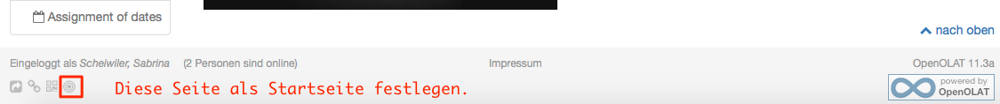
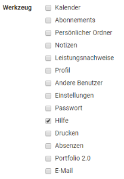
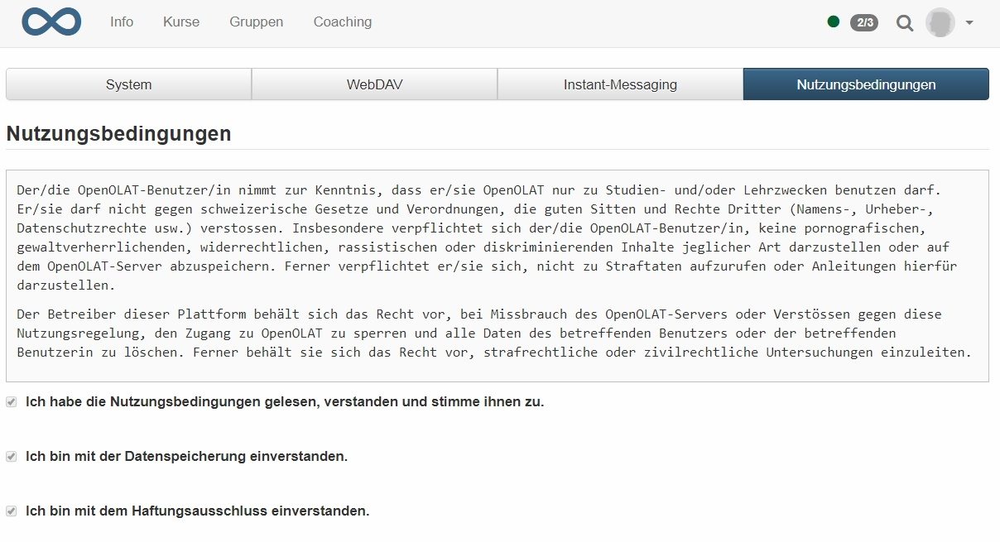
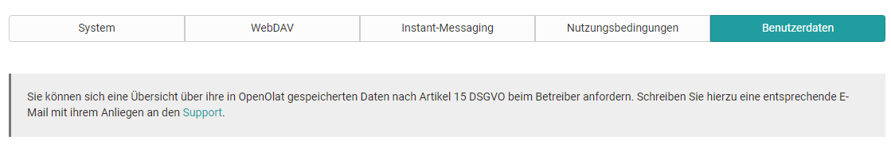
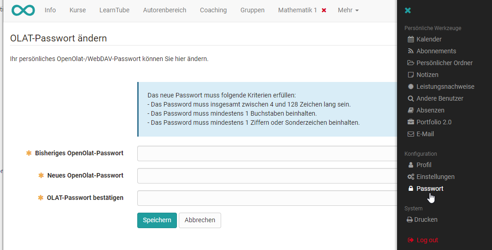

# Konfiguration

Die Konfiguration gewährt Ihnen den Zugriff auf die Menüs Profil,
Einstellungen und Passwort.  

  * 1 Konfiguration 
    * 1.1 Profil
    * 1.2Einstellungen
      * 1.2.1Tab System
      * 1.2.2Tab WebDAV
      * 1.2.3Tab Instant-Messaging
      * 1.2.4Tab Nutzungsbedingungen
      * 1.2.5Tab Benutzerdaten
    * 1.3  Passwort

##  Profil

Im persönlichen Menu unter der Option „Profil“ können Sie Ihre persönlichen
Daten ändern und ihre Visitenkarte einrichten. Vervollständigen Sie einfach
die die vorgesehenen Felder.

Änderungen der E-Mail-Adresse werden nur übernommen, wenn die neue E-Mail-
Adresse aktiviert wird. Hierzu wird nach der Änderung ein Aktivierungs-Link an
die neue Adresse versendet. Sie wählen den Link an oder kopieren ihn in die
Adresszeile Ihres Browsers und melden sich bei OpenOlat an, um die neue
E-Mail-Adresse freizuschalten. Bis zur Aktivierung wird in OpenOlat die
bisherige E-Mail-Adresse verwendet. Sollten Sie den Aktivierungs-Link
innerhalb von zwei Tagen (48 Stunden) nicht anwählen, verfällt der
Änderungswunsch. Kontaktieren Sie dann Ihren Administrator.

In den Kontaktdaten kann eine Telefonnummer für den Versand von SMS
hinzugefügt werden. Wenn bei Ihrem System ein SMS-Service hinterlegt ist, kann
das Passwort mit einer SMS Authentifizierung zurückgesetzt werden. Dafür muss
hier eine Telefonnummer hinterlegt werden. Die Nummer muss im international
gültigen Format +41 12 345 67 89 hinterlegt werden. Empfohlen ist eine
Mobiltelefon-Nummer. Bei Festnetz-Nummern wird die Nummer zur Überprüfung
angerufen und der Code vorgesprochen.

Im Bereich "Über mich" können bei Bedarf einige Informationen als Freitext
über sich eintragen.

Wichtig für das Online-Lernen ist auch, dass Sie Ihrem Profil ein Foto von
sich hinzufügen. So wird das Online-Lernen persönlicher und die Online-
Kommunikation und -Kooperation ist für alle angenehmer und einfacher. Das im
Profil hinterlegte Foto erscheint in OpenOlat an diversen Stellen, z.B. auf
Ihrer Visitenkarte, bei Forenbeiträgen oder in der Teilnehmerliste. Das Bild
wird von OpenOlat auf eine Breite von 100 Pixel zugeschnitten.

  

Einige Felder können eventuell nicht geändert werden.

Tab "Meine Visitenkarte"

Mit Hilfe der Check-Boxen bestimmen Sie, welche Einträge auf Ihrer
Visitenkarte erscheinen und somit von anderen OpenOlat- Benutzern eingesehen
werden können. Einige Check-Boxen können nicht bearbeitet werden. Diese sind
systemweit vorgegeben.

Um sich die Visitenkarten anderer OpenOlat-Benutzer anzuschauen, wählen Sie
**Andere Benutzer** im persönlichen Menü und suchen die gewünschte Person über
die Suchmaske.

## Einstellungen

Mit Hilfe der Einstellungen können Sie OpenOlat nach Ihren Bedürfnissen
anpassen.

### Tab System

#### Allgemeine Systemeinstellungen:

Hier können Sie Ihren Benutzernamen und Ihre OpenOlat Rolle auslesen. Darüber
hinaus können Sie Ihre individuelle Systemsprache auswählen. OpenOlat ist in
zahlreiche Sprachen übersetzt worden. Die Änderung der Sprache wird erst nach
dem nächsten Einloggen aktiv.

Die Sprache von Kursinhalten wird von der Sprachwahl hier aber nicht
beeinflusst.

Darüber hinaus können Sie einstellen, wie oft Sie Benachrichtigungen per
E-Mail erhalten wollen. Zur Auswahl stehen: ausgeschaltet, monatlich,
wöchentlich, täglich, halbtäglich, alle vier und alle zwei Stunden. Legen Sie
zusätzlich fest ob OpenOlat E-Mails nur in dem Posteingang innerhalb des
OpenOlat Systems angezeigt, oder ob Sie auch an ihre im Profil konfigurierte
externe E-Mail Adresse verschickt werden sollen. In der Benachrichtigungsmail
finden Sie auch einen Hinweis bezüglich neuer E-Mails innerhalb des OpenOlat
Postfachs, falls Sie die Option "E-Mails an das interne OpenOlat Postfach
zustellen" gewählt haben.

Über den "Zeichensatz für Download bestimmen Sie, in welchem Zeichensatz
Dateien abgespeichert werden sollen, die Sie über die Datenarchivierung
herunterladen. Dies betrifft den Download der Test- und Fragebogenresultate
sowie der Kursresultate. Voreingestellt ist der Zeichensatz ISO-8859-1.
Enthalten Ihre Tests oder Fragebogen z.B. Arabische Zeichen, müssen Sie hier
den Zeichensatz UTF-8 wählen.

 ** ****** In den Speziellen Systemeinstellungen sehen und ändern Sie die
Einstellungen, die Ihnen den tagtäglichen Einstieg und die Arbeit mit OpenOlat
erleichtern können.

In der Auswahl "Sitzung wiederherstellen" legen Sie fest, was direkt nach dem
Login passiert: Entweder wird

  * die Startseite geladen,
  * es wird automatisch der in OpenOlat zuletzt besucht Ort geladen, oder
  * Sie legen situationsbezogen jeweils fest, wohin Sie nach dem Login gelangen wollen.

Wenn Sie die Einstellung "Ja, automatisch" gewählt haben, wird das Feld zur
Eingabe der Startseite ausgeblendet. Dieses Feld gestattet Ihnen, jede
beliebige Seite innerhalb OpenOlat als Ihre persönliche Startseite festzulegen
und damit die systemweit eingestellte Startseite zu überschreiben.
Seitenspezifische Links finden Sie in der Social Sharing - Leiste links unten
unter "Link kopieren". Noch einfacher ist es auf der gewünschten Startseite
einfach das Startseiten Icon anzuklicken. Hierfür kann jede OpenOlat Seite auf
die Sie Zugriff haben, gewählt werden.

  

 ** **** Benutzerwerkzeuge: **Hier wählen Sie aus, welche Benutzerwerkzeuge
direkt oben rechts in der Menüleiste (neben Ihrem Profilbild) erscheinen
sollen, so dass Sie sehr schnell auf diese Werkzeuge zugreifen können.

Werkzeuge die nicht als Schnellzugriff in der Navigationsleiste liegen, sind
als Menüeintrag im persönlichen Menü verfügbar. Mit Hilfe kommen Sie auf die
Startseite des Benutzerhandbuchs und mit Drucken können Sie die aktuell
geöffnete Seite drucken.

Versuchen Sie nicht alle Werkzeuge zu aktivieren, sondern wählen sie gezielt
die Werkezeuge aus, Sie Sie häufig benutzen. So bleibt die Menüleiste
übersichtlich.

Als letztes haben Sie unter "Einstellungen" im Tab "System" die Möglichkeit,
ihre vorgenommenen systembezogenen Änderungen wieder **auf die
Standardeinstellungen zurückzusetzen** , Hierzu zählen Einstellungen bezüglich
der Personalisierung, der Benachrichtigungen und der
Sitzungswiederherstellung.

### Tab WebDAV

Im Tab "WebDAV" finden Sie den [WebDAV-Link zu Ihrer OpenOlat-
Instanz](Einsatz+von+WebDAV.html), mit der bequem Dateien verwaltet werden
können. Über WebDAV können Sie als OpenOlat User auf ihren persönlichen Ordner
zugreifen. OpenOlat Autoren können über WebDAV ihre gesamten Kursdateien
organisieren.

### Tab Instant-Messaging

Im Tab „Instant-Messaging“ legen Sie die Einstellungen für die [Chat-
Funktion](Instant+Messaging.html) und Ihren Kommunikations-Status nach dem
Login fest.

### Tab Nutzungsbedingungen

Hier können Sie die Nutzungsbedingungen nachlesen, welche Sie beim ersten
Login bestätigt haben. Die genauen Nutzungsbedingungen werden vom OLAT
Administrator festgelegt.

Ferner kann hier auch die Löschung des kompletten OpenOlat Kontos beantragt
werden.

### Tab Benutzerdaten

In diesem Bereich können Sie eine Übersicht über ihre in OpenOlat
gespeicherten Daten nach Artikel 15 DSGVO beim Betreiber anfordern. Der
entsprechende Support-Link ist hinterlegt. Sobald der Export durchgeführt
wurde, können Sie die über Sie gespeicherten Benutzerdaten hier herunterladen.

##   Passwort

Sofern Ihr Account nicht von einem externen Benutzerverwaltungssystem
gesteuert wird, können Sie im Menü "Passwort" Ihr Passwort ändern. Je nach
Einstellung kann der Administrator auch die Vergabe eines neuen Passworts in
bestimmten Abständen erzwingen. Achten Sie darauf bei der Vergabe eines neuen
Passworts nicht noch einmal das alte Passwort zu verwenden. Je nach
Einstellungen durch den OLAT Administrator kann die Verwendung von vorherigen
Passwörtern nicht erlaubt sein.

Wenn Sie Ihr Passwort vergessen haben, können Sie auf der Login Seite ein
neues Passwort anfordern. Der Aktivierungslink wird Ihnen anschliessend per
Mail zugestellt. Falls in Ihrem System die SMS-Authentifizierung möglich und
Sie diese aktiviert haben, kann der Aktivierungscode auch per SMS zugestellt
werden.

