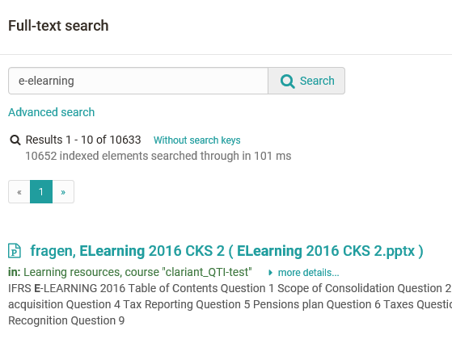
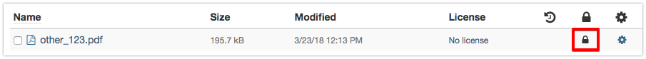

# Full-Text Search

The search is only visible and usable, if it is activated in the
administration. If this is not the case for you, please contact your
administrator directly.

The box for the full-text search is at the top right of the status bar. The
full-text search helps you to look for search terms in the course or group
content, in a forum or even in PDF and Word files. You can furthermore look
for users, portfolio folders, artefacts, and documents in any user folder. The
only exceptions are private folders since they will not be indexed.

You will only get search results of the course contents you have access to.

In order to search in more detail please use the advanced search.

Select the option "Advanced search." The mode _Advanced search_ enables you to
refine your search. Please note that these different fields have to be linked
by the Boolean AND operator. This means that e.g. by filling in the fields
_Title_ and _Author_ you will find documents containing the respective terms
in all indicated fields.

Exception: The field Full-text search searches through all fields.

You will be provided with a list of search results that is linked to the
learning content along with your search term.

Info

Beside the full-text search for the whole OpenOlat there exists also a [course
search](../course_create/Course_Settings.md#CourseSettings-course_search), which can be
activated for every course in the course options. The course search searches
only the corresponding course.

  

###  Syntax {: #syntax}

You can modify your query by means of the following syntax.  
  
**Single terms:** e.g. _OLAT_

 **Phrases:** should be put in double quotation marks, e.g. _"carbonated
water"_

 **Boolean operators:** Single terms as well as phrases can be linked by
Boolean operators. Attention Boolean operators have to be in capital letters.

  *  **OR:** If you do not use Boolean operators between terms you are searching for the OR operator will be used.For example: _"Analysing water" Calcium_ and _"Analysing water" OR Calcium_ will generate the same results, that is, all documents containing either "Analysing water" or "Calcium"
  *  **AND:** Using the AND operator will show documents containing all terms you are searching for.For example: _"Analysing water" AND "Calcium"_ will show documents containing "Analysing water" as well as "Calcium".
  *  **NOT:** Using the NOT operator will eliminate documents containing specific terms.For example: _"Analysing water" AND "Calcium" NOT "Tap water"_ will show a document containing "Analysing water" and "Calcium" but not "Tap water".

  
 **Searching by means of wildcards:** You can choose between two different
kinds of wildcards in order to look for specific word fragments.

  * The question mark within a term stands for any single letter. For example: The query _te?t_ will result in finding all documents containing the words "test", "text" etc.
  * The asterisk within a term stands for any number of letters. For example: The query _test*_ will result in finding all documents containing words beginning with "test". The asterisk can also be put within a term: _te*t_

  
 **Fuzzy search:** By means of the tilde (swung dash) ~ you can search for
words with similar spelling. For example: The query _sauna~_ will result in
finding documents containing words such as "sauna", "saunas" or "fauna".

 **Special characters:** The following characters are part of the search
syntax in OLAT:

 **\+ - && | ! ( ) { } [ ] ^ " ~ * ? : \**

If your query contains one of these characters you have to mask it using the
backslash \\. For example: If you are looking for the equation _(1+1):2=?_ you
have to write _\\(1\\+1\\)\:2=\?_ instead.

 **Searching through fields:** In order to search through fields you can
select the mode _Advanced search_ (different fields are linked by the AND
operator). Or you can search through fields by means of your own Boolean link.
In order to do this please use the following field names in the _Simple
search_ mode:

    *  _title_ (=Title)
  *  _description_ (=Description)
  *  _content_ (=Searching through a text)
  *  _documenttype_ (=Document type)
  *  _filetype_ (=File type)
  *  _author_ (=Author)
  *  _created_ (=Creation date)
  *  _changed_ (=Last modification)

Example: _description:Calcium_ will only search through the field
_Description_.

For more detailed information regarding the lucene search syntax used in OLAT
please go to [Apache
Lucene](http://lucene.apache.org/core/7_2_0/queryparser/org/apache/lucene/queryparser/classic/package-
summary.html#package.description).

###  Meta Data {: #metadata}

Meta data is data  **about**  data, containing information about attributes of
other data. Metadata additionally describe a file, e.g. its title, author or
publisher. They serve as a means to clarify a document's purpose and are
particularly suitable for file names that would otherwise be too long or for
document titles containing special characters.

Each file can be provided with metadata. Metadata are optional, and based on
the Dublin Core Simple Standard. For further information please go to: [Dublin
Simple Core](http://en.wikipedia.org/wiki/Dublin_Core). However, several meta
data cannot be modified: name of person who has uploaded a certain document,
size of document, file type, and time of document upload. Information on e.g.
the original author, the title, the source or the language can be entered
manually.

Metadata are indexed by the full-text search. Therefore you can search for
metadata by means of keywords when trying to find relevant documents.

**Lock a file:** Within the meta data you can mark a file as locked. Locked
files are marked with a lock and other users can no longer change, delete or
move it. This option is not available for folders.

Using the external link, you can link directly to a specific file from outside
of OpenOlat.

