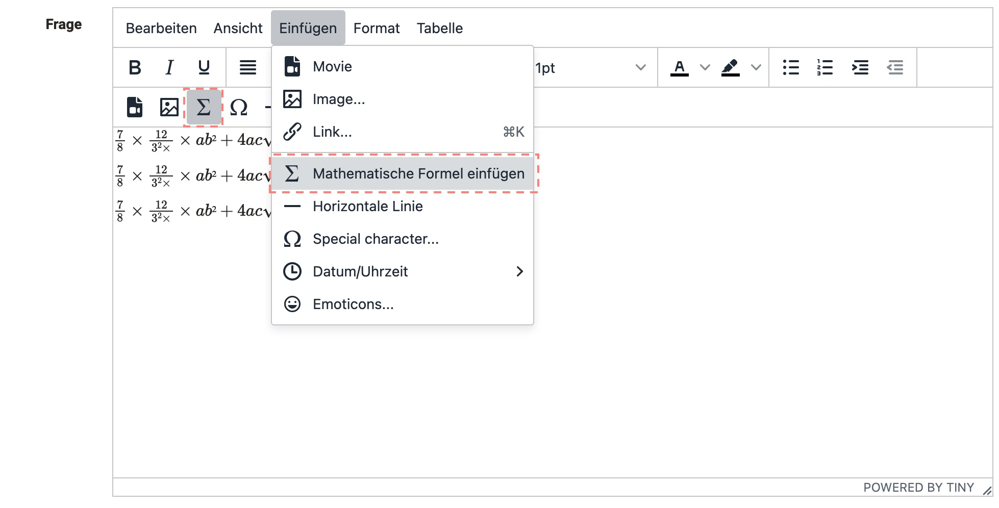
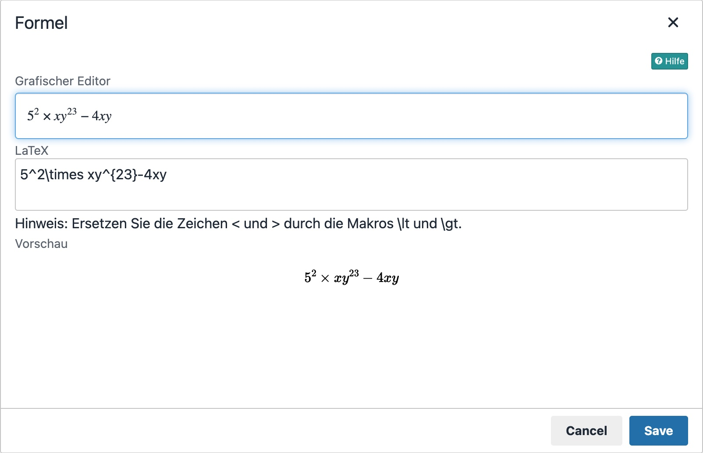

# Matheformel{: #formula}

Formeln können in OpenOlat an verschiedenen Stellen in einem HTML-Editor eingefügt werden, wie ePortfolio, RichText-Eingabefelder und im Freitextaufgabenbaustein.

## Einfügen über HTML-Editor

1. Man kann die mathematische Formel über `Einfügen>Mathematische Formel einfügen` im Kontextmenü des RichText-Editors/HTML-Editors oder direkt über den Formel-Button, falls vorhanden, einfügen.

      {class="shadow"}

2. Geben Sie die Formel über den LaTeX-Editor oder den grafischen Formeleditor ein. Weitere Informationen zur Verwendung des grafischen Editors finden Sie hier: [CortexJS keybindings](https://cortexjs.io/mathlive/reference/keybindings/).

    {class="shadow"}
  
3. schließen Sie den html-Editor mit `Speichern`. Die Formel ist nun eingebunden.

    {class="shadow"}

!!! Wortzählung bei Aufgaben

    Die mathematische Formel zählt als ein Wort, unabhängig von Länge und Komplexität.

## Einfügen einer Formel in den Content Editor

1. Im Contenteditor gibt es jetzt einen neuen Blocktyp. Öffnen Sie den Inhaltseditor. Klicken Sie auf Inhaltsblock hinzufügen.

    {class="shadow"}

2. Wählen Sie `Mathematische Formel` im Menü.
3. Der grafische Formeleditor öffnet sich. Jetzt können Sie Ihre Formel erstellen.
