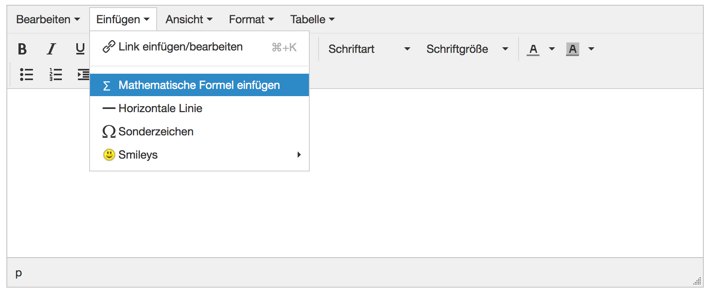
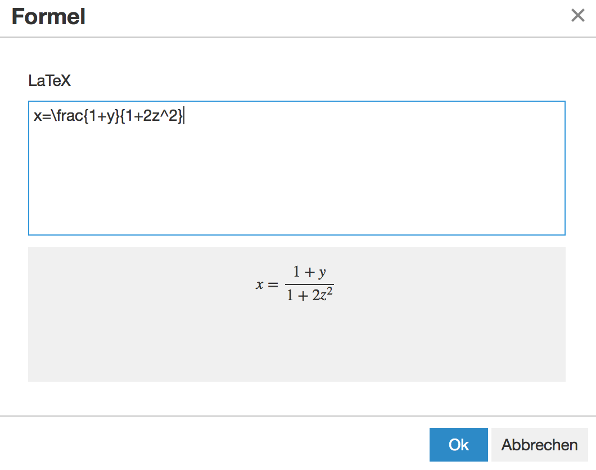

# Mathematische Formel

Mit dem HTML-Editor, der an verschiedenen Stellen in OpenOlat zur Verfügung
steht können neben Texten auch mathematische Formeln hinzugefügt werden. Diese
kurze Übersicht soll aufzeigen, wie eine solche Formel eingefügt werden kann
und was man sich unterem einem
[LaTeX](https://de.wikipedia.org/wiki/LaTeX)-Editor vorstellen soll.

1.| In einem ersten Schritt wird der HTML-Editor geöffnet.  
Unter Einfügen kann "Mathematische Formel einfügen" ausgewählt werden. |

  
  
---|---|---  
2.| Im LaTeX-Editor Formel eingeben und mit "Ok" speichern.  
Im grauen Bereich wird die Vorschau angezeigt.|

  
  
3.| HTML-Editor mit "Speichern" schliessen.  
4.| Formel ist im Text eingebunden (hier als Beispiel Forumsbeitrag).|

