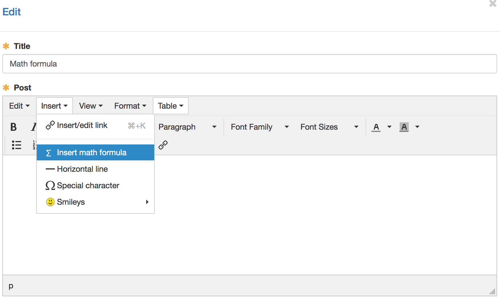
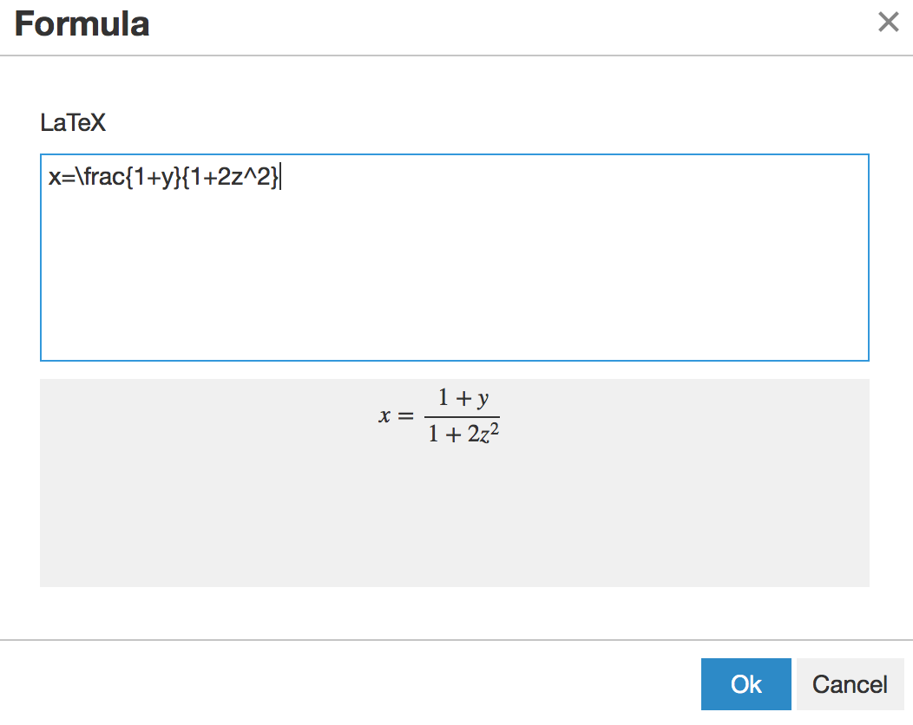
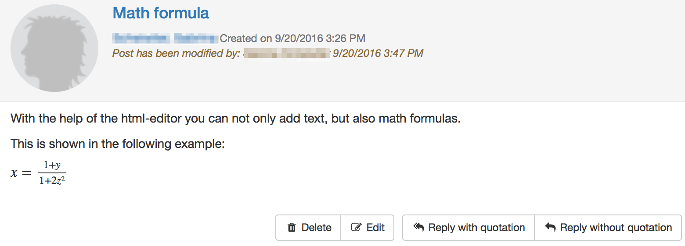

# Math formula

With the help of the html-editor mainly text ist added and formatted in
OpenOlat. For example in the description of the course elements, when creating
a forum entry or in a portfolio entry. But the html-editor cannot only insert
text, but also math formulas. This short overview shows how such a formula can
be inserted and what is to be imagined behind a
[LaTeX](https://en.wikipedia.org/wiki/LaTeX)-Editor.

1.|

In a first step you open the html-editor.  
Below insert "Insert math formula" can be selected.  

  

|

  
  
---|---|---  
2.|

Type in the formula in the LaTeX-editor and save with "Ok".  
The preview is shown in the grey area.

|

  
  
3.| Close the html-editor with "Save".  
4.|

The formula is embedded in the text.  
(here the example of a forum entry)

|

