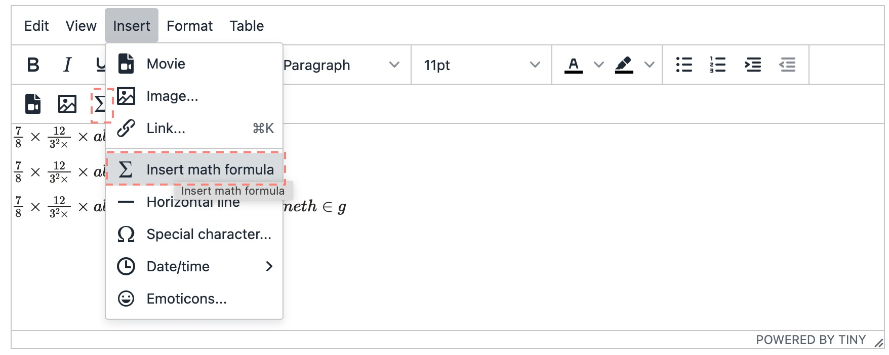
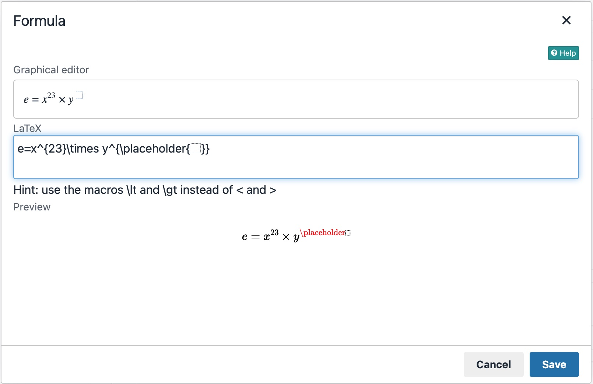
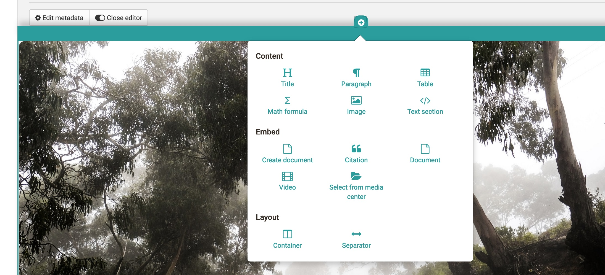

# Math formula{: #formula}

Formula can be inserted in OpenOlat in various places in a html editor, like ePortfolio, RichText Input Fields and in the Freitextaufgabenbaustein.

## Insert via HTML Editor

1. You insert the math formula via `Insert>Insert math formula` in the contenxt menu of the rich text editor/ html editor or directly via formula button, if available. A new popup window will open.

    {class="shadow"}

2. Type in the formula via the LaTeX editor or th graphical form editor. Further information on how to use the graphical editor can be found here: [CortexJS keybindings](https://cortexjs.io/mathlive/reference/keybindings/).

    {class="shadow"}
  
3.Close the html-editor with "Save".
The math formula is now embedded into the text.

   {class="shadow"}

!!! Wordcounting

    The math formular counts as one word, regardless of length and complexity.

## Insert a formula in Content Editor

1. Open the Content Editor. Click on add Content Block.

    {class="shadow"}

2. Choose `Formula` in the menu.
3. The graphical formular editor opens. Now you can create your formula.
