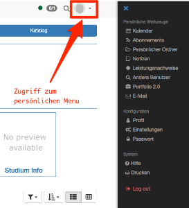
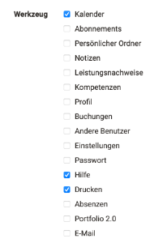
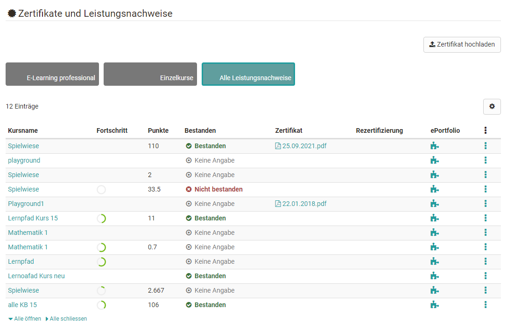

# Persönliche Werkzeuge

Die persönlichen Werkzeuge können über das Ausklappmenü rechts oben angezeigt
und konkreter eingerichtet werden. In Persönliche Werkzeuge erscheinen jene
Werkzeuge, die einem Benutzer zur Verfügung stehen.

In den Einstellungen können Werkzeuge auch dem Schnellzugriff
hinzugefügt werden. Dann erscheinen sie direkt in der oberen
Navigationsleiste.

  
##  Kalender

Im persönlichen Kalender sehen Sie Ihre privaten Einträge sowie Einträge aus
Gruppen- und Kurskalendern. Einzelne Kalender können über die Kalenderliste
ein- bzw. ausgeblendet werden.

Wenn Ihr Kalender trotz eingetragener Termine leer erscheint bzw. bestimmte
Termine nicht angezeigt werden, ist der gewünschte Kalender möglicherweise in
der Kalenderliste nicht ausgewählt.

Wenn Sie in der Liste ihrer persönlichen Werkzeuge keinen Kalender finden,
wurde dies systemweit von einem Administrator ausgeschaltet.

Es ist möglich, private Termine zu erstellen. Private Termine sehen nur Sie,
während bei öffentlichen Terminen alle registrierten OpenOlat-Benutzer mit
Zugriffsrechten auf ihren Kalender diese Einträge inklusive Details in Ihrem
Kalender sehen können.

Informationen zur Kalenderliste, Termine erstellen sowie weiterer
Kursfunktionen finden Sie im Unterkapitel
[Kalender](Calendar.de.md).

  

##  Abonnements {: #subscriptions}

:octicons-device-camera-video-24: **Video-Einführung**: [Abonnements](<https://www.youtube.com/embed/h9gOqt7TR7Q>){:target="_blank”}

Abonnieren Sie bestimmte Elemente in Kursen und Gruppen um sich rasch über Änderungen informieren zu lassen. 

Folgende Objekte sind abonnierbar: 

  * Forum 
  * Ordner 
  * Wiki 
  * Kalender
  * Aufgabe
  * Dateidiskussion
  * Portfoliomappen
  * Mitteilung
  * Teilnehmer-Ordner
  * Blog
  * Podcast
  * Video 

Neuigkeiten werden Ihnen ein Mal pro Tag als E-Mail zugeschickt, und falls das
Portal aktiviert ist, dort unter "Meine Benachrichtigungen" angezeigt. Wenn
Sie diese Änderungen seltener oder häufiger per E-Mail erhalten wollen oder
die E-Mail nicht erhalten wollen, können Sie dies unter „Einstellungen -
Allgemeine Systemeinstellungen" im Tab „System“ anpassen. Unter "Abonnements"
im persönlichen Menü können Sie ihre Neuigkeiten ebenfalls einsehen. Auf der
Übersichtsseite, dem Tab "Neuigkeiten" können Sie sich Änderungen innerhalb
eines Zeitraumes anzeigen lassen oder die Änderungen noch einmal per E-Mail
verschicken. Die Gesamtzahl der von Ihnen abonnierten Objekten ist im Tab
"Abonnements" aufgelistet.  Sie haben auch die Möglichkeit, sich mittels RSS
über den Änderungsverlauf zu informieren.

Personen die das Recht für das Bewertungswerkzeug besitzen (z.B. Betreuer oder Kursbesitzer) können sich auch benachrichtigen lassen, wenn neue Testresultate eingegangen sind oder sich neue Benutzer registriert haben.

### Neuigkeiten per RSS {: #rss}

**Warum sollte ich wissen, was RSS ist?:**

Dank RSS sind Sie schnell und komfortabel über Änderungen in von Ihnen
abonnierten Foren und Ordnern informiert. Auf einem Blick sehen Sie die
Überschriften neuer Beiträge und was seit Ihrem letzten Besuch geschehen ist.
Ausserdem erhalten Sie die entsprechenden Links, um direkt an den "Ort des
Geschehens" in OpenOlat zu springen. Alles was Sie für diesen Service
benötigen, ist die Internet-Adresse der für Sie bereitgestellten RSS-Datei und
einen sogenannten RSS-Reader.

 **Wo finde ich die Adresse der RSS-Datei?:**

Klicken Sie auf das Icon
Ein
neues Browser-Fenster öffnet sich. Ignorieren Sie den Inhalt der Seite und
kopieren Sie die Webadresse (URL) in die Zwischenablage. Fügen Sie die
Webadresse dann in Ihren RSS-Reader ein.

 **Wie komme ich an einen RSS-Reader?:**

Wir empfehlen folgende Suchbegriffe: _RSS reader_ , _RSS newsreader_ ,
_feedreader_ um einen für Sie geeigneten RSS-Reader zu finden.

 **Hier finden Sie weiterführende Informationen:**

[Wikipedia](http://en.wikipedia.org/wiki/Rss_feed)

Wenn Sie das Abonnement nicht mehr wollen, können Sie es entweder abbestellen
(an gleicher Stelle wie „Abonnieren“) oder Sie können unter „Abonnements“
hinter der Ressource die Option „löschen“ wählen. Das Abonnement erlischt
ausserdem, wenn Sie nicht mehr Mitglied im entsprechenden Kurs oder Baustein
(direkt oder via Gruppe) sind.

##  Persönlicher Ordner

Im persönlichen Ordner stellt OpenOlat Ihnen Speicherplatz zur Verfügung. Sie
können dort beispielsweise Präsentationen ablegen, auf die Sie von einem
anderen Rechner zugreifen möchten, Forschungsarbeiten zwischenspeichern, etc.
Weitere Infos finden Sie
[hier](Personal_folders.de.md).

## Notizen

In jedem Kurs können Sie Notizen verfassen. Unter diesem Punkt sehen Sie,
welche Notizen Sie gemacht haben und können diese bearbeiten und ausdrucken.

##  Leistungsnachweise

Ein Leistungsnachweis ist eine Bestätigung einer erfolgten Leistungskontrolle und zeigt beispielsweise absolvierte Tests oder abgegebene und bewertete Aufgaben an. Kursautoren legen in ihren Kursen fest, ob OpenOlat Leistungsnachweise erstellen soll. Kursteilnehmende sehen ihre Leistungsnachweise dann, wenn sie Kurse mit Leistungsnachweisen besuchen, bereits Leistungen erbracht haben und wenn diese auch bewertet wurden. 

Falls in einem Kurs neben dem Leistungsnachweis auch ein Zertifikat zur Verfügung gestellt wird, können Sie dieses in der Einzelansicht des betreffenden Leistungsausweises ebenfalls anschauen und herunterladen.
Nutzer können auch externen Zertifikate in OpenOlat hochladen, um ihr Profil zu vervollständigen. Im persönlichen Menü unter dem Tab "Leistungsnachweise" befindet sich die Schaltfläche "Zertifikat hochladen" (sofern vom Administrator aktiviert) 

## Kompetenzen

Hier erhält der Benutzer eine Übersicht zu allen persönlichen Kompetenzen, die
in OpenOlat zugewiesen sind, z.B. in ePortfolio-Einträgen oder als Kompetenz
im Benutzerprofil.

## Buchungen

Alle Kurs-Buchungen des Benutzers werden hier inklusive weiterer
Buchungsinformationen aufgelistet.

##  Andere Benutzer

Sie können nach anderen OpenOlat-Benutzern suchen, öffentliche Visitenkarten
ansehen, den „public“-Bereich der persönlichen Ordner von Benutzern
durchstöbern, freigegebene Portfoliomappen anschauen oder mit Hilfe des
Kontaktformulars die jeweiligen Personen kontaktieren.

## Absenzen

Bei aktiviertem Modul "Absenzenmanagement" können Benutzer an dieser Stelle
die für sie erfassten Absenzen einsehen.

##  Portfolio 2.0

Ein Portfolio dient der Sammlung und Dokumentation von (Lern-)Artefakten,
Lernergebnissen und Lernprozessen sowie zur Förderung der Reflexion über den
eigenen Entwicklungsprozess. Lernprodukte können hier gesammelt und bei Bedarf
bestimmten Personen zugänglich gemacht werden. Unter dem Menueintrag Portfolio
2.0 können Sie Portfolio-Mappen erstellen, diese bestimmten
Personen (OpenOlat-Benutzern sowie Externen) [zugänglich machen](../portfolio/Shared_by_me.de.md), die Mappen anderer
Benutzer [betrachten ](../portfolio/Shared_with_me.de.md)und auch
[Portfolioaufgaben](../portfolio/Portfolio_task_and_assignment_Collecting_and_editing.de.md)die Lehrende im Rahmen eines OpenOlat-Kurses  bereitgestellt haben, bearbeiten.
Weitere Informationen zum Thema dazu finden Sie 
[hier](../portfolio/Portfolio_-_General_Information.de.md).  

  

 Was ist eine Reflexion?

Eine Reflexion ist eine möglichst emotionsfreie Auseinandersetzung mit einem
zurückliegenden Geschehen oder gerade laufenden Prozess. Reflexion heisst,
möglichst distanziert zu betrachten, was z.B. mit einem Arbeitsauftrag, mit
einem selbst oder mit einer Gruppe auf welche Weise, durch welche Eingriffe
oder ähnlichem geschehen ist. Beim Lernen mit Portfolios nimmt die
schriftliche Reflexion einen wichtigen Stellenwert ein. Jeder Lernende
überlegt für sich selbst den persönlichen Lernzuwachs, das Ausmass des eigenen
Interesses, der eigenen Betroffenheit und wo und wie das Erlernte angewandt
werden kann. Gutes Reflektieren ist ein wichtiger grundsätzlicher Schritt von
Lernenden in Richtung eigenverantwortliches Arbeiten.

Reflexionen können auch nachträglich bearbeitet werden. Wenn Sie ein Artefakt
in einer Mappe verlinkt haben, können Sie in der Tabellenübersicht in der
Spalte "Reflexion" die zugehörige Reflexion bearbeiten.

##  E-Mails

Unter E-Mails können Sie alle in OpenOlat versandten und erhaltenen E-Mails
einsehen. Die E-Mail-Historie in OpenOlat wird gespeichert und somit der
Überblick über erhaltene und versendete E-Mails gewahrt. Zur besseren
Übersicht können Sie E-Mails nach Kontext sortieren und anzeigen lassen.

