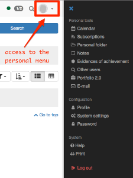
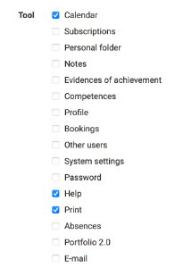

# Personal Menu

The personal tools can be displayed and set up more specifically via the drop-
down menu in the top right-hand corner. The tools that are available to a user
appear in Personal Tools.

  

Some tools can also be added to the quick access in the settings. Then they
appear directly in the upper navigation bar.

The following personal tools will be described briefly:

##  Calendar

In your personal calendar you can see your private events as well as events
regarding calendars of groups and courses. You can hide or unhide calendars
via the calendar list. Should your calendar remain empty or should certain
events not appear, it could be that you forgot to select that calendar in the
calendar list.

  

If you can't find the calendar among your personal tools, it was disabled by a
system administrator.

It is possible to create private entries. While only you can see and access
private entries, all registered OpenOlat users can see public entries
including all details on your calendar.

Further information on the calendar list, how to create entries and other
calendar functions is available in the [calendar](Calendar.md) chapter.

##  Subscriptions {: #subscriptions}

Thanks to OpenOlat's notifications you are always up-to-date regarding your
courses or groups. OpenOlat assists you in getting information on
modifications regarding subscribed objects. In order to get this information
you have to first determine the relevant objects you want to stay informed on.
You will be informed about e.g new documents in a folder, about answers to
forum entries or modified Wiki pages. In many places you can select the option
"Subscribe" within the relevant objects to be kept informed.

The following objects can be subscribed:  **Forum, Folder, Wiki, Task, File
discussion, Portfolios, Blog, Podcast, Participant-Folder, Notifications and
Video**. If you have the right to use the assessment tool you can be notified
in case of new incoming test results or new registered users.

OpenOlat will send you an appropriate e-mail once a day, and if the the Portal
is activated, news will be displayed immediately in the Portal under "My
Notifications". If you prefer to receive such messages more or less often or
not at all you can change this in the "Settings" in the tab "System". You will
also find your news in the personal menu under "Subscriptions". You can choose
to be shown any modifications within a certain period of time in the tab
"News" or you can choose to have sent those modifications once again via
e-mail. _The tab "_ Subscriptions _"_ provides you with a list of all
subscribed objects _._ You have also the possibility to get information on
modifications via RSS.

### News via RSS {: #rss}

**Why should I know what RSS is?:**

By means of RSS you will quickly and comfortably get information on
modifications of forums and folders you have subscribed to. Just one look and
you will see the titles of new entries as well as what has happend since your
last login. Furthermore, you will receive relevant links in order to get
directly to the new stuff in OpenOlat. All you need to get this service is the
Internet address of the RSS files provided for you and a so-called RSS reader.  
  
**Where do I find this address of a RSS file?:**

Click on the icon
A
new window will be opened. Ignore the page's content and copy the URL to the
temporary folder. Then paste the URL to your RSS reader.  
  
**How do I get a RSS reader?:**  
We suggest the the following search terms: _RSS reader_ , _RSS newsreader_ ,
_feedreader_ in order for you to find a suitable RSS reader  
  
 **For more information:**  
[__ Wikipedia](http://en.wikipedia.org/wiki/Rss_feed)

  

If you do not need your subscription any longer you can either unsubscribe it
(same place as "Subscribe") or you can select the option "Delete" in the
section "Subscriptions," right next to your resource. The subscription also
expires if you are no longer a member of the corresponding course or module
(directly or via a group).

##  Personal folder

OpenOlat provides you with storage space in your personal folder. You can, for
example, store presentations that you would like to access from another
computer, cache research work, etc. Further information can be found
[here](Personal_folders.md).

##  Notes

You can take notes in each course. You can collect and edit your notes before
even printing them.

##  Evidences of achievement

An evidence of achievement is a certification of some assessment, e.g. tests,
written examinations, or other tasks handed in to be reviewed. Course authors
determine if OpenOlat should create assessments in their course. Course
participants will see their evidences of achievement after taking a test, etc.
that has been assessed. If a certificate is provided along with an evidence of
achievement, you can view and download the certificate in the detailed view of
the respective evidence of achievement.

## Competences

Here the user gets an overview of all personal competencies assigned in
OpenOlat, e.g. in ePortfolio entries or as a competency in the user profile.

## Bookings

All of the user's course bookings are listed here, including additional
booking information.

##  Other users

Search for other OpenOlat users! Have a look at their visiting card, at the
"Public" area of their personal folder, at any released portfolio folders, or
send them a message by means of a contact form.

## Absences

If the "Absence Management" module is activated, users can view the absences
recorded for them at this point.

##  Portfolio 2.0

A Portfolio is used to document learning results as well as learning processes
and is therefore meant to assist in reflecting on someone's process of
development. The menu entry Portfolio 2.0 serves to create binders of
portfolios before making those accessible to certain people (OpenOlat users as
well as external people). You can also have a look at other users' portfolios
or perform portfolio tasks of an OpenOlat course. Further information you fin
in [creating portfolio](Creating+Portfolios.html)s.

 What's a reflection?

A reflection is an examination of passed events or ongoing processes and
should be unemotional. To reflect means to evaluate from a distance how e.g. a
task has been performed, how one has dealt with oneself, with a certain
situation, or how one has acted within a group, etc. When learning with
portfolios this kind of written reflection is very important. Each lerner has
to think about his or her own personal learning progress, about the amount of
interest or concern, as well as about how the knowledge acquired can be used.
Judgements such as "this was good, that wasn't interesting, etc." should not
be mentioned in reflections. A good reflection is an important step towards
learning with a high degree of personal responsibility.

Reflections can be altered later on. When linking an artefact in a folder you
can also edit its corresponding reflection in the table view, column
"Reflection."

##  E-mail

The "E-mails" section provides you with an overview of all your sent and
received E-mails. OpenOlat stores all E-mails and thus allows for an easy
navigation between different contexts.

