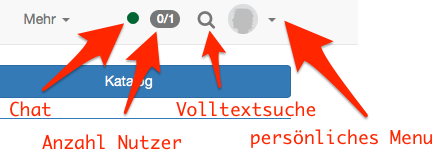

# :material-home: Persönliches Menü und allgemeine Funktionen

Nach dem Login gelangen Sie entweder auf Ihre persönliche Startseite in
OpenOlat, auf eine Infoseite, eine Seite die in der Regel generelle
Informationen zu verschiedenen Themen enthält, das Portal oder auf eine von
Ihnen festgelegte Startseite. In diesem Kapitel erfahren Sie, welche
Einstellungen Sie im persönlichen Menu vornehmen können, wie sie weitere
Funktionen wie Volltextsuche und Chat nutzen und wie Sie das Portal
individuell anpassen können. Falls Sie den Tab „Portal“ nicht sehen, wurde
diese Seite von ihrem Systemadministrator systemweit abgeschaltet.

!!! note "Quick Links"

    * [Persönliche Werkzeuge](Personal_Menu.de.md)
    * [Konfiguration](Configuration.de.md)
    * [Volltextsuche](Full-Text_Search.de.md)
    * [Chat](Chat.de.md)
    * [Portal konfigurieren](Portal_configuration.de.md)
    * [Mathematische Formel](Math_formula.de.md)
    * [mit Tabellen arbeiten](Working_with_tables.de.md)

## Navigationsleiste

In der oberen Navigationsleiste generell verfügbar ist der
[Chat](Chat.de.md) (instant Messnger).  Welche weiteren
Elemente in der Navigationsleiste rechts oben angezeigt werden, ist abhängig
von Ihren Einstellungen.

{ class="shadow aside-right lightbox"}

Im persönlichen Menü finden Sie die Bereiche [Persönliche
Werkzeuge,](Personal_Menu.de.md)
[Konfiguration](Configuration.de.md) und System. Je nach
unter "Einstellungen" ausgewählten Werkzeugen werden bestimmte persönliche
Tools in die obere Navigationsleiste verschoben oder bleiben über das
persönliche Menü aufrufbar.

Weitere Informationen zu den einzelnen Elementen finden Sie unter den
entsprechenden Links