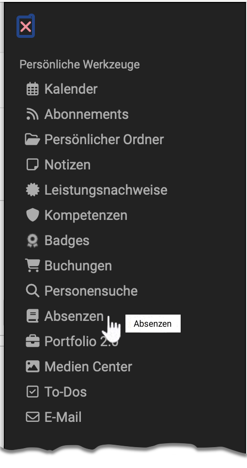
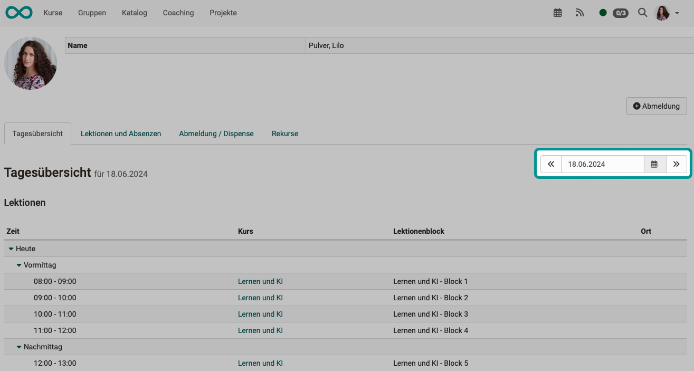
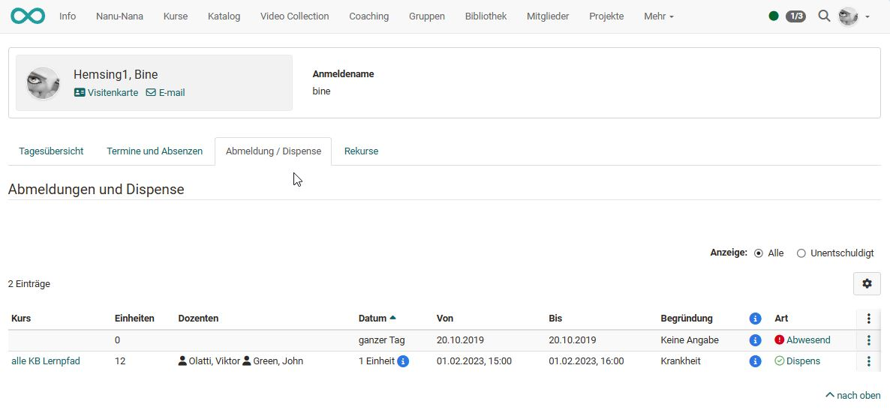
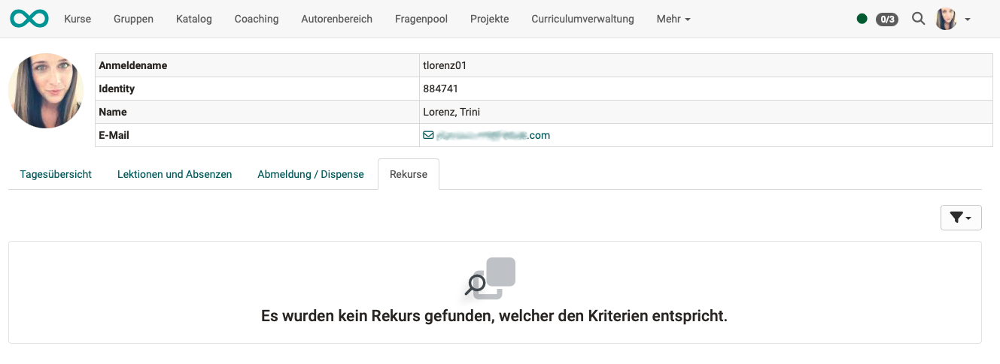

# Persönliche Werkzeuge: Absenzen

{ class="aside-right lightbox"}

Bei aktiviertem Absenzenmanagment sind im persönlichen Menü die Kurse ersichtlich, in denen das Absenzenmanagement verwendet wird. 

Es sind nicht nur Ihre persönlichen Absenzen in diesen Kursen (Lektionen) angzeigt, sondern der Übersicht halber auch alle Lektionen, die zum Gesamtprogramm der Kurse gehören und regulär zu besuchen wären. 

Ausserdem werden Ihnen Abmeldungen, Dispense und Rekurse angezeigt.

 

## Tab Tagesübersicht
Im Tab "Tagesübersicht" sehen Sie die Lektionen und eventuelle Absenzen des aktuellen Tages. 
Um einen anderen Tag anzuzeigen, wählen Sie rechts oben über der Tabelle den gewünschten Tag aus.

{ class="shadow lightbox"}

## Tab Lektionen und Absenzen

Sie erfahren hier, wie viele Lektionen pro Kurs erfasst sind und wie sich Ihre Anwesenheit bzw. Abwesenheit pro Kurs konkret verteilt.  Auch der bisherige **Fortschritt** wird angezeigt. Dabei steht grün für Anwesenheit in einer Lektion, orange für "entschuldigt" und rot für "unentschuldigt abwesend". 
Darüber hinaus können über die Option "**Details**" weitere Einzelheiten angezeigt werden.  In der **Spalte mit dem Warndreieck** erscheint ein rotes Ausrufezeichen, wenn die Anwesenheitsquote unter das geforderte Minimum fällt.

{ class="shadow lightbox"}

## Tab Abmeldung / Dispense

Von Administrator:innen kann erlaubt werden (unter: Administration > Module > Lektionen), dass sich Teilnehmer:innen auch selbst abmelden können. Es erscheint dann der Button "Abmeldung" im Tab "Abmeldung / Dispense". Ansonsten werden in dieser Liste nur die von Betreuer:innen erfassten Abwesenheiten angezeigt. 

{ class="shadow lightbox"}

## Tab Rekurse

Hier sind die eigenen Rekurse aufgelistet. Wer ausser Ihnen sonst noch Ihre Rekurse einsehen darf (Dozierende, Klassenlehrer), wird durch Administrator:innen bestimmt.

{ class="shadow lightbox"}

## Weitere Informationen

[Lektionen und Absenzen](../learningresources/Lectures_and_absences.de.md) 
[Lektionen und Absenzen aus Sicht Kursbesitzer:in](../learningresources/Lectures_Teacher_view.de.md) 
[Lektionen aus Sicht der Benutzer:innen](../learningresources/Lectures_User_view.de.md) 
[Lektionen aus Sicht der Betreuer:innen](../area_modules/coaching_lektionen.de.md) 
[Lektionen- und Absenzenmanagement aus Sicht Administration](../../manual_admin/administration/Lecture_and_roll_call_management.de.md) 

