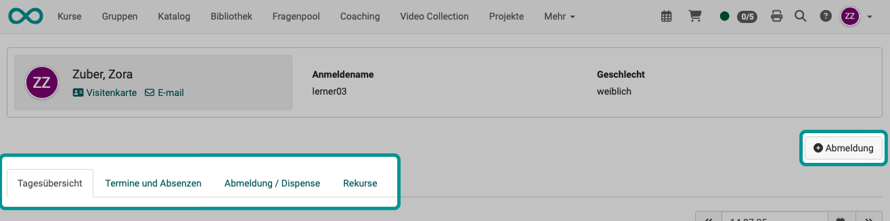
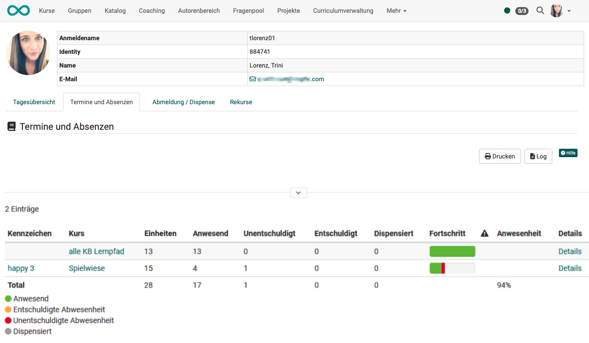

# Persönliche Werkzeuge: Absenzen {: #pers_tools_absences}

{ class="aside-right lightbox"}

Bei aktiviertem Absenzenmanagment sind im persönlichen Menü die Kurse ersichtlich, in denen das Absenzenmanagement verwendet wird. Alle Benutzer:innen können ihre eigenen Absenzen dort ansehen und bearbeiten, soweit erlaubt.

Es sind nicht nur Ihre persönlichen Absenzen in diesen Kursen (Termine) angezeigt, sondern der Übersicht halber auch alle Termine, die zum Gesamtprogramm der Kurse gehören und regulär zu besuchen wären. 

Ausserdem werden Ihnen Abmeldungen, Dispense und Rekurse angezeigt.

Die Ansichten können in 4 Tabs abgerufen werden. In jedem Tab wird der Button für eine Abmeldung aus Eigeninitiative angezeigt.

{ class="shadow lightbox" }

## Tab Tagesübersicht {: #tab_overview}
Im Tab "Tagesübersicht" sehen Sie die Termine und eventuelle Absenzen des aktuellen Tages. 
Um einen anderen Tag anzuzeigen, wählen Sie rechts oben über der Tabelle den gewünschten Tag aus.

{ class="shadow lightbox"}

[Zum Seitenanfang ^](#pers_tools_absences)

---

## Tab Termine und Absenzen {: #tab_events_absences}

Sie erfahren hier, wie viele Termine pro Kurs erfasst sind und wie sich Ihre Anwesenheit bzw. Abwesenheit pro Kurs konkret verteilt.  Auch der bisherige **Fortschritt** wird angezeigt. Dabei steht grün für Anwesenheit in einer Einheit, orange für "entschuldigt" und rot für "unentschuldigt abwesend". 
Darüber hinaus können über die Option "**Details**" weitere Einzelheiten angezeigt werden.  In der **Spalte mit dem Warndreieck** erscheint ein rotes Ausrufezeichen, wenn die Anwesenheitsquote unter das geforderte Minimum fällt.

{ class="shadow lightbox"}

[Zum Seitenanfang ^](#pers_tools_absences)

---

## Tab Abmeldung / Dispense {: #tab_notices_dispensation}

Von Administrator:innen kann erlaubt werden (unter: Administration > Module > Termine/Absenzen), dass sich Teilnehmer:innen auch selbst abmelden können. Es erscheint dann rechts oben der Button "Abmeldung". Ansonsten werden in dieser Liste nur die von Betreuer:innen erfassten Abwesenheiten angezeigt. 

{ class="shadow lightbox"}

[Zum Seitenanfang ^](#pers_tools_absences)

---

## Tab Rekurse {: #tab_appeals}

Hier sind die eigenen Rekurse aufgelistet. Wer ausser Ihnen sonst noch Ihre Rekurse einsehen darf (Dozierende, Klassenlehrer), wird durch Administrator:innen bestimmt.

{ class="shadow lightbox"}

Wenn ein:e Teilnehmer:in mit der eingetragenen Absenz nicht einverstanden ist, kann ein Rekurs eingereicht werden. Nachdem der Termin zu Ende ist, erscheint ein Datum, ab welchem der Rekurs eingereicht werden kann. Dies wird berechnet aus der Endzeit des Termins plus die Tage der Sperrfrist. Sobald ein Termin automatisch (nach Ende der Sperrfrist) oder manuell durch den Dozenten (Kursbetreuer) auf "Erledigt" gesetzt worden ist, erscheint ein neues Datum, bis zu welchem der Rekurs eingereicht werden kann. Anschliessend wird "Geschlossen" angezeigt. Die Fristen werden systemweit in der Administration hinterlegt. Der Rekursantrag wird an die Dozenten des entsprechenden Termins gesendet.

[Zum Seitenanfang ^](#pers_tools_absences)

---

## Weitere Informationen {: #further_information}

[Basiskonzept Termine und Absenzen >](../basic_concepts/Events_and_Absences.de.md) 
[Aktivierung und Konfiguration des Absenzenmanagements durch Administrator:innen >](../../manual_admin/administration/Modules_Events_and_Absences.de.md) 
[Konfiguration der Absenzenverwaltung in einem Kurs >](../learningresources/Course_Settings_Execution.de.md#config_event_and_absence_management) 
[Erfassung und Verwaltung der Absenzen in einem Kurs durch Kursbesitzer:innen >](../learningresources/Events_and_absences.de.md) 
[Erfassung und Verwaltung der Absenzen in einem Kurs durch Betreuer:innen >](../learningresources/Toolbar_Events.de.md) 
[Kursübergreifende Absenzenerfassungung im Coachingtool >](../area_modules/Coaching.de.md) 
[Kursübergreifende Absenzenverwaltung durch Absenzenverwalter:innen>](../area_modules/Absence_Management.de.md) 

[Zum Seitenanfang ^](#pers_tools_absences)

