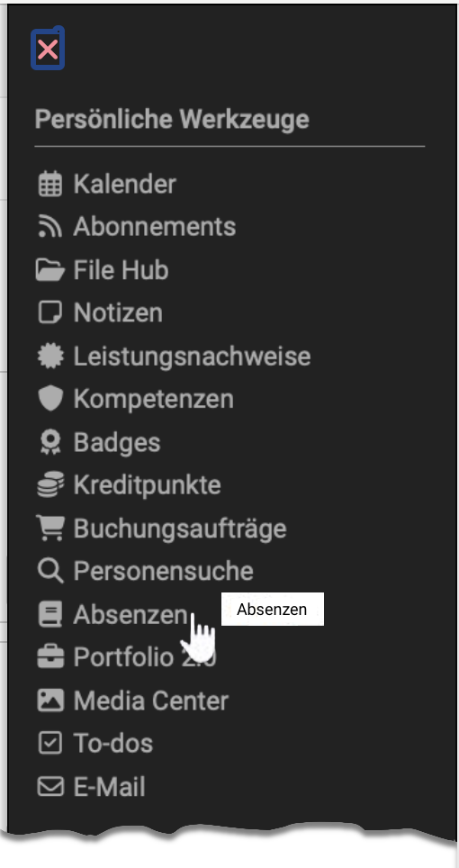
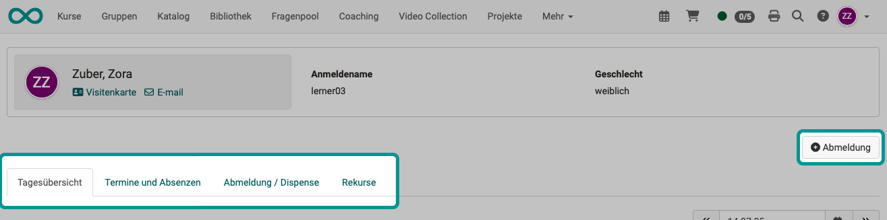
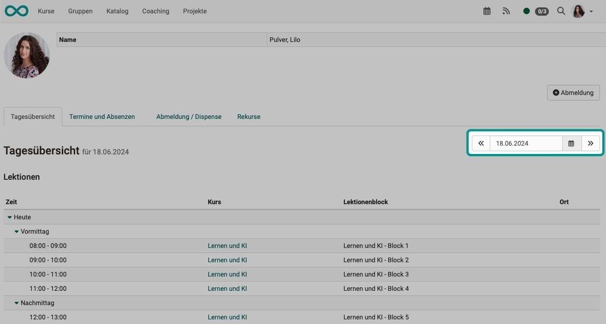
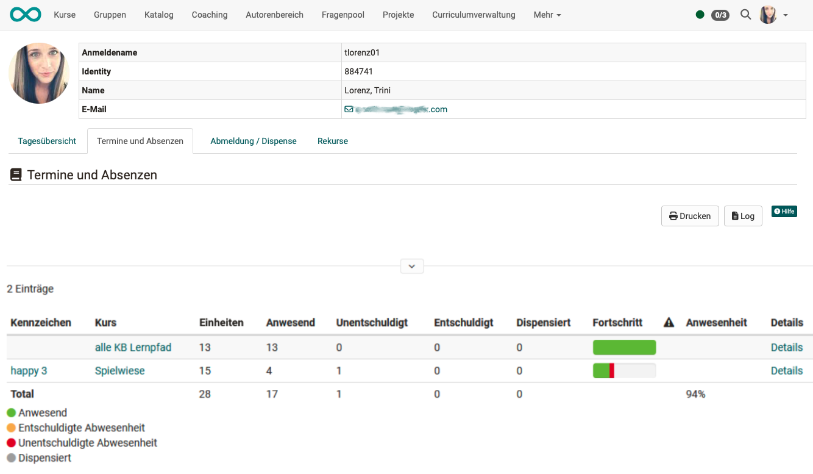
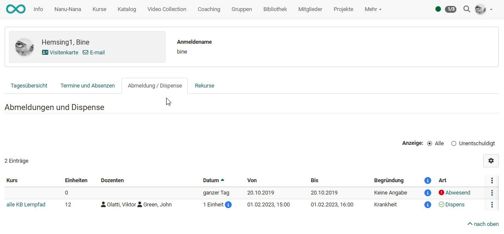
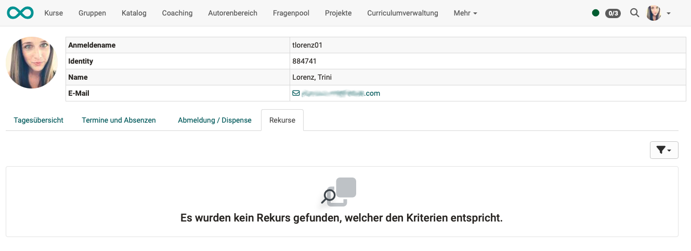

# Persönliche Werkzeuge: Absenzen {: #pers_tools_absences}

{ class="aside-right lightbox"}

{ class="shadow lightbox" }

Ist das Modul Termine und Absenzen eingeschaltet, sehen Sie im persönlichen Menü unter "Absenzen" die Kurse, in denen das Absenzenmanagement verwendet wird. Alle Benutzer:innen können dort ihre eigenen Absenzen ansehen und, soweit erlaubt, bearbeiten.

Angezeigt werden nicht nur Ihre persönlichen Absenzen in diesen Kursen (Termine), sondern der Übersicht halber auch alle Termine, die zum Gesamtprogramm der Kurse gehören und regulär zu besuchen wären.

Ausserdem werden Ihnen Abmeldungen, Dispense und Rekurse angezeigt.

Die Ansichten sind auf bis zu vier Tabs verteilt. Die Tabs "Abmeldung / Dispense" und "Rekurse" erscheinen nur, wenn Administrator:innen Abmeldungen bzw. Rekurse eingeschaltet haben. Oberhalb der Tabs steht der Button "Abmeldung", sofern Teilnehmer:innen sich selbst abmelden dürfen (siehe Tab Abmeldung / Dispense).

{ class="shadow lightbox" }

## Tab Tagesübersicht {: #tab_overview}

Im Tab "Tagesübersicht" sehen Sie die Termine und eventuelle Absenzen des aktuellen Tages. Um einen anderen Tag anzuzeigen, wählen Sie rechts oben über der Tabelle den gewünschten Tag aus.

{ class="shadow lightbox"}

[Zum Seitenanfang ^](#pers_tools_absences)

---

## Tab Termine und Absenzen {: #tab_events_absences}

Sie erfahren hier, wie viele Termine pro Kurs erfasst sind und wie sich Ihre Anwesenheit bzw. Abwesenheit pro Kurs konkret verteilt. Auch der bisherige **Fortschritt** wird angezeigt. Dabei steht grün für Anwesenheit in einer Einheit, orange für "entschuldigt", rot für "unentschuldigt abwesend" und grau für "dispensiert". Darüber hinaus können über die Option "**Details**" weitere Einzelheiten angezeigt werden. In der **Spalte mit dem Warndreieck** erscheint ein rotes Ausrufezeichen, wenn die Anwesenheitsquote unter das geforderte Minimum fällt. Oberhalb der Tabelle finden Sie die Buttons "Drucken" und "Log".

{ class="shadow lightbox"}

[Zum Seitenanfang ^](#pers_tools_absences)

---

## Tab Abmeldung / Dispense {: #tab_notices_dispensation}

Administrator:innen können in der System-Administration unter `Administration > Module > Termine / Absenzen`, Tab "Berechtigungen", die Option "Teilnehmer:innen dürfen sich abmelden" einschalten. Dann erscheint rechts oben der Button "Abmeldung", über den Sie sich selbst von Terminen abmelden. Ansonsten zeigt diese Liste nur die Abmeldungen und Dispense, die Dozent:innen oder Absenzenverwalter:innen für Sie erfasst haben.

{ class="shadow lightbox"}

[Zum Seitenanfang ^](#pers_tools_absences)

---

## Tab Rekurse {: #tab_appeals}

Hier sind die eigenen Rekurse aufgelistet. Wer ausser Ihnen sonst noch Ihre Rekurse einsehen darf (Dozent:innen, Klassenlehrer:innen), wird durch Administrator:innen bestimmt.

{ class="shadow lightbox"}

Sind Sie mit einer eingetragenen Absenz nicht einverstanden, können Sie einen Rekurs einreichen. Nach dem Ende des Termins erscheint das Datum, ab dem der Rekurs möglich ist: die Endzeit des Termins plus die Tage der Sperrfrist. Sobald der Termin automatisch (nach Ablauf der Sperrfrist) oder manuell durch die Dozent:innen auf "Erledigt" gesetzt ist, erscheint das Datum, bis zu dem der Rekurs eingereicht werden kann (Rekursfrist). Anschliessend wird "Geschlossen" angezeigt. Sperrfrist und Rekursfrist legen Administrator:innen systemweit fest, in der System-Administration unter `Administration > Module > Termine / Absenzen`, Tab "Konfiguration". Der Rekurs wird an die Dozent:innen des Termins gesendet.

[Zum Seitenanfang ^](#pers_tools_absences)

---

## Weiterführende Informationen {: #further_information}

**Weiterführend** 
[Termine und Absenzen (Basiskonzept) >](../basic_concepts/Events_and_Absences.de.md) 
[Modul Termine und Absenzen >](../../manual_admin/administration/Modules_Events_and_Absences.de.md) 
[Kurseinstellungen - Tab Durchführung >](../learningresources/Course_Settings_Execution.de.md) 
[Termine und Absenzen (Kurs) >](../learningresources/Events_and_absences.de.md) 
[Toolbar: Termine >](../learningresources/Toolbar_Events.de.md) 
[Coaching - Termine und Absenzen >](../area_modules/Coaching_Events_Absences.de.md) 
[Coaching - Übersicht >](../area_modules/Coaching.de.md) 
[Absenzenverwaltung >](../area_modules/Absence_Management.de.md)

[Zum Seitenanfang ^](#pers_tools_absences)
