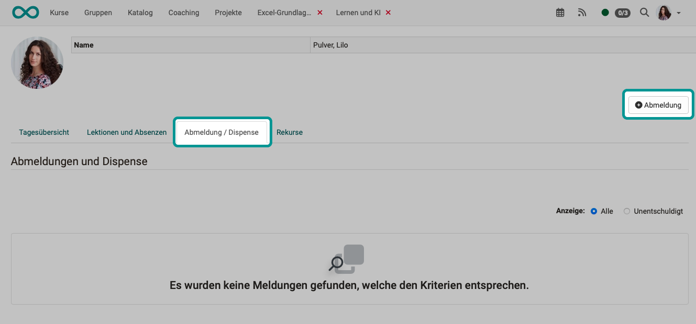

# Personal tools: Absences

{ class="aside-right lightbox"}

If absence management is activated, the courses in which absence management is used can be seen in the personal menu. 

Not only are your personal absences from these courses (lessons) shown, but for the sake of clarity also all lessons that are part of the overall course program and should have been attended regularly. 

You will also be shown deregistrations, dispensations and appeals.

 

## Tab Daily overview
In the "Daily overview" tab, you can see the lessons and any absences for the current day. 
To display a different day, select the desired day at the top right of the table.

{ class="shadow lightbox"}

## Tab Lessons and absences

Here you can find out how many lessons are recorded per course and how your attendance or absence per course is actually distributed.   The **progress** to date is also displayed. Green stands for attendance in a lesson, orange for "excused" and red for "unexcused absence". 
In addition, further details can be displayed using the "**Details**" option.   A red exclamation mark appears in the **column with the warning triangle** if the attendance rate falls below the required minimum.

{ class="shadow lightbox"}

## Tab Deregistration / Dispense

Administrators can allow participants to unsubscribe themselves (under: Administration > Modules > Lessons). The "Deregistration" button then appears in the "Deregistration / Dispense" tab. Otherwise, only the absences recorded by coaches are displayed in this list.  

{ class="shadow lightbox"}

## Tab Appeals

Your own appeals are listed here. Who else is allowed to view your appeals (lecturers, class teachers) is determined by the administrator.

{ class="shadow lightbox"}

## Further information

[Lectures and absences](../learningresources/Lectures_and_absences.md) 
[Lectures Teacher view](../learningresources/Lectures_Teacher_view.md) 
[Lectures User view](../learningresources/Lectures_User_view.md) 
[Lectures Coach view](../area_modules/coaching_lektionen.md) 
[Lecture and roll call management](../../manual_admin/administration/Lecture_and_roll_call_management.md) 

