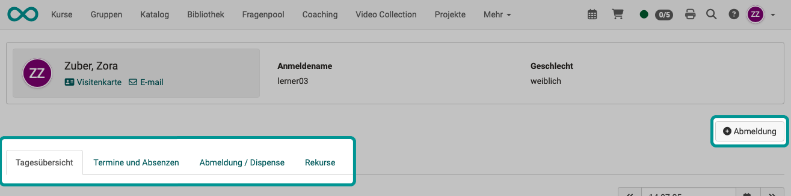
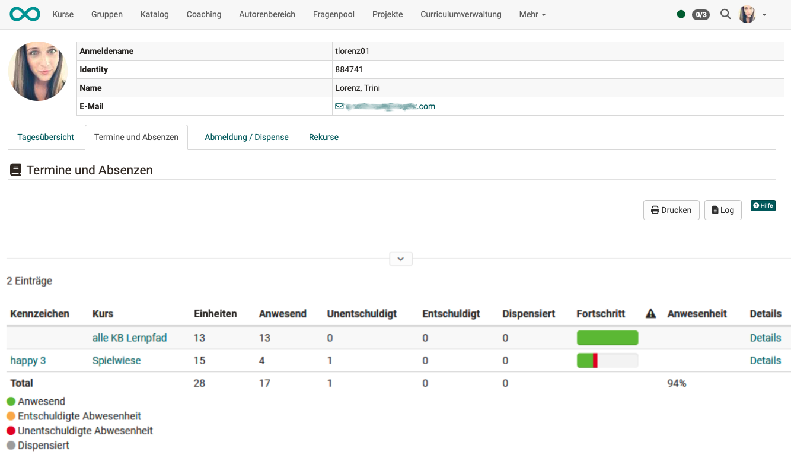
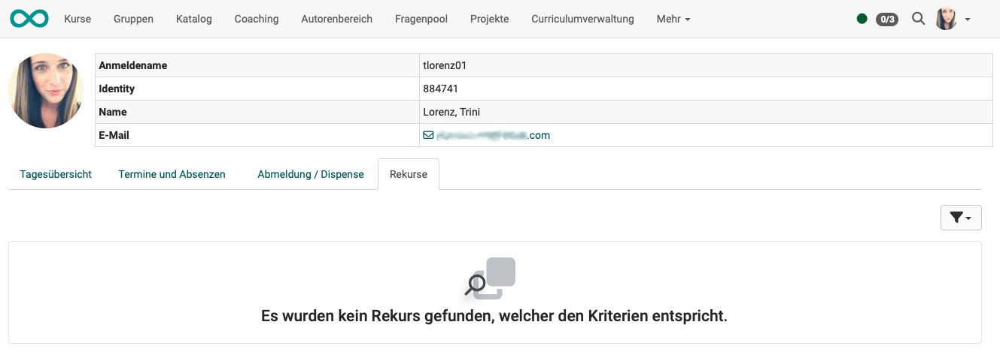

# Personal tools: Absences {: #pers_tools_absences}

{ class="aside-right lightbox"}

When absence management is activated, the courses in which absence management is used are visible in the personal menu. All users can view and edit their own absences there, if permitted.

Not only are your personal absences from these courses (dates) displayed, but for the sake of clarity, all dates that are part of the overall course program and would normally be attended are also displayed.

You will also be shown deregistrations, dispensations and appeals.

The views can be accessed in 4 tabs. Each tab displays a button for unsubscribing on your own initiative.

{ class="shadow lightbox" }

## Tab Daily overview {: #tab_overview}
In the "Daily overview" tab, you can see the events and any absences for the current day. 
To display a different day, select the desired day at the top right of the table.

{ class="shadow lightbox"}

[To the top of the page ^](#pers_tools_absences)

---

## Tab Events and Absences {: #tab_events_absences}

Here you can find out how many events are recorded per course and how your attendance or absence per course is actually distributed.   The **progress** to date is also displayed. Green stands for attendance in a lesson, orange for "excused" and red for "unexcused absence". 
In addition, further details can be displayed using the "**Details**" option.   A red exclamation mark appears in the **column with the warning triangle** if the attendance rate falls below the required minimum.

{ class="shadow lightbox"}

[To the top of the page ^](#pers_tools_absences)

---

## Tab Notices / Dispensation {: #tab_notices_dispensation}

Administrators can allow participants to unsubscribe themselves (under: Administration > Modules > Events/Absences). The "Log out" button will then appear in the top right corner. Otherwise, only the absences recorded by coaches will be displayed in this list.  

{ class="shadow lightbox"}

[To the top of the page ^](#pers_tools_absences)

---

## Tab Appeals {: #tab_appeals}

Your own appeals are listed here. Who else is allowed to view your appeals (lecturers, class teachers) is determined by the administrator.

{ class="shadow lightbox"}

If a participant disagrees with the recorded absence, an appeal can be lodged. Once the appointment has ended, a date will appear from which the appeal can be lodged. This is calculated from the end time of the appointment plus the number of days of the blocking period. As soon as a deadline has been set to "Completed" automatically (after the end of the blocking period) or manually by the lecturer (course coach), a new date appears by which the appeal can be submitted. Subsequently, "Closed" is displayed. The deadlines are stored system-wide in the administration. The appeal application is sent to the lecturers of the corresponding deadline. 

[To the top of the page ^](#pers_tools_absences)

---

## Further information {: #further_information}

[Events and absences >](../learningresources/Events_and_absences.md) 
[Events and absences: Course owner view >](../learningresources/Events_and_absences_Teacher_view.md) 
[Events and absences: User view >](../learningresources/Events_and_absences_User_view.md) 
[Events and absences: Coach view >](../area_modules/coaching_lektionen.md) 
[Absence management >](../area_modules/Absence_Management.md) 
[Configuration of events and absences in the administration >](../../manual_admin/administration/Modules_Events_and_Absences.md) 

[To the top of the page ^](#pers_tools_absences)
