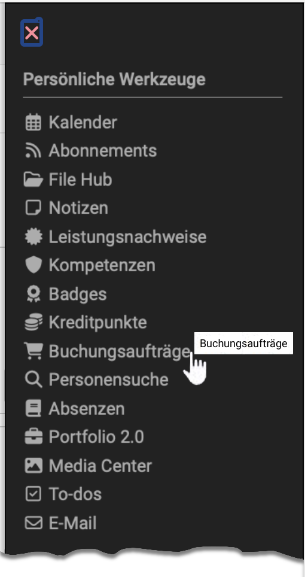
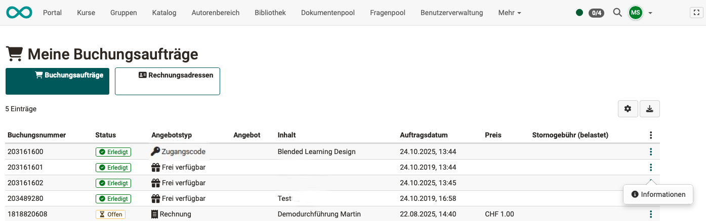

# Persönliche Werkzeuge: Buchungsaufträge {: #bookings}

{ class="aside-right lightbox"}

Unter "Buchungsaufträge" im Bereich "Persönliche Werkzeuge" finden OpenOlat Nutzer:innen eine Übersicht all ihrer gebuchten Kurse und Lernressourcen. Dabei erscheinen nur die Kurse und Lernressourcen, die auch mit einer [Angebotsart](../learningresources/Access_configuration.de.md), z.B. mit einem Kurscode verknüpft sind und vom Nutzer bzw. der Nutzerin gebucht wurden (Selbstregistrierung). Buchen kann dabei als Synonym für "belegen", "einschreiben" oder "einkaufen" verstanden werden.

Lernressourcen bei denen die Besitzer:innen die Teilnehmenden manuell eintragen oder die Lernende über eine Gruppe zugeordnet werden, erscheinen hier *nicht*. 

{ class="shadow lightbox }

Wählen Sie über das Zahnrad die Spalten aus, die Sie sehen möchten, z.B. den Angebotstyp (Code, frei verfügbar, PayPal) und den Titel des Angebots (= Inhalt). OpenOlat legt bei Buchung automatisch eine Buchungsnummer an, unter der diese Kursteilnahme verwaltet wird. Diese ist ebenfalls hier ersichtlich.

Über das Icon rechts neben dem Zahnrad können Sie alle Buchungen downloaden. Des Weiteren können über das 3-Punkte-Menü die vorhandenen Infos zu einer konkreten Buchung gebündelt angezeigt werden.
Sind für die einzelnen Buchungen Rechnungsadressen von den OpenOlat [Administrator:innen](../../manual_admin/administration/Modules_Organisations.de.md) hinterlegt, können diese im Reiter Rechnungsadressen ausgelesen werden. 

Die Möglichkeit zur Buchung erscheint ferner im [Katalog](../area_modules/catalog2.0_angebote.de.md##wie-wird-ein-angebot-erstellt), sofern das entsprechendes Angebot/die Lernressource dort veröffentlicht wurde.

## Weitere Informationen {: #further_information}

[Angebotsart >](../learningresources/Access_configuration.de.md#status-der-veroffentlichung) 
[Mitglieder zu Kursen hinzufügen >](../learningresources/Members_management.de.md#mitglieder-hinzufugen) 
[Angebote im Katalog >](../area_modules/catalog2.0_angebote.de.md##wie-wird-ein-angebot-erstellt) 

[Zum Seitenanfang ^](#bookings)
