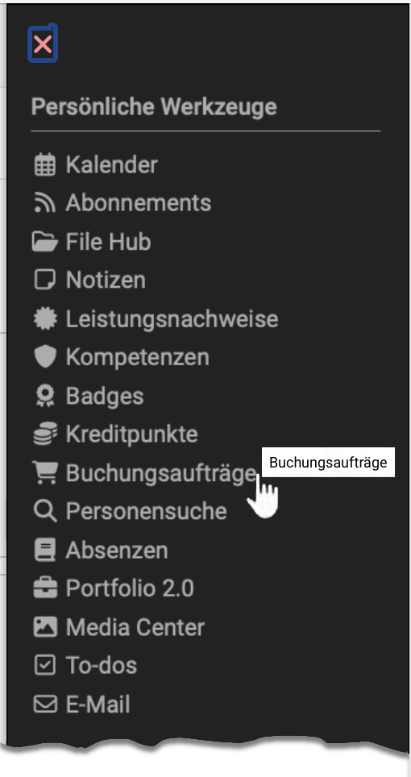
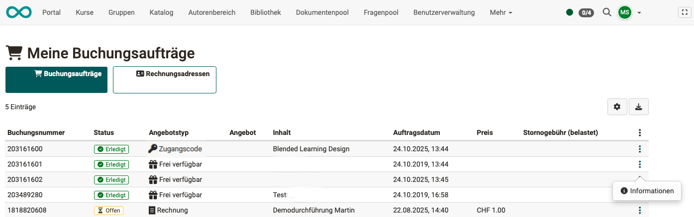

# Persönliche Werkzeuge: Buchungsaufträge {: #bookings}

{ class="aside-right lightbox"}

Unter "Buchungsaufträge" im Bereich "Persönliche Werkzeuge" finden Benutzer:innen eine Übersicht all ihrer gebuchten Kurse und Lernressourcen. Dabei erscheinen nur die Kurse und Lernressourcen, die mit einer [Angebotsart](../learningresources/Access_configuration.de.md) verknüpft sind, z.B. mit einem Zugangscode, und die Benutzer:innen selbst gebucht haben. Buchen kann dabei als Synonym für "belegen", "einschreiben" oder "einkaufen" verstanden werden.

Lernressourcen, bei denen die Besitzer:innen die Teilnehmenden manuell eintragen oder bei denen Teilnehmende über eine Gruppe zugeordnet werden, erscheinen hier *nicht*.

{ class="shadow lightbox" }

Wählen Sie über das Zahnrad die Spalten aus, die Sie sehen möchten, z.B. den Angebotstyp ("Zugangscode", "Frei verfügbar", "Rechnung", PayPal), das Angebot und den Inhalt (die gebuchte Lernressource). OpenOlat legt bei jeder Buchung automatisch eine Buchungsnummer an, unter der dieser Buchungsauftrag verwaltet wird. Diese ist ebenfalls hier ersichtlich.

Über das Download-Icon rechts neben dem Zahnrad laden Sie alle Buchungsaufträge als Tabelle herunter. Über das 3-Punkte-Menü einer Buchung zeigen Sie die Detailinformationen zu diesem Buchungsauftrag an.

Ist die Angebotsart "Rechnung" eingeschaltet, erscheint zusätzlich der Tab "Rechnungsadressen". Dort sehen Sie die Rechnungsadressen, die für Ihre Buchungen hinterlegt sind. Rechnungsadressen von Organisationen pflegen [Administrator:innen](../../manual_admin/administration/Modules_Organisations.de.md).

Die Möglichkeit zur Buchung erscheint ferner im [Katalog](../area_modules/catalog2.0_angebote.de.md#offers_create), sofern das entsprechende Angebot dort veröffentlicht wurde.

## Weiterführende Informationen {: #further_information}

[Zugangskonfiguration / Freigabe >](../learningresources/Access_configuration.de.md) 
[Modul Organisationen >](../../manual_admin/administration/Modules_Organisations.de.md) 
[Katalog 2.0 - Angebote >](../area_modules/catalog2.0_angebote.de.md) 
[Mitgliederverwaltung >](../learningresources/Members_management.de.md)

[Zum Seitenanfang ^](#bookings)
