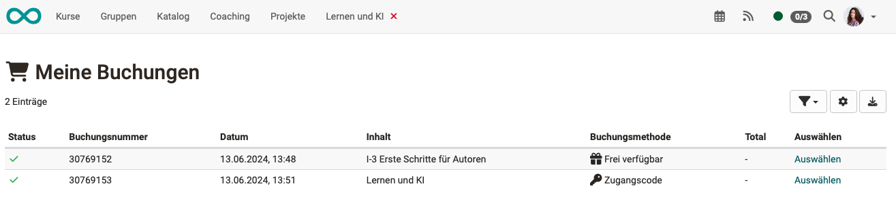

# Persönliche Werkzeuge: Buchungen

{ class="aside-right lightbox"}

Wenn OpenOlat-Nutzer:innen als Mitglieder einem Kurs zugeordnet werden, kann dies geschehen

-  durch Kursbesitzer bzw. Personen, die über das Recht der Mitgliederverwaltung verfügen.  ([Kursadministration > Mitgliederverwaltung](../learningresources/Members_management.de.md#mitglieder-hinzufugen))
- durch Selbstregistration (**Buchung**) der Teilnehmer:innen. Buchen kann dabei als Synonym für "belegen", "einschreiben" oder "einkaufen" verstanden werden.

Um eine Übersicht zu erhalten, in welche Kurse man eingebucht ist, gibt es im persönlichen Menü eine Liste aller aktuell gebuchten Kurse.

{ class="shadow lightbox"}

Alle Buchungen des Benutzers werden hier inklusive weiterer Buchungsinformationen aufgelistet.
So ist z.B. ersichtlich, welche **Buchungsmethode** gewählt wurde.

- **Zugangscode**  
 Nur Personen, die über einen Zugangscode verfügen, können buchen. Vor dem ersten Öffnen muss dieser Code von dem/der Benutzer:in eingegeben werden. Auch eine zeitliche Begrenzung der Buchung mit dem Zugangscode kann definiert werden.
- **Frei verfügbar** 
Ein Zutritt ist ohne Passwort möglich. Alle Systembenutzer können die Ressource buchen und werden so als Teilnehmer:in hinzugefügt. Der freie Zugang kann zeitlich begrenzt werden.
- **PayPal** 
(Nur verfügbar, wenn vom Administrator freigeschaltet)

OpenOlat legt bei Buchung eine Buchungsnummer an, unter der diese Kursteilnahme verwaltet wird.

Die Möglichkeit zur Buchung kann z.B. im [Katalog](../area_modules/catalog2.0_angebote.de.md##wie-wird-ein-angebot-erstellt) angeboten werden, indem dort ein entsprechendes Angebot veröffentlicht wird.

## Weitere Informationen

[Buchungsmethoden](../learningresources/Access_configuration.de.md#status-der-veroffentlichung) 
[Mitglieder zu Kursen hinzufügen](../learningresources/Members_management.de.md#mitglieder-hinzufugen) 
[Angebote im Katalog](../area_modules/catalog2.0_angebote.de.md##wie-wird-ein-angebot-erstellt) 

