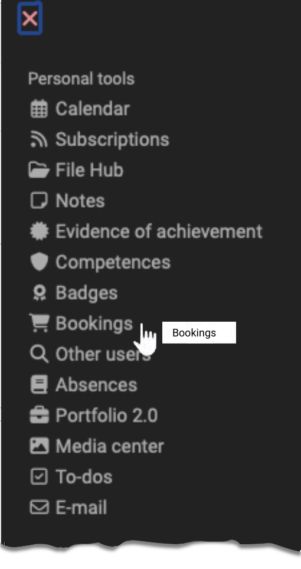

# Personal tools: Bookings {: #bookings}

{ class="aside-right lightbox"}

Under "Booking requests" in the "Personal tools" section, OpenOlat users can find an overview of all their booked courses and learning resources. 
Only those courses and learning resources appear that are also linked to a [booking method](../learningresources/Access_configuration.md), e.g. with a course code, and have been booked by the user (self-registration). Booking can be understood as a synonym for "enroll", "register" or "purchase".

Learning resources where the owners enter the participants manually or the learners are assigned via a group do *not* appear here.

{ class="shadow lightbox"}

Use the cogwheel to select the columns you want to see, e.g. the offer type (code, freely available, PayPal) and the title of the offer (= content). When a booking is made, OpenOlat automatically creates a booking number under which this course participation is managed. This can also be seen here.

You can download all bookings via the icon to the right of the cogwheel. Furthermore, the 3-dot menu can be used to display the available information on a specific booking in a bundle.
If the OpenOlat [Administrator](../../manual_admin/administration/Modules_Organizations.md) has stored invoice addresses for the individual bookings, these can be read out in the Invoice addresses tab.

The option to book will also appear in the [catalog](../area_modules/catalog2.0_angebote.md##how-we-create-an-offer), provided that the corresponding offer/learning resource has been published there.

## Further information {: #further_information}

[Booking methods >](../learningresources/Access_configuration.md#publication-status) 
[Add members to a course >](../learningresources/Members_management.md#adding-members) 
[Offers in a catalog >](../area_modules/catalog2.0_angebote.md#how-is-an-offer-created) 

