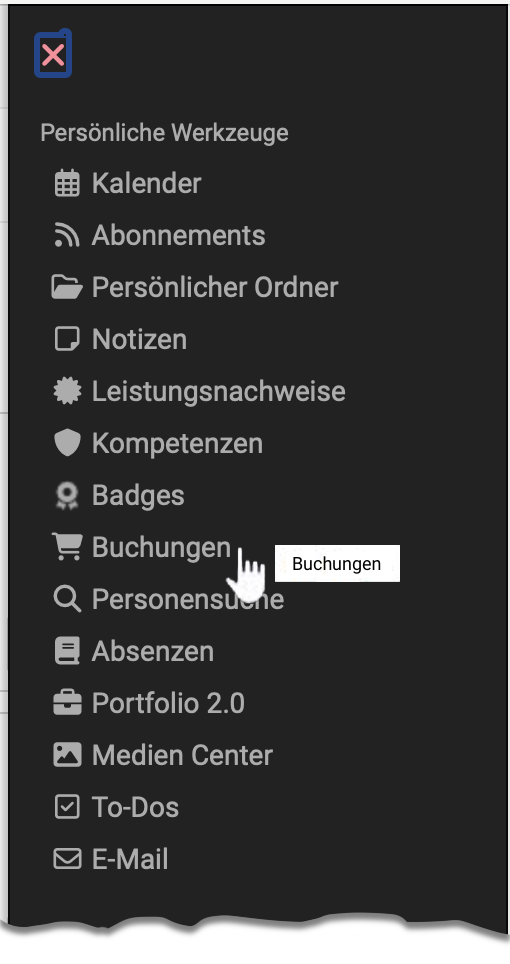
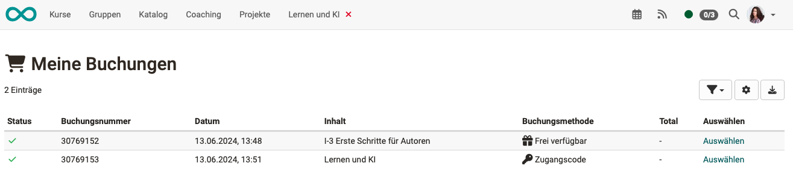

# Personal tools: Bookings

{ class="aside-right lightbox"}

If OpenOlat users are assigned to a course as members, this can be done

- by course owners or persons who have the right to manage members.   ([Course administration > Members management](../learningresources/Members_management.md#adding-members))
- through self-registration (**booking**) by the participants. Booking can be understood as a synonym for "booking", "registering" or "purchasing".

To get an overview of which courses you are enrolled in, there is a list of all currently booked courses in the personal menu.

{ class="shadow lightbox"}

All of the user's bookings are listed here, including further booking information.
For example, you can see which **booking method** has been selected.

- **Access code** 
  Only persons who have an access code can book. This code must be entered by the user before the first opening. A time limit for booking with the access code can also be defined.
- **Available for free** 
  Access is possible without a password. All system users can book the resource and are thus added as participants. Free access can be limited in time.
- **PayPal** 
  (Only available if enabled by the administrator)

OpenOlat creates a booking number at the time of booking, under which this course participation is managed.

The possibility of booking can be offered, for example, in the [catalog](../area_modules/catalog2.0_angebote.md#how-is-an-offer-created) by publishing a corresponding offer there.

## Further information

[Booking methods](../learningresources/Access_configuration.md#publication-status) 
[Add members to a course](../learningresources/Members_management.md#adding-members) 
[Offers in a catalog](../area_modules/catalog2.0_angebote.md#how-is-an-offer-created) 

