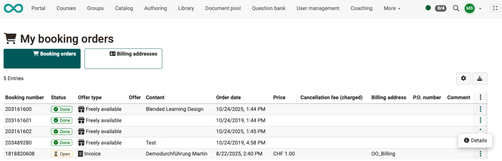

# Personal tools: Booking orders {: #bookings}

{ class="aside-right lightbox"}

Under "Booking orders" in the "Personal tools" section, users find an overview of all their booked courses and learning resources. Only those courses and learning resources appear that are linked to an [offer type](../learningresources/Access_configuration.md), e.g. an access code, and that the users booked themselves. Booking can be understood as a synonym for "enroll", "register" or "purchase".

Learning resources where the owners enter the participants manually, or where participants are assigned via a group, do *not* appear here.

{ class="shadow lightbox" }

Use the cogwheel to select the columns you want to see, e.g. the offer type ("Access code", "Freely available", "Invoice", PayPal), the offer and the content (the booked learning resource). With every booking, OpenOlat automatically creates a booking number under which this booking order is managed. This number is also shown here.

Use the download icon to the right of the cogwheel to download all booking orders as a table. Use the 3-dot menu of a booking to display the detail information on this booking order.

If the offer type "Invoice" is enabled, the additional tab "Billing addresses" appears. There you see the billing addresses stored for your bookings. [Administrators](../../manual_admin/administration/Modules_Organisations.md) maintain the billing addresses of organisations.

The option to book also appears in the [catalog](../area_modules/catalog2.0_angebote.md#offers_create), provided that the corresponding offer has been published there.

## Further information {: #further_information}

[Access configuration >](../learningresources/Access_configuration.md) 
[Module Organisations >](../../manual_admin/administration/Modules_Organisations.md) 
[Catalog 2.0 - Offers >](../area_modules/catalog2.0_angebote.md) 
[Members management >](../learningresources/Members_management.md)

[To the top of the page ^](#bookings)
