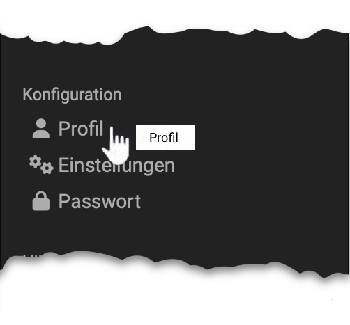
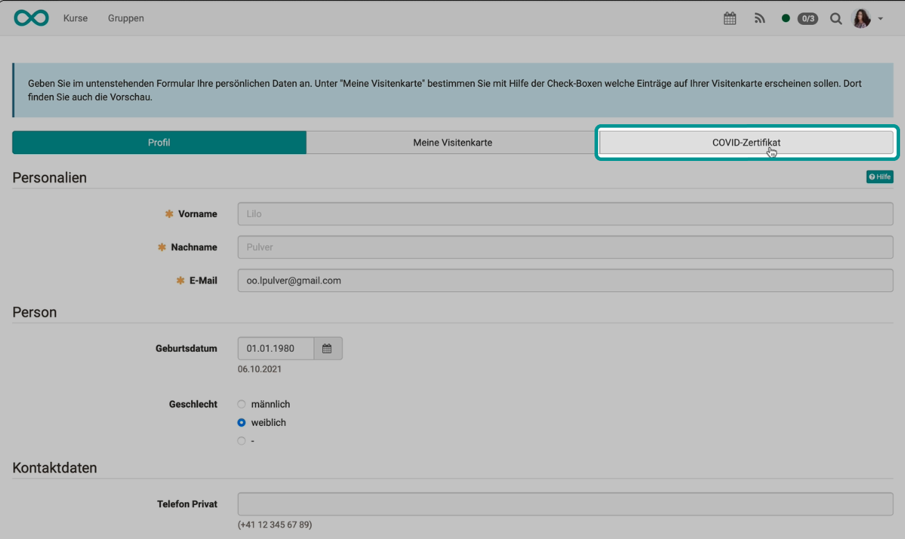
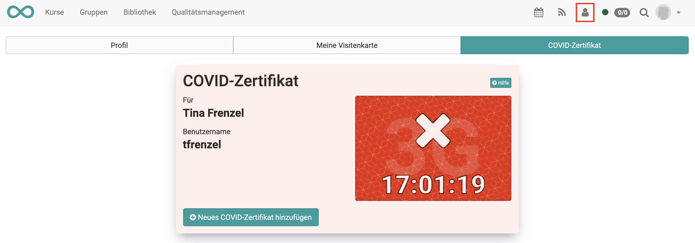

# Persönliche Konfiguration: COVID-Zertifikat {: #covid_certificate}

{ class="aside-right lightbox"}

Sofern Administrator:innen das COVID-Zertifikat in der System-Administration unter `Administration > Module > COVID-Zertifikat` aktiviert haben, finden Benutzer:innen im persönlichen Menü unter "Profil" den Tab "COVID-Zertifikat". Hier fügen Sie ein neues persönliches COVID-Zertifikat hinzu oder sehen den Status Ihres bestehenden Zertifikats ein. Der Tab erscheint nur in Ihrem eigenen Profil.

{ class="shadow lightbox" }

!!! info "Wichtig"

    Das Zertifikat selbst wird **nicht** gespeichert. OpenOlat speichert nur das Datum, bis zu dem der Nachweis gültig ist.

:octicons-device-camera-video-24: **Video-Einführung**: [COVID-Zertifikate in OpenOlat](<https://www.youtube.com/embed/863v3ug_QaM>){:target="_blank"}

## COVID-Zertifikat hinzufügen {: #add_covid_certificate}

Klicken Sie auf "Neues COVID-Zertifikat hinzufügen".

Unter "Automatisch" scannen Sie den QR-Code Ihres Zertifikats mit "QR-Code scannen" oder laden das Zertifikat mit "Zertifikat importieren" als Bild oder PDF hoch (maximal 10 MB). Die Validierung erfolgt automatisch, siehe [Validierungsstatus](#validation_status). Die Option "Automatisch" steht nur zur Verfügung, wenn Administrator:innen das Scannen von COVID-Zertifikaten eingeschaltet haben.

Funktioniert das automatische Hinzufügen **nicht**, wählen Sie "Manuell". Dort geben Sie den Zertifikatstyp an (Impfung, Genesung, PCR-Test, Antigen-Schnelltest oder Arztzeugnis) sowie das zugehörige Datum. Manuell erfasste Daten werden nicht automatisch validiert, siehe [Validierungsstatus](#validation_status).

In beiden Fällen bestätigen Sie, dass alle Angaben der Wahrheit entsprechen. Mit der Option "E-Mail-Erinnerung vor Ablauf des Zertifikats erhalten" benachrichtigt Sie OpenOlat per E-Mail, bevor Ihr Zertifikat abläuft.

{ class="shadow lightbox" }

## Validierungsstatus {: #validation_status}

Die Statusanzeige zeigt neben der Farbe die aktuelle Uhrzeit.

### Grün

{ class="shadow lightbox" }

Ihr Zertifikat ist validiert und gültig.

### Orange

{ class="shadow lightbox" }

Sie haben Daten hinterlegt, diese sind jedoch noch nicht validiert.

Haben Sie Ihr Zertifikat manuell hinzugefügt, ist der Status immer Orange.

Wenden Sie sich an die 3G-Beauftragten Ihrer Organisation, um Ihr Zertifikat validieren zu lassen oder wenn die automatische Erfassung nicht funktioniert hat.

### Rot

{ class="shadow lightbox" }

Es ist kein Zertifikat hinterlegt, das Zertifikat ist abgelaufen oder die automatische Erfassung des Zertifikats konnte nicht abgeschlossen werden.

Vorname, Nachname und Geburtsdatum auf dem Zertifikat müssen mit Ihren Benutzerdaten in OpenOlat übereinstimmen, andernfalls erhalten Sie eine Meldung.

Wenden Sie sich an die 3G-Beauftragten Ihrer Organisation, wenn Sie Probleme beim Hinzufügen Ihres COVID-Zertifikats haben.

## Weiterführende Informationen {: #further_information}

[Persönliche Konfiguration >](Personal_Configuration.de.md) 
[Persönliche Konfiguration: Profil >](Profile.de.md) 
[Module: Übersicht (Administrationshandbuch) >](../../manual_admin/administration/Modules.de.md)

**youtube** 
[COVID-Zertifikate in OpenOlat](<https://www.youtube.com/embed/863v3ug_QaM>)

[Zum Seitenanfang ^](#covid_certificate)
