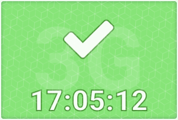
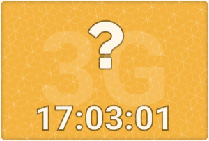
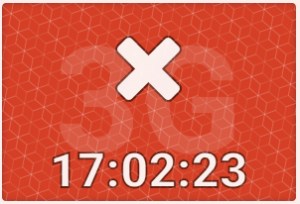

# COVID Zertifikat

    !!! Wichtig!

    Es werden **keine** Daten gespeichert. Für die Validierung des COVID-
    Zertifikats wird lediglich das Datum gespeichert.

Unter "Profil" finden Sie den Tab "COVID-Zertifikat". Hier können neue COVID-Zertifikate hinzugefügt oder der Status eines bestehenden Zertifikats eingesehen werden.

Der Status ihres Zertifikats ist nur für Sie sichtbar.

  
  :octicons-device-camera-video-24: **Video-Einführung**: [COVID-Zertifikate in OpenOlat](<https://www.youtube.com/embed/863v3ug_QaM>){:target="_blank”} 

## COVID-Zertifikat hinzufügen

Klicken Sie auf "Neues COVID-Zertifikat hinzufügen".

Unter "Automatisch" können Sie entweder den **QR-Code scannen** oder Ihr
Zertifikat als **Datei importieren**. Die Validierung erfolgt automatisch.
(Siehe Validierungs-Status)

Wenn das automatische Hinzufügen **nicht** funktioniert, können Sie Ihr
Zertifikat auch manuell hinzufügen. Die Validierung erfolgt hier nicht
automatisch. (Siehe Validierungs-Status)

  

## Validierungs-Status

  

### Grün

Ihr Zertifikat wurde validiert.

### Orange

Sie haben Daten hinterlegt, diese wurden jedoch noch nicht validiert.

Haben Sie Ihr Zertifikat manuell hinzugefügt, ist der Status immer Orange.

Wenden Sie sich bitte an Ihren 3G-Beauftragen, um ihr Zertifikat validieren zu
lassen oder wenn die automatische Erfassung nicht funktioniert hat.

### Rot

Es ist noch kein Zertifikat hinterlegt oder die automatische Erfassung des
Zertifikats konnte nicht abgeschlossen werden.

Die Daten auf dem Zertifikat müssen mit den Benutzerdaten in OpenOlat
übereinstimmen, andernfalls erhalten Sie eine Meldung.

Wenden Sie sich bitte an Ihren 3G-Beauftragen, wenn sie Probleme beim
Hinzufügen Ihres COVID-Zertifikats haben.

