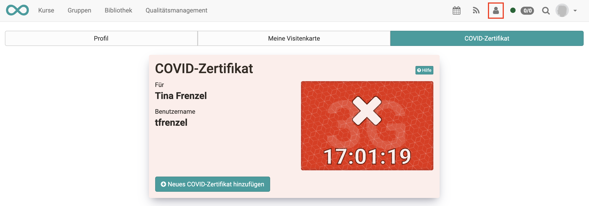

# COVID certificate

If the Covid certificate has been activated by the admin, users will find the "COVID certificate" tab under "Profile". Here you can add new COVID certificates or view the status of an existing certificate.
The status of your certificate is only visible to you.

!!! Note "Important"

    No data is stored. Only the date is saved for the validation of the COVID certificate.

## Add COVID certificate

Click on "Add new COVID certificate".

Under "Automatic", you can either **scan the QR code** or **import** your
certificate as a file. The validation will be done automatically. (See
Validation Status).

If automatic adding does **not** work, you can also add your certificate
manually. Validation is not automatic in this case. (See Validation status)

  

## Validation status

### Green

Your certificate has been validated.

### Orange

You have deposited data, but it has not yet been validated.

If you have added your certificate manually, the status is always orange.

Please contact your 3G representative to have your certificate validated or if
the automatic capture did not work.

### Red

No certificate has been deposited yet or the automatic capture of the
certificate could not be completed.

The data on the certificate must match the user data in OpenOlat, otherwise
you will receive a message.

Please contact your 3G representative if you have problems adding your COVID
certificate.

