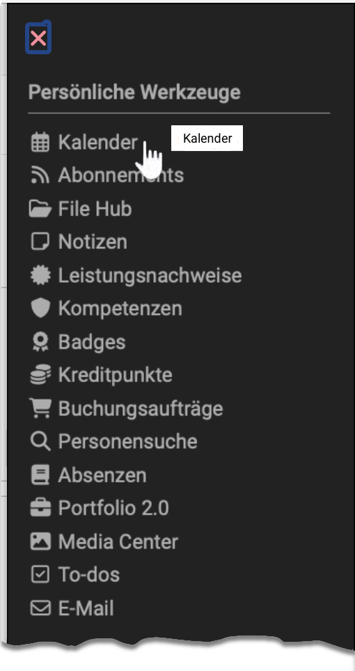
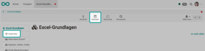
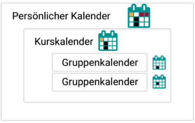
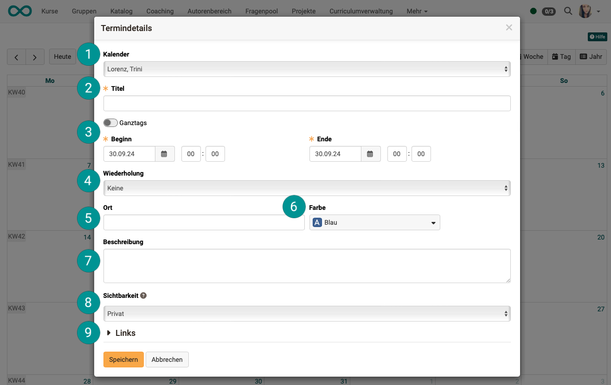
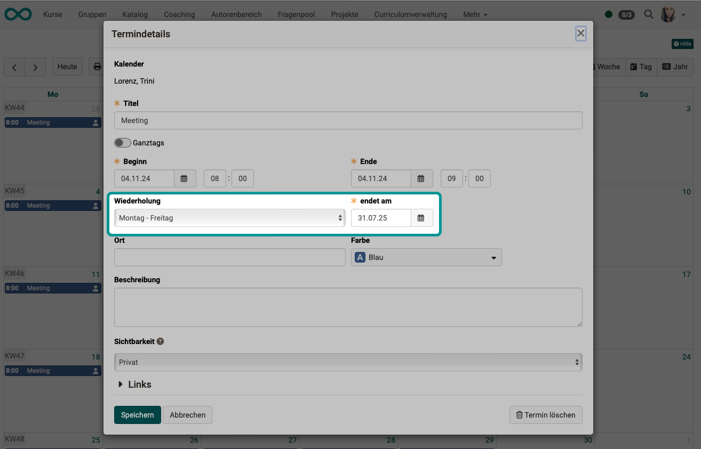
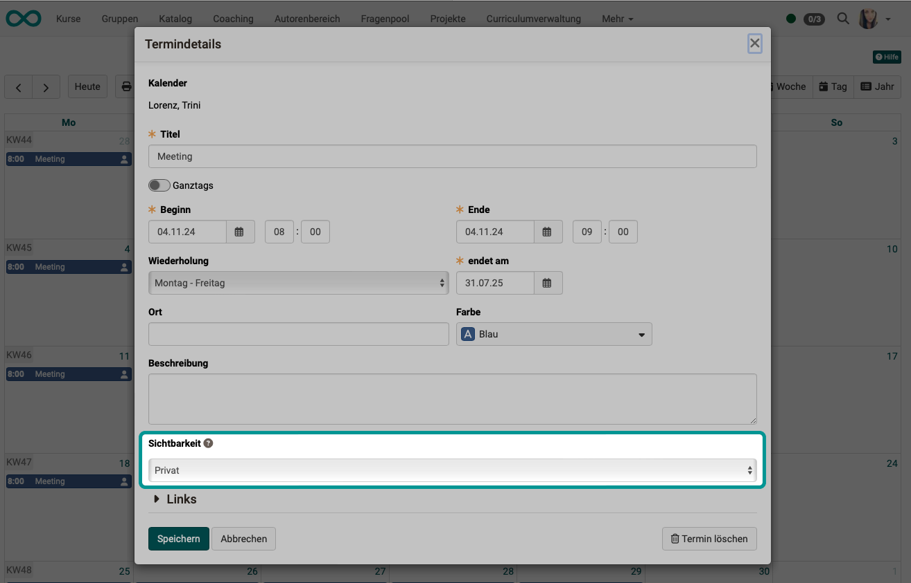
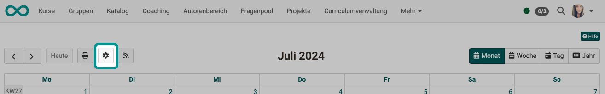
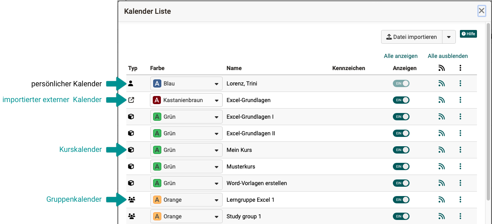
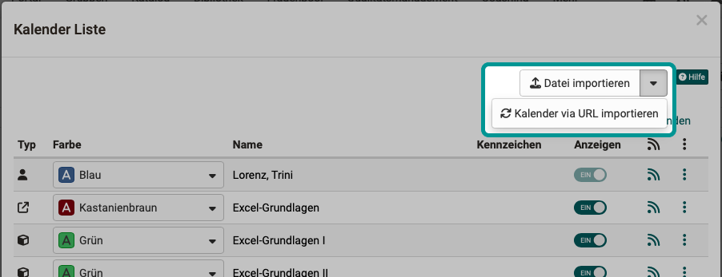

# Persönliche Werkzeuge: Kalender {: #calendar}

{ class="aside-right lightbox" }

:fontawesome-regular-calendar-days:

Die Kalenderfunktion steht Ihnen an verschiedenen Orten zur Verfügung:

* In der [Gruppe](../groups/Using_Group_Tools.de.md):  Zugriff auf den Gruppenkalender, sowie eventuell externe importierte Kalender.

* Im [Kurs](../area_modules/Courses.de.md):  Zugriff auf Kurstermine, sowie Zugriff auf alle Kalender von eingebundenen Gruppen. Kurskalender können sowohl in einem Kursbaustein als auch in der Toolbar eingebunden sein. 

{ class="shadow lightbox" }

 :octicons-device-camera-video-24: **Video-Einführung**: [Kurskalender](<https://www.youtube.com/embed/tfx6UCYw8t8>){:target="_blank"}

* Im [persönlichen Menü](../personal_menu/index.de.md) [(Persönliche Werkzeuge)](../personal_menu/Personal_Tools.de.md):  Im persönlichen Kalender können zusätzlich zu den persönlichen Terminen alle Termine aus Ihren verschiedenen Kursen und Gruppen, in denen Sie Mitglied sind, zusammengeführt werden. Sie erhalten so eine Übersicht. Auch externe Kalender können nach individuellem Bedarf importiert werden.

{ class="shadow lightbox" }

!!! info "Wichtig"

    Wenn Sie in der Liste Ihrer persönlichen Werkzeuge keinen Kalender finden, haben Administrator:innen ihn in der System-Administration ausgeschaltet: 
    `Administration > Core Konfiguration > Kalender`

[Zum Seitenanfang ^](#calendar)

---

## Termin erstellen / bearbeiten {: #create_entry}

Um einen neuen Termin hinzuzufügen, klicken Sie in das entsprechende Kalenderfeld. Es öffnet sich ein Popup für die Termindetails.

{ class="shadow lightbox" }

1. Wenn Sie Gruppenmitglied sind, treffen Sie erst oben im Kalender Pulldown-Menu die Auswahl, in welchem Kalender Sie einen Termin erstellen möchten (persönlicher Kalender oder Gruppenkalender).

2. Zu den "Termindetails" gehört zwingend ein Titel.

3. Auch ein Start- und Enddatum ist eine Pflichtangabe. Mit dem Toggle-Button können die Uhrzeit-Felder ausgeblendet werden und es werden ganztägige Termine erstellt.

4. Für Wiederholungen wählen Sie eine der Optionen des Auswahlfeldes.

5. Im Feld "Ort" halten Sie fest, wo der Termin stattfindet.

6. Mit dem Auswahlfeld "Farbe" geben Sie diesem Termin eine eigene Farbe.

7. Im Feld "Beschreibung" ergänzen Sie weitere Angaben zum Termin.

8. Welche Details zu einem Termin für wen angezeigt werden, ist im Abschnitt [Sichtbarkeit](../personal_menu/Calendar.de.md#visibility) beschrieben.

9. Links können Sie erst hinzufügen, nachdem der Termin erstellt wurde. Speichern Sie einfach den bestehenden Termin und bearbeiten Sie ihn erneut. Dann wird Ihnen unter "Links" ein Button "Link hinzufügen" angezeigt.

Termine können nachträglich bearbeitet oder wieder gelöscht werden, indem man auf den Termin und anschliessend auf die Schaltfläche "Bearbeiten" klickt.

Ein Termin kann auch mit Drag&Drop verschoben werden.

!!! info "Wichtig"

    Verknüpfungen zu Kursbausteinen können nur im Kurskalender erstellt werden. Bei den anderen Kalendern erscheint der Kommentar: _Keine Verknüpfung möglich_.

!!! danger "Achtung"

    Die Schaltfläche "Termin löschen" in den Termindetails löscht den Termin endgültig. Der Termin kann nicht wiederhergestellt werden!

[Zum Seitenanfang ^](#calendar)

---

## Wiederholung (Serientermine) {: #recurring_events}

In den Termindetails kann unter "Wiederholung" die gewünschte Frequenz von Serienterminen ausgewählt werden. Sobald eine Wiederholung gewünscht wird, erscheint das Eingabefeld, mit dem das Ende der Serie definiert wird (Pflichtfeld).

{ class="shadow lightbox" }

Auch Serientermine können bearbeitet werden. Klicken Sie dazu im Kalender auf einen der Termine. Beim Speichern der Anpassung kann ausgewählt werden, ob die Änderung für alle Termine der Serie oder nur für den aufgerufenen Termin gilt. Wenn alle Termine geändert werden sollen, werden diese Termine geändert, welche zuvor nicht individuell angepasst wurden.

[Zum Seitenanfang ^](#calendar)

---

## Sichtbarkeit {: #visibility}

Legen Sie hier fest, wer den Kalendereintrag sehen darf.

{ class="shadow lightbox" }

Je nach Kalenderart (Persönlicher Kalender, Gruppenkalender, Kurskalender) unterscheiden sich die Auswirkungen der drei Sichtbarkeitsstufen "Privat", "Nur Zeitangabe sichtbar" und "Öffentlich":

|| Persönlicher Kalender| Gruppenkalender| Kurskalender
---|---|---|---
**Privat** | Nur die Person, die den Eintrag erstellt hat, darf den Kalendereintrag sehen, da der Kalender dieser Person zugewiesen wurde.| Nur Mitglieder der Gruppe, der dieser Kalender zugewiesen wurde, dürfen den Kalendereintrag sehen.| Nur Mitglieder des Kurses, dem dieser Kalender zugewiesen wurde, dürfen den Kalendereintrag sehen.
**Nur Zeitangabe sichtbar** | Da nur die Person, die den Eintrag erstellt hat, und niemand anderes den Eintrag sehen kann, haben diese Einstellungen in diesem Kontext keinen Effekt. | Alle Gruppen- bzw. Kursmitglieder sehen den Eintrag mit allen Angaben. Zusätzlich können alle in OpenOlat registrierten Personen oder Gäste mit Zugriff auf die Gruppe/den Kurs die Zeit des Eintrags aber keine weiteren Angaben sehen. | Alle Gruppen- bzw. Kursmitglieder sehen den Eintrag mit allen Angaben. Zusätzlich können alle in OpenOlat registrierten Personen oder Gäste mit Zugriff auf die Gruppe/den Kurs die Zeit des Eintrags aber keine weiteren Angaben sehen.
**Öffentlich** | Da nur die Person, die den Eintrag erstellt hat, und niemand anderes den Eintrag sehen kann, haben diese Einstellungen in diesem Kontext keinen Effekt. | Alle Gruppen- bzw. Kursmitglieder sehen den Eintrag mit allen Angaben. Zusätzlich können alle in OpenOlat registrierten Personen oder Gäste mit Zugriff auf die Gruppe/den Kurs alle Angaben des Eintrags sehen. | Alle Gruppen- bzw. Kursmitglieder sehen den Eintrag mit allen Angaben. Zusätzlich können alle in OpenOlat registrierten Personen oder Gäste mit Zugriff auf die Gruppe/den Kurs alle Angaben des Eintrags sehen.

[Zum Seitenanfang ^](#calendar)

---

## Inhalt {: #content}

Im persönlichen Kalender werden angezeigt:

1. Die selbst in diesem Kalender eingetragenen **persönlichen Termine**.
2. Andere **eigenständige Kalender**, die in der Kalenderliste für die gemeinsame Ansicht ausgewählt wurden.  Z.B. ein Gruppen- oder Kurskalender.
3. **Aggregierte Kalender**  Aggregierte Kalender haben ihrerseits Termine wieder aus mehreren verschiedenen Kalendern zusammengezogen. Bei aggregierten Kalendern ist zu beachten, dass OpenOlat nicht auflösen kann, woher die Termine ursprünglich kamen. Ein eingebundener aggregierter Kalender liefert diese Herkunftsinformation für die einzelnen Termine nicht mit, lediglich welche Kalender darin enthalten sind.

!!! info "Aggregierte Kalender"

    Ein aggregierter Kalender ist ein Sammelfeed, der alle Kalender und deren Termine enthält, auf die Sie Zugriff haben. Sie können diesen Feed von anderen Anwendungen aus verwenden, um alle Ihre OpenOlat-Termine dort einzufügen oder anzuzeigen. Dies erspart Ihnen die Arbeit, jeden Kalender einzeln einfügen zu müssen (siehe Kalender integrieren unten). Über das Zahnradsymbol in der Liste können Sie ferner Dateien und Kalender importieren sowie die Termine eines kompletten Kalenders zurücksetzen.

[Zum Seitenanfang ^](#calendar)

---

## Kalenderliste {: #list}

Über die Schaltfläche "Einstellungen" (kleiner Button mit dem Zahnrad-Icon) öffnet sich die Kalenderliste.

{ class="shadow lightbox" }

In der Kalenderliste finden Sie alle Kalender, die im aktuellen Kalender angezeigt werden können (Gruppe, Kurs, extern und persönlich).

{ class="shadow lightbox" }

Die Spalte "Typ" zeigt mit einem Symbol, um welche Art Kalender es sich handelt: persönlicher Kalender, Gruppenkalender, Kurskalender oder importierter externer Kalender.

Zur besseren Unterscheidung können Sie den Kalendern unterschiedliche Farben geben.

Bei Kurskalendern zeigt die Spalte "Kennzeichen" das Kennzeichen des Kurses. Bei persönlichen und Gruppenkalendern bleibt die Spalte leer.

Zu jedem dieser eigenständigen Kalender kann in der Spalte "Anzeigen" mit einem Toggle-Button eingestellt werden, ob die Termine in Ihrem persönlichen Kalender mit angezeigt werden. Mit den Schaltflächen "Alle anzeigen" und "Alle ausblenden" schalten Sie alle Kalender der Liste gemeinsam ein oder aus. [:octicons-tag-16:{ title="ab Release 18.1 (OO-7314)" }](https://track.frentix.com/issue/OO-7314)

Unter dem Feedsymbol finden Sie die URL, mit der dieser Kalender an anderer Stelle eingebunden werden kann.

Unter dem Icon mit den 3 Punkten am Ende einer Zeile werden Bearbeitungsmöglichkeiten angezeigt, wenn es sich um eigenständige Kalender handelt. (Bei aggregierten Kalendern ist die Bearbeitung beschränkt/nicht möglich.)

[Zum Seitenanfang ^](#calendar)

---

## Kalender zur Kalenderliste hinzufügen  {: #add_to_list}

Die Kurs- und Gruppenkalender werden der Kalenderliste des persönlichen Kalenders standardmässig hinzugefügt.
Soll ein weiterer eigenständiger Kalender zur Kalenderliste hinzugefügt werden, verwenden Sie dazu die Buttons oberhalb der Liste.

Mit dem Button "Datei importieren" können Kalenderdateien (.ics) eingefügt werden. 
Mit Klick auf den kleinen Pfeil daneben erscheint der Eintrag "Kalender via URL importieren".

{ class="shadow lightbox" }

!!! info "Beachten Sie:"

    Mit den Buttons oberhalb der Kalenderliste fügen Sie weitere **eigenständige Kalender** zur Kalenderliste hinzu.

    * Es erscheint eine weitere Zeile = weiterer eigenständiger Kalender
    * Sie können in der Kalenderliste bestimmen, ob die Termine dieses Kalenders in Ihren persönlichen Kalender übernommen werden sollen (Toggle-Button einschalten).
    * Sie können den Kalendern unterschiedliche Farben geben.

    Die Optionen zum Hinzufügen oder Löschen unter den 3 Punkten am Ende einer Zeile bearbeiten dagegen nur diesen einzelnen **(aggregierten) Kalender**.

    * Die hier importierten Kalender erscheinen *nicht* in der Kalenderliste, sind aber in dem nun aggregierten Kalender enthalten.
    * Sie können *keine* farbliche Unterscheidung vornehmen.

    **Empfehlung:**  Zur besseren Übersichtlichkeit wird der Import als eigenständige Kalender empfohlen (Import durch Buttons in der Kopfzeile der Kalenderliste).

!!! tip "Tipp"

    Wenn Ihr Kalender trotz eingetragener Termine leer erscheint bzw. bestimmte Termine nicht angezeigt werden, ist der gewünschte Kalender möglicherweise in der Kalenderliste nicht ausgewählt. (Toggle-Button nicht eingeschaltet.)

[Zum Seitenanfang ^](#calendar)

---

## OpenOlat-Kalender weitergeben {: #share}

Über iCal (einem Standard zur Verwaltung von Terminen), können Sie die verschiedenen OpenOlat-Kalender in einen anderen Kalender wie z.B. den Google-Kalender integrieren. Klicken Sie dazu das iCal Icon :o_icon_o_icon_rss: entweder in der Kalenderansicht oder in der entsprechenden Zeile der Kalenderliste und kopieren Sie den iCal Link.

[Zum Seitenanfang ^](#calendar)

---

## Managed Kalender {: #managed}

Andere Kalender (wie beispielsweise aus dem System PerformX) lassen sich auf Feed auch in den OpenOlat-Kalender als **managed Kalender** integrieren. Managed Termine werden mit einem Schloss-Symbol gekennzeichnet.

!!! info "Wichtig"

    In Kurs- und Gruppenkalendern können die Bearbeitungsmöglichkeiten gegenüber dem persönlichen Kalender abweichen.

[Zum Seitenanfang ^](#calendar)

---

## Weitere Informationen

[Kurskalender](../learningresources/Using_Additional_Course_Features.de.md#kurskalender) 
[Gruppenkalender](../groups/Using_Group_Tools.de.md) 
[Gruppenkalender aktivieren](../groups/Group_Administration.de.md#tools) 
[Kursbaustein Kalender](../learningresources/Course_Element_Calendar.de.md) 
[Aktivierung des Kalenders durch Administrator:innen](../../manual_admin/administration/Core_functions.de.md#calendar_administration) 

[Zum Seitenanfang ^](#calendar)