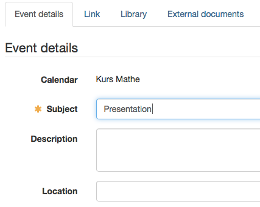
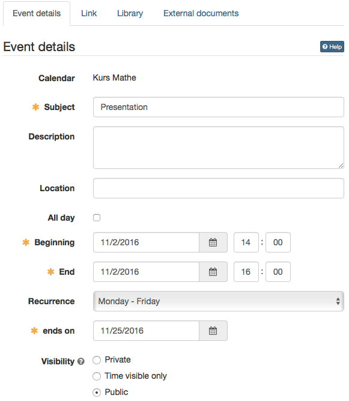
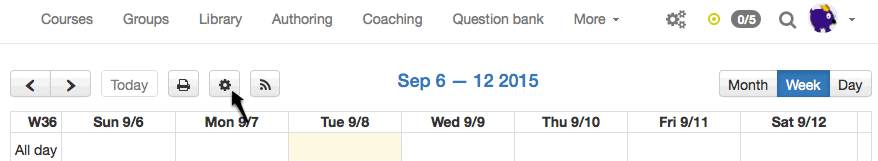
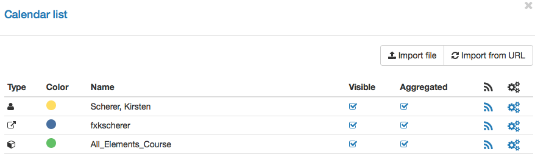

# Calendar

 Calendar in OpenOlat

You have threefold access to the calendar:

* in the group: grants you access to the group calendar as well as any imported external calendars.
* in the course: provides access to course dates as well as group calendars.
* in your personal menu: aggregates all your OpenOlat calendars.

Course calendars, like group calendars, are automatically added to your [personal calendar](../personal_menu/Personal_Tools.md#PersonalMenu-_pers_kalender); course events will be displayed there for you.

## Create / Edit entry

In order to add a new event to your calendar you have to click inside the appropriate calendar field. If you are a group member you have to first select from the pull-down menu to which calendar (personal calendar or group calendar) you want to add your new event. Events can be edited or deleted by clicking on the event an then "Edit". An event can also be moved by drag and drop.

For the "Event details" a subject as well as a start and end date are mandatory. Further a description can be added, a recurring option and a kind of visibility can be defined.

!!! info "Note"

    Links to course elements, entries in the library or external documents can only be added in a second step after the initial calendar entry creation.
    
    Links to course elements can only be created within the course calendar. All other calendars will display the message: _Link not possible._

!!! warning "Attention"

    Click the button „Delete this entry“ in order to definitely delete the calendar entry. It cannot be restored anymore!

{ class="shadow lightbox" }

### Recurring events

Recurring events are events, which are repeated regularly over a certain time period. In the event details under "Recurrence" the desired frequency can be chosen. After a date need to be set, which defines the end of the recurrence.

Recurring events can be edited as well. After saving the adaption it can be chosen, if it is valid for the whole recurrence or only this single event. If all events are changed, only these events get changed, which haven't been adapted before.

{ class="shadow lightbox" }

### Visibility {: #visibility}

Please determine who may see your calendar's entries.

Depending on the type of calendar (Personal calendar, group calendar, course calendar) the three visibility levels "Private", "Time visible only" and "Public" have different effects:

|| Personal calendar| Group calendar| Course calendar  
---|---|---|---  
**Private** | Only the creator is allowed to view the entry, as it is his or her calendar.| Only group members are allowed to view entries, as it is the calendar of the group. | Only course members are allowed to view entries, as it is the calendar of the course.  
**Time visible only** | As only the creator is allowed to view the entry, these visibility levels have no effect in this context. | All group and course members can view the entries including all details. Additionally all registered OpenOlat users or guests with access to the group or course are allowed to view the time of the entries, but no further details. | All group and course members can view the entries including all details. Additionally all registered OpenOlat users or guests with access to the group or course are allowed to view the time of the entries, but no further details.
**Public** | As only the creator is allowed to view the entry, these visibility levels have no effect in this context. | All group and course members can view the entries including all details. Additionally all registered OpenOlat users or guests with access to the group or course are allowed to view the entries including all details. | All group and course members can view the entries including all details. Additionally all registered OpenOlat users or guests with access to the group or course are allowed to view the time of the entries, but no further details.

### Group calendar in connection with course calendars

In a group calendar group participants will see all entries of group members, no matter if appointments are private or public. If a group is assigned to a course the following entries will be displayed there for group participants: public entries of that group, the group's own group calendar entries of that group member as well as course-specific calendar entries. Persons who are not members of that group will not see the calendar entries of other groups in their course. If several groups are assigned to a course members will only see their own group calendar entries but not those of other groups.

### Calendar list

The button „Settings“ opens the calendar list, which allows you to (de)activate each single calendar and decide which calendar should be presented in what color.

{ class="shadow lightbox" }

The calendar list shows all embedded calendars for your current calendar (group, course or personal). Click on the color to select another color. De-/Select a calendar in the columns " **Visible** " and " **Aggregated** " in order to either show/hide the calendar in the overview or integrate in the aggregated calendar feed.

The aggregated calendar is a feed, which contains all calendars and events where you have access to. This feed can be used from other applications to fill in and show your OpenOlat events there as well. This preserves you from adding every calendar individually (see Calendar integration below).

You can also use the gearwheel icon in the list to import files and calendars and to reset the dates of a complete calendar.

{ class="shadow lightbox" }

Should your calendar remain empty or should certain events not appear, it could be that you forgot to select that calendar in the calendar list.

### Calendar integration

Via iCal (a standard to manage dates) you can integrate various OpenOlat calendars into another one, e.g. the Google calendar. Use the iCal link { width=24px } provided when clicking on the iCal icon either in the calendar view or in the respective table row in the calendar list. Other calendars like the ones out of PerformX can be integrated into the OpenOlat calendar as managed calendars. Managed appointments are marked with a padlock symbol.

!!! info "Note"

    If you can't find the calendar among your personal tools, it was disabled by a system administrator.
