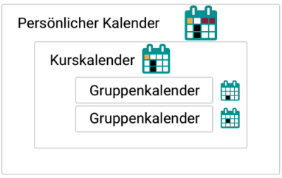
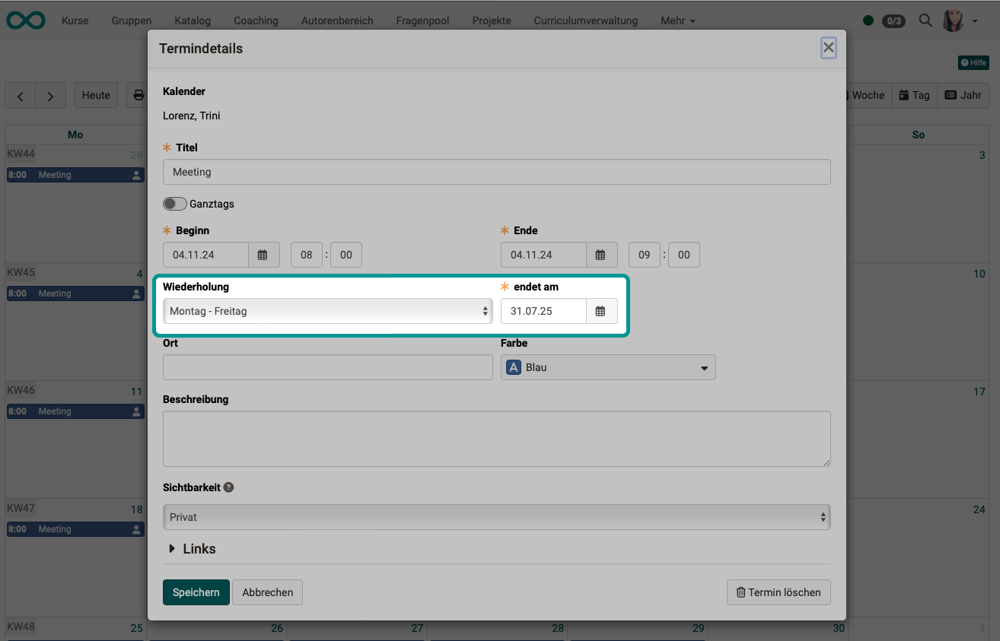
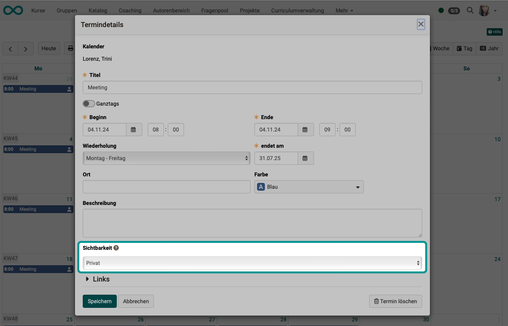
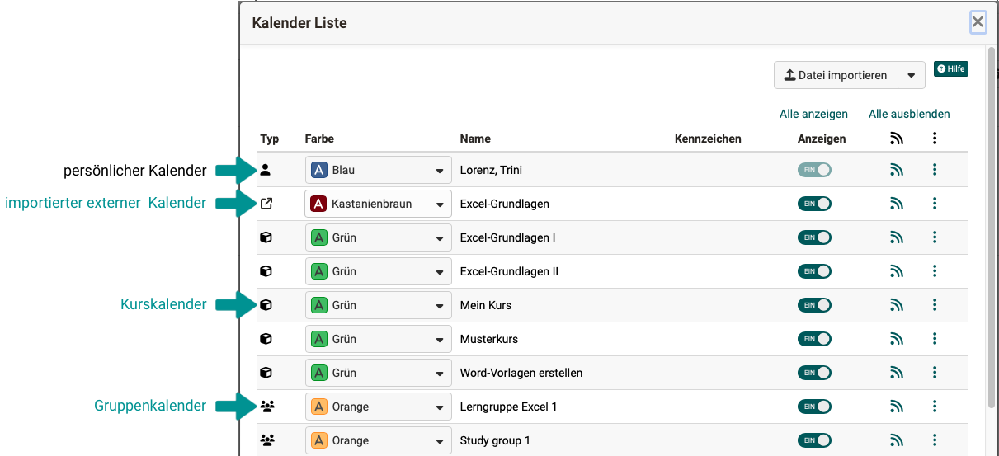
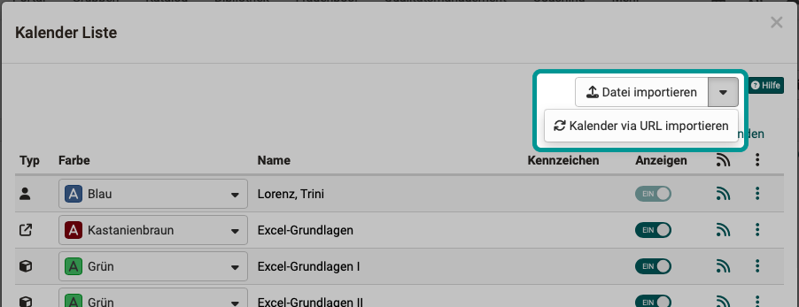

# Personal tools: Calendar {: #calendar}

{ class="aside-right lightbox"}

The calendar function is available in various places:

* In the [group](../groups/Using_Group_Tools.md):   Access to the group calendar and any external imported calendars.

* In the [course](../area_modules/Courses.md):   Access to course dates and access to all calendars of integrated groups. Calendars can be integrated into courses both in the course run and in the toolbar.  

{ class="shadow lightbox" } 

* In the [personal menu](../personal_menu/index.md) [(Personal tools)](../personal_menu/Personal_Tools.md):  In addition to your personal appointments, all appointments from the various courses and groups of which you are a member can be combined in your personal calendar. This gives you an overview. External calendars can also be imported according to individual requirements.

{ class="shadow lightbox" }

!!! info "Note"

    If you cannot find a calendar in the list of your personal tools, this has been switched off system-wide by an administrator.

[To the top of the page ^](#calendar)

---

## Create / Edit entry {: #create_entry}

To add a new appointment, click in the corresponding calendar field. A pop-up opens for the appointment details.

{ class="shadow lightbox" }

1. If you are a group member, first select the calendar in which you would like to create an appointment (personal calendar or group calendar) in the calendar pull-down menu at the top. 

2. The "Date details" must include a title.

3. A start and end date is also mandatory. The toggle button can be used to hide the time fields and create all-day appointments.

4. For repetitions, select one of the options in the selection field.

5. Location

6. You can use different colors for different calendars.

7. Description

8. Which details of an appointment are displayed for whom is described in the [Visibility](../personal_menu/Calendar.md#visibility--visibility) section.

9. You can only add links after the appointment has been created. Simply save the existing appointment and edit it again. You will then see an "Add link" button under "Links".

Appointments can be subsequently edited or deleted by clicking on the appointment and then on the "Edit" button. 

An appointment can also be moved using drag & drop.

!!! info "Note"

    Links to course elements can only be created within the course calendar. All other calendars will display the message: _Link not possible_.

!!! warning "Attention"

    The "Delete this entry" button in the appointment details deletes the appointment permanently. The appointment cannot be restored!

[To the top of the page ^](#calendar)

---

## Recurring events {: #recurring_events}

The desired frequency of series appointments can be selected in the appointment details under "Repetition". As soon as a repetition is desired, the input field appears with which the end of the series is defined (mandatory field).

{ class="shadow lightbox" }

Serial appointments can also be edited. To do this, click on one of the appointments in the calendar. When saving the adjustment, you can select whether the change applies to all appointments in the series or only to the selected appointment. If all appointments are to be changed, those appointments that have not previously been customized will be changed.

[To the top of the page ^](#calendar)

---

## Visibility {: #visibility}

Specify here who can see the calendar entry.

{ class="shadow lightbox" }

Depending on the type of calendar (Personal calendar, group calendar, course calendar) the three visibility levels "Private", "Time visible only" and "Public" have different effects:

|| Personal calendar| Group calendar| Course calendar  
---|---|---|---  
**Private** | Only the creator is allowed to view the entry, as it is his or her calendar.| Only group members are allowed to view entries, as it is the calendar of the group. | Only course members are allowed to view entries, as it is the calendar of the course.  
**Only time information visible** | As only the creator is allowed to view the entry, these visibility levels have no effect in this context. | All group and course members can view the entries including all details. Additionally all registered OpenOlat users or guests with access to the group or course are allowed to view the time of the entries, but no further details. | All group and course members can view the entries including all details. Additionally all registered OpenOlat users or guests with access to the group or course are allowed to view the time of the entries, but no further details.
**Public** | As only the creator is allowed to view the entry, these visibility levels have no effect in this context. | All group and course members can view the entries including all details. Additionally all registered OpenOlat users or guests with access to the group or course are allowed to view the entries including all details. | All group or course members can see the entry with all the details. In addition, all OpenOlat users or guests with access to the group/course can see all the details of the entry.

[To the top of the page ^](#calendar)

---

## Content {: #content}

The personal calendar is displayed:

1. The **personal schedule** entered in this calendar.
2. Other **standalone calendars** that have been selected in the calendar list for the shared view.  E.g. a group or course calendar.
3. **Aggregated calendar**  Aggregated calendars, for their part, have combined appointments from several different calendars. With aggregated calendars, it should be noted that OpenOlat cannot resolve where the events originally came from. An integrated aggregated calendar does not provide this origin information for the individual appointments, only which calendars are included.

!!! info "Aggregated calendar"

    An aggregated calendar is a collective feed that contains all calendars and their appointments that you have access to. You can use this feed from other applications to add or display all your OpenOlat appointments there. This saves you the work of having to insert each calendar individually (see Integrating calendars below). You can also use the gear icon in the list to import files and calendars and reset the appointments of an entire calendar.

[To the top of the page ^](#calendar)

---

## Calendar list (in the Personal Tools area) {: #list}

The "Settings" button (small button with the cogwheel icon) opens the calendar list.

{ class="shadow lightbox" }

In the calendar list you will find all calendars that can be displayed in the current calendar (group, course, external and personal).

{ class="shadow lightbox" }

You can give the calendars different colors for better differentiation.

For each of these independent calendars, a toggle button can be used to set whether the appointments are also displayed in your personal calendar.

Under the feed symbol you will find the URL with which this calendar can be integrated elsewhere.

Editing options are displayed under the icon with the 3 dots at the end of a line if they are independent calendars. (Editing is limited/not possible for aggregated calendars).

[To the top of the page ^](#calendar)

---

## Add calendars to the calendar list {: #add_to_list}

The course and group calendars are added to the calendar list of the personal calendar by default. 
If you want to add another independent calendar to the calendar list, use the buttons above the list.

Calendar files (.ics) can be added using the "Import file" button.
 
By clicking on the small arrow next to it, calendars can be linked via URL.

{ class="shadow lightbox" }

!!! info "Please note:"

    Use the buttons above the calendar list to add further **independent calendars** to the calendar list.

    * Another line appears = another independent calendar
    * You can specify in the calendar list whether the appointments in this calendar should be transferred to your personal calendar (activate the Toogle button).
    * You can give the calendars different colors.

    The options to add or delete under the 3 dots at the end of a line, on the other hand, only edit this single **(aggregated) calendar**.

    * The calendars imported here do *not* appear in the calendar list, but are included in the now aggregated calendar.
    * You can *not* differentiate by color.

    **Recommendation:**  For a better overview, we recommend importing as a separate calendar (import via buttons in the header of the calendar list).

!!! tip "Hint"

    If your calendar appears empty or certain appointments are not displayed despite having been entered, the desired calendar may not be selected in the calendar list. (Toggle button not switched on.)

[To the top of the page ^](#calendar)

---

## Share OpenOlat calendar {: #share}

Using iCal (a standard for managing appointments), you can integrate the various OpenOlat calendars into another calendar, such as the Google calendar. To do this, click the iCal icon { width=24px } either in the calendar view or in the corresponding line of the calendar list and copy the iCal link. 

[To the top of the page ^](#calendar)

---

## Managed calendar {: #managed}

Other calendars (such as those from the PerformX system) can also be integrated into the OpenOlat calendar as **managed calendars** on Feed. Managed appointments are marked with a lock symbol.

!!! info "Note"

    In course and group calendars, the editing options may differ from the personal calendar. 

[To the top of the page ^](#calendar)

---

## Further information

[Course Calender](../learningresources/Using_Additional_Course_Features.md#course-calendar) 
[Group Calender](../groups/Using_Group_Tools.md) 
[Activate group calender](../groups/Group_Administration.md#tools) 
[Course element calender](../learningresources/Course_Element_Calendar.md) 
[Activation of calenders by administrators](../../manual_admin/administration/Core_functions.md#calender-administration) 

[To the top of the page ^](#calendar)