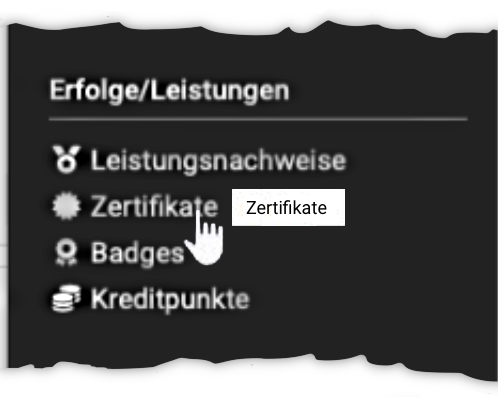
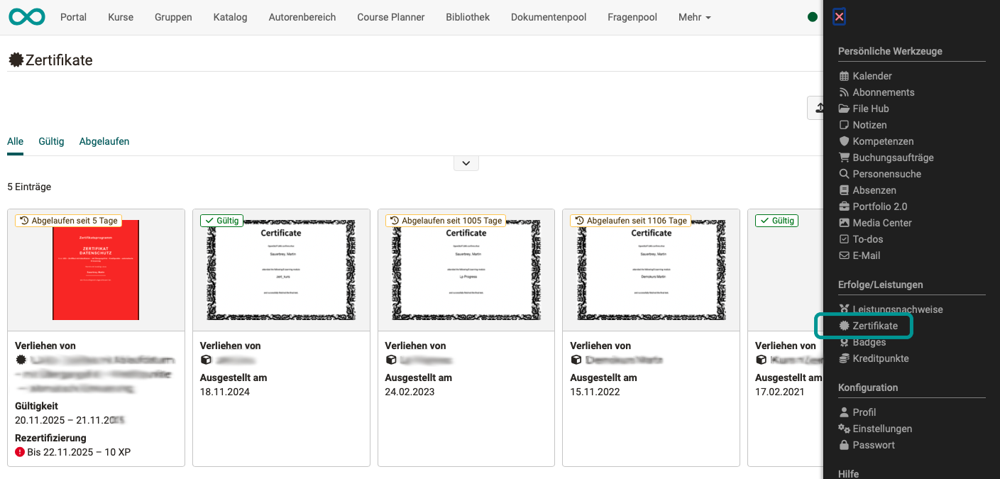
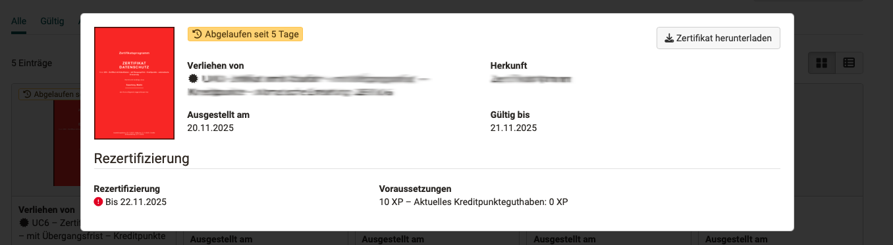

# Persönliche Erfolge/Leistungen: Zertifikate {: #certificates}

{ class="aside-right lightbox"}

Im persönlichen Menü können Sie alle Ihre Zertifikate anzeigen lassen. Auch bereits abgelaufene Zertifikate sind noch einsehbar.

Sie können die Zertifikate vorsortiert anzeigen lassen. (Alle - Gültig - Abgelaufen)

{ class="shadow lightbox"}

Klicken Sie auf eines der angezeigten Zertifikate um es zu vergrössern und alle Angaben sichtbar zu machen. 

{ class="shadow lightbox"}

Zu jedem Zertifikat sind genauere Angaben vorhanden:

* Von wem das Zertifikat verliehen wurde. Insbesondere bei manueller Vergabe muss dies nachvollziehbar sein.
* Die Herkunftsangabe zeigt, in welchem OpenOlat-Kurs das Zertifikat erstellt wurde.
* Ausstellungsdatum
* Gültigkeitsdauer
* Ob eine Rezertifizierungsmöglichkeit besteht/bestand.
* Welche Voraussetzungen für die Rezertifizierung verlangt wurden, z.B. eine bestimmte Anzahl Kreditpunkte.

Ausserdem finden Sie rechts oben einen Button zum Herunterladen.

[Zum Seitenanfang ^](#certificates)

---

## Weitere Informationen {: #further_information}

[Zertifikate in Einzelkursen >](../learningresources/Course_Settings_Assessment_Certificate.de.md) 
[Zertifikate in Zertifikatsprogrammen >](../area_modules/Course_Planner_Certification_Programs.de.md) 
[Leistungsnachweise in Kursen >](../area_modules/Course_Settings_Assessment.de.md#section_evidence_of_achievements) 

[Zum Seitenanfang ^](#certificates)

