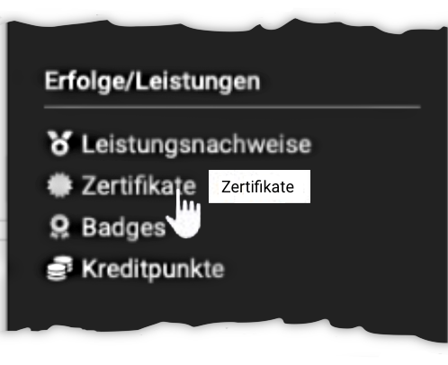
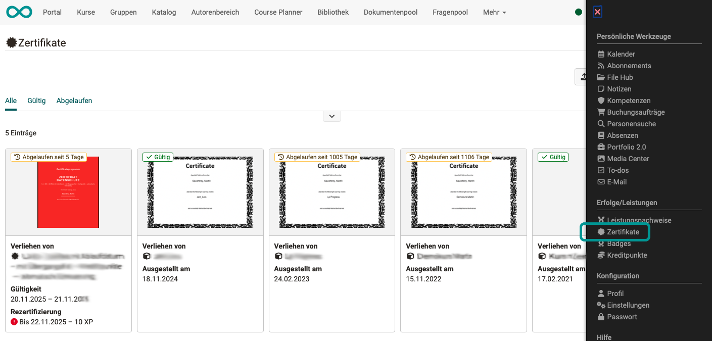
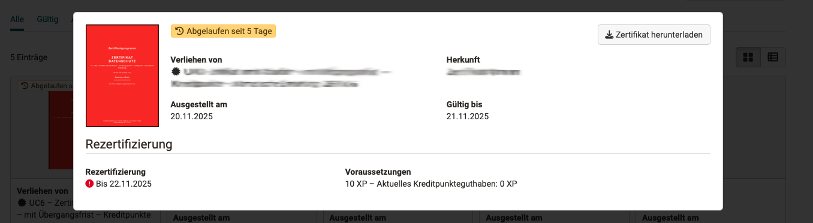

# Personal achievements/successes: Certificates {: #certificates}

{ class="aside-right lightbox"}

In the personal tool "Certificates" you see all certificates that were issued to you from courses and certification programs or that you uploaded yourself. Expired certificates also remain visible.

With the tabs "All", "Valid" and "Expired" you display the certificates pre-sorted. With the filters "With recertification", "Origin" (Certificate program, Course, Uploaded manually) and "Status" (Valid, Expired, Revoked, Archived) you narrow the list down further. The certificates are shown as cards or as a table.

{ class="shadow lightbox" title="Tool Certificates in the personal menu" }

Click one of the displayed certificates to enlarge it and to see all details.

{ class="shadow lightbox" title="Detail view of a certificate" }

More detailed information is available for each certificate:

* "Awarded by": Who awarded the certificate. This must be traceable, especially in the case of manual awarding.
* "Origin": Whether the certificate originates from an OpenOlat course or a certification program or was uploaded manually.
* "Issued on": Date of issue
* "Valid until": Period of validity
* "Recertification": Whether and until when recertification is/was possible.
* "Requirements": Which requirements were necessary for recertification, e.g. a certain number of credit points.

You also find the button "Download certificate" in the top right-hand corner.

**Newly issued certificates**

A newly issued certificate is valid immediately; OpenOlat generates the PDF file for it in the background. The file is usually available after a short time. Until then, the card shows a placeholder instead of the preview image, the detail view carries the label "Pending", and the button "Download certificate" is deactivated. As soon as the PDF file is generated, you download the certificate as usual. [:octicons-tag-16:{ title="from Release 21.1 (OO-9128)" }](https://track.frentix.com/issue/OO-9128)

**Upload external certificates**

You upload externally acquired certificates with the button "Upload certificate", provided the administration allows this for users. Uploaded certificates carry the origin "Uploaded manually". [:octicons-tag-16:{ title="from Release 20.2.0 (OO-8984)" }](https://track.frentix.com/issue/OO-8984)

[To the top of the page ^](#certificates)

---

## Further information {: #further_information}

[Course Settings - Tab Assessment: Certificates and recertification >](../learningresources/Course_Settings_Assessment_Certificate.md) 
[Course Planner: Certification programs >](../area_modules/Course_Planner_Certification_Programs.md) 
[Personal achievements/successes: Evidence of Achievements >](Evidence_of_Achievements.md) 
[Personal achievements/successes: Credit points >](Credit_Points.md)

[To the top of the page ^](#certificates)
