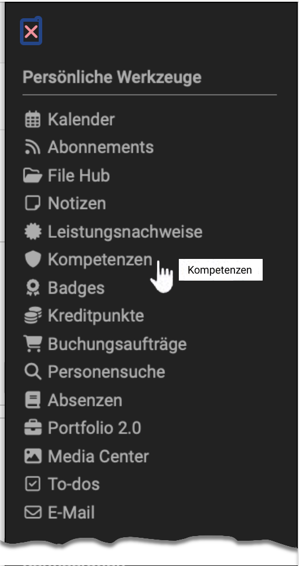
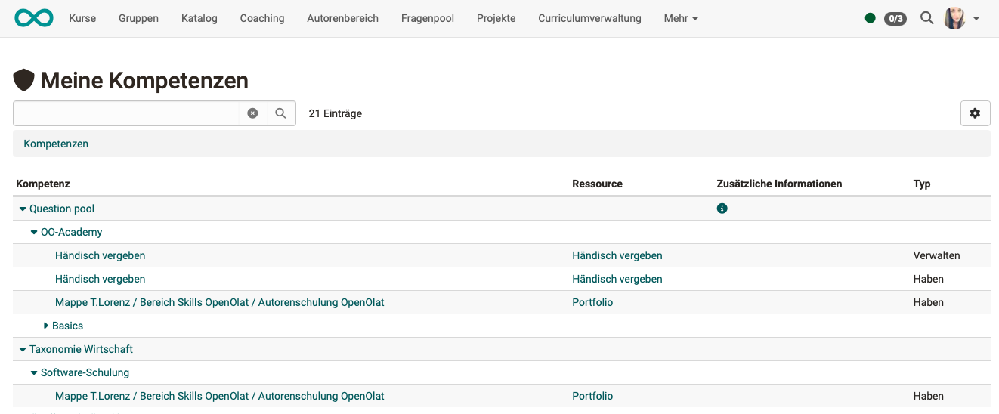

# Persönliche Werkzeuge: Kompetenzen {: #competences}

{ class="aside-right lightbox"}

In den persönlichen Werkzeugen erhalten Lernende eine Übersicht über alle Kompetenzen, die ihnen in OpenOlat zugeordnet worden sind.

Die Zuordnung von Kompetenzen kann z.B. in ePortfolio-Einträgen erfolgt sein oder manuell von Benutzerverwalter:innen im Benutzerprofil eingetragen worden sein.

{ class="shadow lightbox"}

!!! info "Wichtig"

    Voraussetzung für die Anzeige der Kompetenzen ist die Verwendung des Moduls Taxonomie und der Aufbau von Taxonomie-Strukturen durch OpenOlat-Administrator:innen.

[Zum Seitenanfang ^](#competences)

---

## Wo spielen Kompetenzen eine Rolle? {: #where_used}

Das Vergeben bzw. der Erwerb von Kompetenzen kommt neben der Anzeige in den persönlichen Werkzeugen noch in folgenden Zusammenhängen vor:

- [Kompetenzen verschlagworten >](../area_modules/Competences_tags.de.md) (ePortfolio)
- [Konzept des File Hub >](../basic_concepts/File_Hub_Concept.de.md) (Dokumentenpool)

Im Administrationshandbuch:

- [Fragenpool >](../../manual_admin/administration/eAssessment_Question_bank.de.md)
- [Modul Taxonomie >](../../manual_admin/administration/Modules_Taxonomy.de.md)
- [REST API >](../../manual_admin/administration/REST_API.de.md)
- Benutzerprofil in der [Benutzerverwaltung >](../../manual_admin/usermanagement/Configure_User.de.md)

[Zum Seitenanfang ^](#competences)

---

## Weiterführende Informationen {: #further_information}

[Kompetenzen verschlagworten >](../area_modules/Competences_tags.de.md) 
[Konzept des File Hub >](../basic_concepts/File_Hub_Concept.de.md) 
[e-Assessment Administration: Fragenpool >](../../manual_admin/administration/eAssessment_Question_bank.de.md) 
[Modul Taxonomie >](../../manual_admin/administration/Modules_Taxonomy.de.md) 
[REST API >](../../manual_admin/administration/REST_API.de.md) 
[Benutzer konfigurieren >](../../manual_admin/usermanagement/Configure_User.de.md)

[Zum Seitenanfang ^](#competences)
