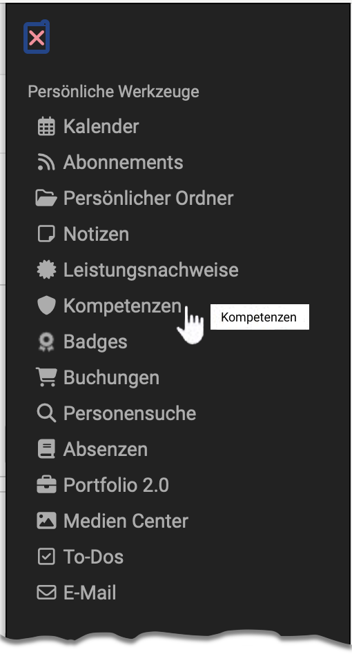
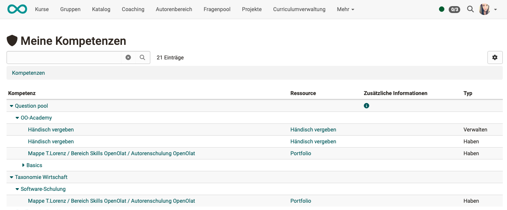

# Personal tools: Competences

{ class="aside-right lightbox"}

In the personal tools, learners are given an overview of all the skills that have been assigned to them in OpenOlat. 

Competences may have been assigned in ePortfolio entries, for example, or entered manually as a competency in the user profile.

{ class="shadow lightbox"}

!!! info

    A prerequisite for the display of competencies is the use of the taxonomy module and the creation of taxonomy structures by OpenOlat administrators.

## Where do competences play a role?

In addition to being displayed in a user's personal tools, the awarding or acquisition of skills also occurs in the following contexts:

- [ePortfolio](../area_modules/Competences_tags.md), Competences tags
- [File-Hub](../basic_concepts/File_Hub_Concept.md) -> Document pool

In the admin manual

- [eAssessment: Questeion bank](../../manual_admin/docs/administration/eAssessment_Question_bank.md) (Administration)
- [Module Taxonomy](../../manual_admin/docs/administration/Modules_Taxonomy.md) (Administration)
- [REST API](../../manual_admin/docs/administration/REST_API.md) (Administration)
- User profile of the [User management](../../manual_admin/docs/usermanagement/Configure_User.md) (Administration)

