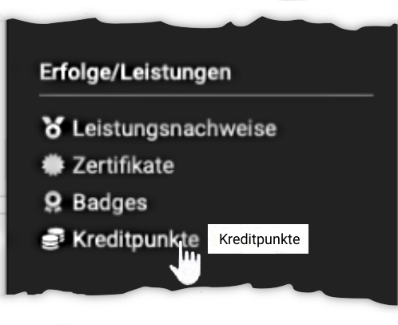
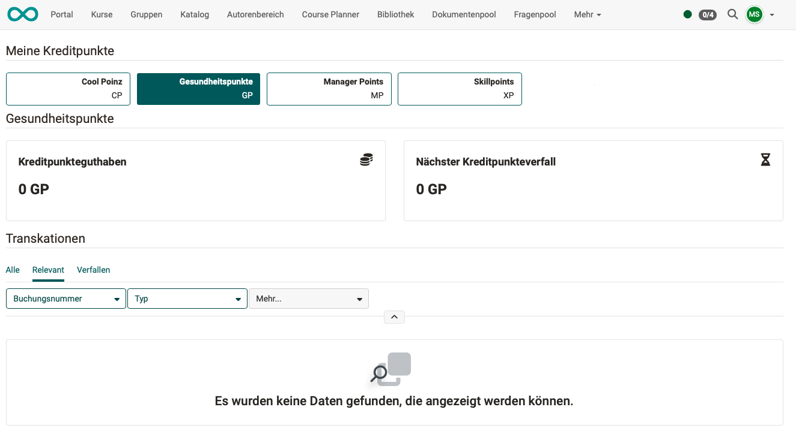

# Persönliche Erfolge/Leistungen: Kreditpunkte {: #credit_points}

{ class="aside-right lightbox"}

Wenn in Kursen Kreditpunkte vergeben werden, werden Ihnen nach erfolgreichem Absolvieren eines Kurses Kreditpunkte gutgeschrieben.

Die Kreditpunkte können Ihnen in verschiedenen "Währungen" gutgeschrieben werden. Welche "Währungen" (Kreditpunktsysteme) grundsätzlich im System verfügbar sind, kann von Administrator:innen festgelegt werden.

Im persönlichen Menü finden Sie Ihren aktuellen Kontostand.

{ class="shadow lightbox"}

[Zum Seitenanfang ^](#credit_points)

---

## Kreditpunkte als Voraussetzung für eine Kursteilnahme

Im Rahmen von Zertifikatsprogrammen kann eingerichtet werden, dass vor der Zulassung zu einem Kurs eine bestimmte Anzahl Kreditpunkte auf Ihrem Konto vorhanden sein muss. 

Beachten Sie dabei, dass es Kreditpunkte in verschiedenen "Währungen" (Kreditpunktsystemen) geben kann. 

**Beispiel** 
Es kann z.B. eingerichtet werden, dass Sie "Sicherheitspunkte" (= Währung der OpenOlat-Kreditpunkte) in verschiedenen Sicherheitsschulungen Level 1 erwerben können. Für die Zulassung zu einer Sicherheitsschulung Level 2 kann als Voraussetzung ein Guthaben von 50 "Sicherheitspunkten" verlangt werden. Andere Kreditpunkte werden für diese Schulung nicht anerkannt.

[Zum Seitenanfang ^](#credit_points)

---

## Mit Kreditpunkten weitere OpenOlat-Kurse bezahlen

Kreditpunkte können auch als Währung verwendet werden. Die Möglichkeit, mit Kreditpunkten innerhalb OpenOlat weitere Kurse zu bezahlen, ist in Entwicklung. (Stand: Release 20.2.0)

[Zum Seitenanfang ^](#credit_points)

---

## Weitere Informationen {: #further_information}

[Kreditpunkte in Kursen vergeben >](../learningresources/Course_Settings_Assessment.de.md#4_green_24png-abschnitt-kreditpunkte--section_credit_points) 
[Kreditpunkte systemweit aktivieren (Administration) >](../../manual_admin/administration/e-Assessment_Credit_Points.de.md) 

[Zum Seitenanfang ^](#credit_points)

