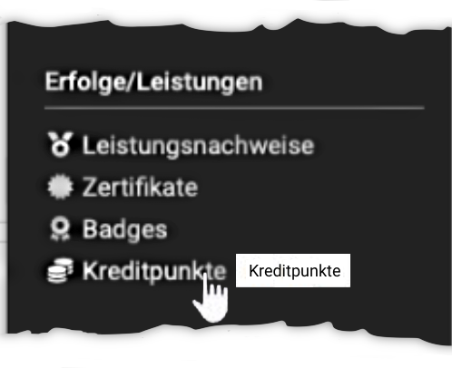
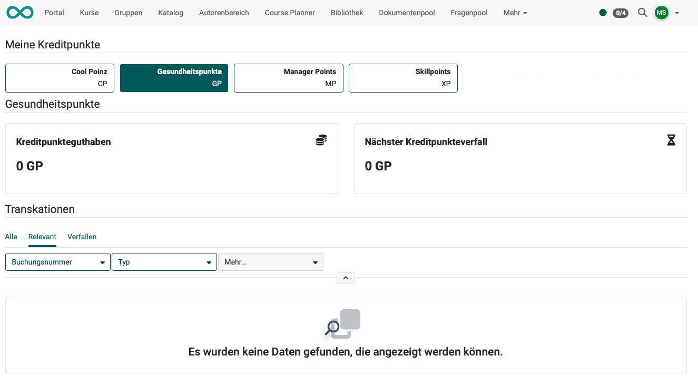

# Personal achievements/successes: Credit points {: #credit_points}

{ class="aside-right lightbox"}

If credit points are awarded in courses, you are credited with credit points after successfully completing a course.

The credit points can be credited to you in different "currencies". Administrators define which "currencies" (credit point systems) are available in the system.

In the personal menu under "Credit points" you find your current credit point balance.

The page "My credit points" shows the tiles "Credit point balance" and "Next credit point expiry" for each credit point system. Below them, the table "Transactions" lists all credits, debits, reversals, removals and expiries. Use the tabs "All", "Relevant" and "Expiring" and the filters "Order number" and "Type" to narrow down the list. [:octicons-tag-16:{ title="from Release 20.1.1 (OO-8558)" }](https://track.frentix.com/issue/OO-8558)

A credit point system only appears once you have transactions in it or are a member of a certification program that uses this credit point system. [:octicons-tag-16:{ title="from Release 20.2.0 (OO-9070)" }](https://track.frentix.com/issue/OO-9070)

{ class="shadow lightbox"}

[To the top of the page ^](#credit_points)

---

## Credit points as a prerequisite for course participation {: #prerequisite}

Certification programs can be set up so that a certain number of credit points must be in your account before you are admitted to a course.

Please note that credit points can exist in different "currencies" (credit point systems).

**Example** 
For example, it can be set up so that you earn "safety points" (= currency of the OpenOlat credit points) in various Level 1 safety training courses. A balance of 50 "safety points" can be required for admission to a Level 2 safety training course. Other credit points are not recognised for this training course.

[To the top of the page ^](#credit_points)

---

## Pay for additional OpenOlat courses with credit points {: #pay_with_credit_points}

Credit points can also be used as a currency. The option to pay for additional courses within OpenOlat with credit points is under development. (Status: Release 20.2.0)

[To the top of the page ^](#credit_points)

---

## Further information {: #further_information}

[Course Settings - Tab Assessment >](../learningresources/Course_Settings_Assessment.md) 
[e-Assessment Administration: Credit points >](../../manual_admin/administration/e-Assessment_Credit_Points.md) 
[How do I make successes and achievements visible? >](../../manual_how-to/achievements/achievements.md)

[To the top of the page ^](#credit_points)
