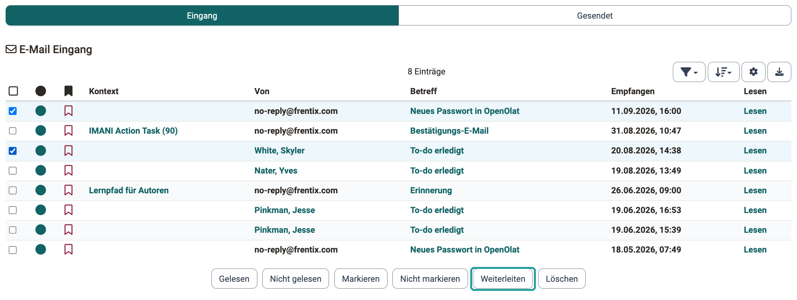

# Persönliche Werkzeuge: E-Mail {: #email}

{ class="aside-right lightbox"}

OpenOlat verfügt über ein internes E-Mail-System, über das Sie an verschiedenen Orten E-Mails versenden können. Ist das OpenOlat Postfach aktiviert, werden E-Mails auch intern zugestellt. Falls nicht, werden alle in OpenOlat erstellten E-Mails ausschliesslich an die persönliche E-Mail-Adresse der Empfänger:innen versandt. Das Postfach schaltet die Administration ein: [E-Mail Einstellungen](../../manual_admin/administration/E-Mail_Settings.de.md).

## Das Postfach {: #inbox}

Das persönliche Werkzeug "E-Mail" erscheint nur bei aktiviertem Postfach. Das Postfach sammelt alle E-Mails, die Sie über OpenOlat erhalten oder versendet haben. Es hat zwei Segmente: Unter "Eingang" finden Sie die erhaltenen, unter "Gesendet" die von Ihnen versandten internen E-Mails. Die Liste lässt sich nach dem Kontext filtern, aus dem eine E-Mail stammt.

Sie wählen eine oder mehrere Nachrichten über die Kontrollkästchen aus und lösen darauf eine Aktion aus.

{ class="shadow lightbox" }

### E-Mails an die eigene Adresse weiterleiten {: #forward}

Mit der Aktion "Weiterleiten" schicken Sie ausgewählte Nachrichten an die E-Mail-Adresse, die in Ihrem Profil steht. Nutzen Sie die Aktion, wenn Sie eine Nachricht aus OpenOlat in Ihrem gewohnten Mailprogramm brauchen, etwa zum Archivieren oder zum Beantworten von unterwegs.

So leiten Sie eine Nachricht weiter:

1. Öffnen Sie das Segment "Eingang" oder "Gesendet".
2. Markieren Sie die Kontrollkästchen der gewünschten Nachrichten.
3. Klicken Sie "Weiterleiten".

OpenOlat bestätigt jede weitergeleitete Nachricht einzeln mit ihrem Betreff. Sie können also mehrere Nachrichten auf einmal auswählen und in einem Schritt weiterleiten. Die Aktion steht in beiden Segmenten zur Verfügung, Sie leiten damit auch eine selbst versendete Nachricht weiter. Die Nachricht bleibt nach dem Weiterleiten im Postfach.

!!! info "Wichtig"

    Das Ziel der Weiterleitung lässt sich nicht frei wählen. OpenOlat sendet immer an die E-Mail-Adresse aus Ihrem Profil. Kommt nichts an, prüfen Sie diese Adresse: [Persönliche Konfiguration: Profil](Profile.de.md). Ohne gültige Adresse findet keine Zustellung nach aussen statt.

Soll nicht nur eine einzelne Nachricht, sondern jede künftige E-Mail zusätzlich an Ihre eigene Adresse gehen, richten Sie die Weiterleitung dauerhaft ein: [Persönliche Konfiguration: Einstellungen](Settings.de.md#mail_delivery), Feld "E-Mail Versand".

### Weitere Aktionen im Postfach {: #actions}

Über "Lesen" öffnen Sie eine einzelne Nachricht.

"Löschen" entfernt die ausgewählten Nachrichten aus Ihrem Postfach. OpenOlat fragt vorher nach.

Im Segment "Eingang" stehen zusätzlich vier Aktionen zur Verfügung, im Segment "Gesendet" nicht:

  * "Gelesen" und "Nicht gelesen" steuern, welche Nachrichten als bearbeitet gelten.
  * "Markieren" und "Nicht markieren" heben einzelne Nachrichten hervor, damit Sie sie später wiederfinden.

[Zum Seitenanfang ^](#email)

---

## E-Mails versenden {: #sending}

E-Mails können an diversen Stellen versandt werden, z.B.:

  * im Kurs ([Kursbaustein "E-Mail"](../learningresources/Course_Element_EMail.de.md), [Kursbaustein "Liste der Teilnehmer:innen"](../learningresources/Course_Element_Participant_List.de.md))
  * in der [Toolbar](../learningresources/Toolbar.de.md) des Kurses
  * durch [Kurserinnerungen](../learningresources/Course_Reminders.de.md)
  * bei Kurs- oder Gruppeneinladungen
  * über die Visitenkarte
  * über das Gruppenwerkzeug "E-Mail" in der [Gruppenadministration](../groups/Group_Administration.de.md)
  * in der [Mitgliederverwaltung](../learningresources/Members_management.de.md) von Lernressourcen und Gruppen.

[Zum Seitenanfang ^](#email)

---

## Weiterführende Informationen {: #further_information}

**Auf dieser Seite erwähnt** 
[E-Mail Einstellungen >](../../manual_admin/administration/E-Mail_Settings.de.md) 
[Persönliche Konfiguration: Profil >](Profile.de.md) 
[Persönliche Konfiguration: Einstellungen >](Settings.de.md) 
[Kursbaustein "E-Mail" >](../learningresources/Course_Element_EMail.de.md) 
[Kursbaustein "Teilnehmerliste" >](../learningresources/Course_Element_Participant_List.de.md) 
[Toolbar: Übersicht >](../learningresources/Toolbar.de.md) 
[Erinnerungen >](../learningresources/Course_Reminders.de.md) 
[Gruppenadministration >](../groups/Group_Administration.de.md) 
[Mitgliederverwaltung >](../learningresources/Members_management.de.md)

**Weiterführend** 
[Persönliche Werkzeuge: Übersicht >](Personal_Tools.de.md) 
[Abonnements >](Subscriptions.de.md)

[Zum Seitenanfang ^](#email)
