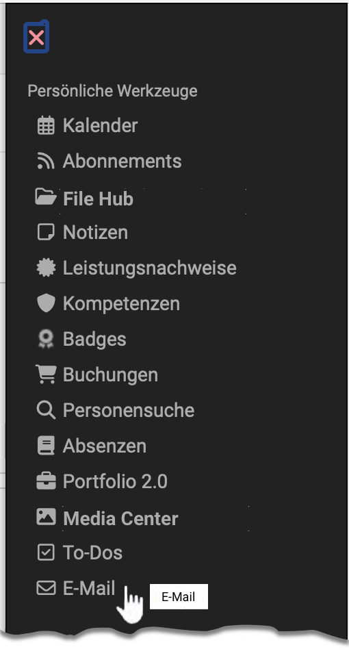

# Persönliche Werkzeuge: E-Mail {: #email}

{ class="aside-right lightbox"}

OpenOlat verfügt über ein internes E-Mail System, über das Sie an
verschiedenen Orten Mails versenden können. Ist das Postfach aktiviert, können
E-Mails auch intern verschickt werden. Falls nicht, werden alle in OpenOlat
erstellten E-Mails ausschliesslich an die jeweils persönliche E-Mail Adresse
versandt.

E-Mails können an diversen Stellen versandt werden z.B.

  * im Kurs ([Kursbaustein E-Mail](../learningresources/Course_Element_EMail.de.md), [Teilnehmerliste](../learningresources/Course_Element_Participant_List.de.md))
  * in der Kurs [Toolbar](../learningresources/Toolbar.de.md)
  * durch [Kurserinnerungen](../learningresources/Course_Reminders.de.md)
  * bei Kurs- oder Gruppeneinladungen
  * via Visitenkarte
  * über das [Mail-Gruppenwerkzeug](../groups/Group_Administration.de.md)
  * in der [Mitgliederverwaltung](../learningresources/Members_management.de.md) von Lernressourcen und Gruppen.

