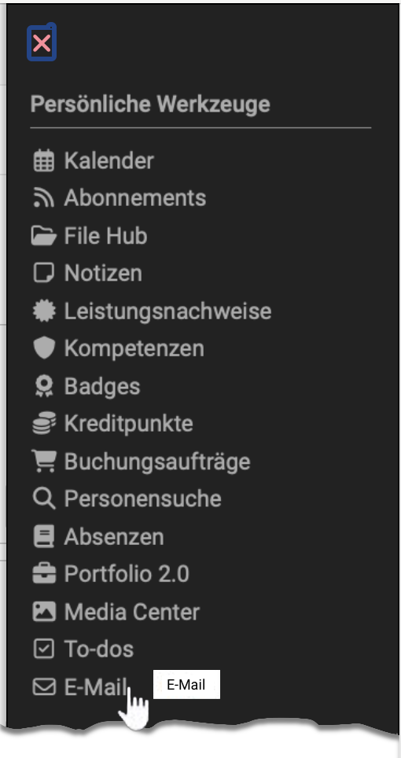
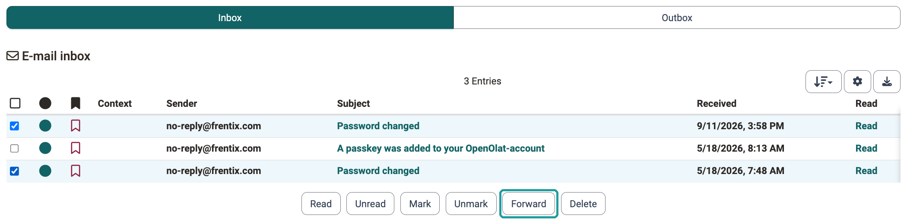

# Personal tools: E-Mail {: #email}

{ class="aside-right lightbox"}

OpenOlat has an internal e-mail system that lets you send e-mails from various places. If the OpenOlat inbox is enabled, e-mails are also delivered internally. If not, all e-mails created in OpenOlat are sent exclusively to the personal e-mail address of the recipients. The administration enables the inbox: [Email Settings](../../manual_admin/administration/E-Mail_Settings.md).

## The inbox {: #inbox}

The personal tool "E-mail" only appears when the inbox is enabled. The inbox collects all e-mails you received or sent via OpenOlat. It has two segments: under "Inbox" you find the e-mails you received, under "Outbox" the internal e-mails you sent. You can filter the list by the context an e-mail originates from.

You select one or several messages with the check boxes and then trigger an action.

{ class="shadow lightbox" }

### Forwarding e-mails to your own address {: #forward}

With the action "Forward" you send selected messages to the e-mail address stored in your profile. Use the action when you need a message from OpenOlat in your usual mail program, for example to archive it or to answer it on the go.

To forward a message:

1. Open the segment "Inbox" or "Outbox".
2. Select the check boxes of the messages you want.
3. Click "Forward".

OpenOlat confirms each forwarded message separately with its subject. You can therefore select several messages at once and forward them in one step. The action is available in both segments, so you can also forward a message you sent yourself. The message stays in the inbox after forwarding.

!!! info "Important"

    You cannot choose the target of the forwarding. OpenOlat always sends to the e-mail address from your profile. If nothing arrives, check this address: [Personal Configuration: Profile](Profile.md). Without a valid address, no delivery to the outside takes place.

If not only a single message but every future e-mail should also go to your own address, set up the forwarding permanently: [Personal Configuration: Settings](Settings.md#mail_delivery), field "E-mail delivery".

### Further actions in the inbox {: #actions}

With "Read" you open a single message.

"Delete" removes the selected messages from your inbox. OpenOlat asks you first.

In the segment "Inbox", four additional actions are available; in the segment "Outbox" they are not:

  * "Read" and "Unread" control which messages count as processed.
  * "Mark" and "Unmark" highlight single messages so that you find them again later.

[To the top of the page ^](#email)

---

## Sending e-mails {: #sending}

E-mails can be sent from various places, e.g.:

  * in the course ([Course Element "E-Mail"](../learningresources/Course_Element_EMail.md), [Course Element "Participant list"](../learningresources/Course_Element_Participant_List.md))
  * in the [Toolbar](../learningresources/Toolbar.md) of the course
  * via [Course Reminders](../learningresources/Course_Reminders.md)
  * with invitations to courses or groups
  * via the visiting card
  * via the group tool "E-mail" in the [Group Administration](../groups/Group_Administration.md)
  * in the [Members management](../learningresources/Members_management.md) of learning resources and groups.

[To the top of the page ^](#email)

---

## Further information {: #further_information}

**Mentioned on this page** 
[Email Settings >](../../manual_admin/administration/E-Mail_Settings.md) 
[Personal Configuration: Profile >](Profile.md) 
[Personal Configuration: Settings >](Settings.md) 
[Course Element "E-Mail" >](../learningresources/Course_Element_EMail.md) 
[Course Element "Participant list" >](../learningresources/Course_Element_Participant_List.md) 
[Toolbar: Overview >](../learningresources/Toolbar.md) 
[Course Reminders >](../learningresources/Course_Reminders.md) 
[Group Administration >](../groups/Group_Administration.md) 
[Members management >](../learningresources/Members_management.md)

**Further reading** 
[Personal tools >](Personal_Tools.md) 
[Subscriptions >](Subscriptions.md)

[To the top of the page ^](#email)
