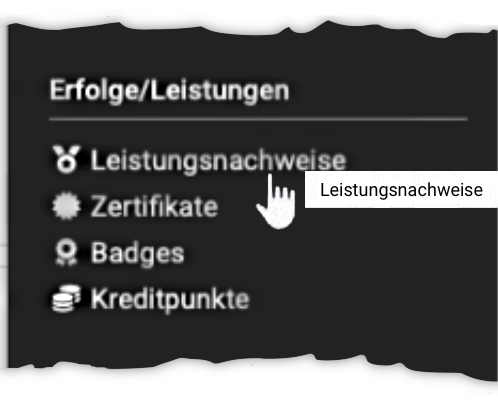
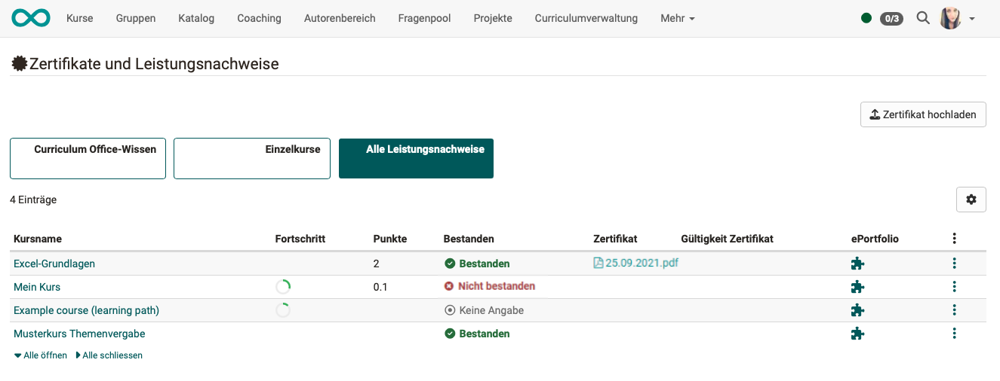
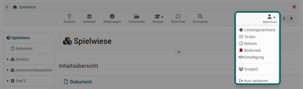

# Persönliche Erfolge/Leistungen: Leistungsnachweise {: #evidence_of_achievements}

{ class="aside-right lightbox"}

Ein Leistungsnachweis fasst alle Resultate einer Person in einem Kurs zusammen: je bewertbarem Kursbaustein mit Punkten, Status und Datum, z.B. für absolvierte Tests oder abgegebene und bewertete Aufgaben.

{ class="shadow lightbox"}

Als Bestätigung für den Besuch eines Kurses bzw. der Erreichung von bestimmten kursbezogenen Aktivitäten kann ausserdem ein [PDF-Zertifikat](../learningresources/Course_Settings_Assessment_Certificate.de.md#certificate) ausgestellt werden. Ein Zertifikat kann auch ohne die Verwendung eines Leistungsnachweises ausgestellt werden.

## Wer vergibt Leistungsnachweise? {: #who_awards}

Kursbesitzer:innen legen in ihren Kursen fest, ob die Teilnehmenden ihren Leistungsnachweis sehen. Die Option "Leistungsnachweis den Teilnehmer:innen anzeigen" finden sie unter `Kurs > Administration > Einstellungen > Bewertung` (siehe [Kurseinstellungen - Tab Bewertung](../learningresources/Course_Settings_Assessment.de.md)). OpenOlat erstellt den Leistungsnachweis unabhängig von dieser Einstellung; Kursbesitzer:innen und Betreuer:innen sehen ihn in den Bewertungsansichten immer, z.B. beim Zurücksetzen von Kursdaten oder bei der Rezertifizierung. [:octicons-tag-16:{ title="ab Release 19.1.7 (OO-8401)" }](https://track.frentix.com/issue/OO-8401)

[Zum Seitenanfang ^](#evidence_of_achievements)

---

## Wo sieht man die Leistungsnachweise? {: #where}

Benutzer:innen finden ihre Leistungsnachweise und, sofern aktiviert, auch ihre erhaltenen [Zertifikate](../learningresources/Course_Settings_Assessment_Certificate.de.md#certificate) sowohl im jeweiligen Kurs, in dem der Leistungsnachweis bzw. das Zertifikat ausgestellt wurde, als auch gesammelt im persönlichen Menü.

### Leistungsnachweise im Persönlichen Menü {: #where_in_pers_tools}

Die Anzeige im Persönlichen Menü eignet sich, um einen schnellen Überblick über alle bereits in OpenOlat erhaltenen, persönlichen Leistungsnachweise und Zertifikate zu erhalten. So kann man schnell zu den einzelnen Leistungsnachweisen und Zertifikaten navigieren und weitere Informationen erhalten. Aktivieren Sie in der Übersicht alle für Sie relevanten Spalten z.B. Punkte, Bestanden, Zertifikat. Bei aktivem Notenmodul lässt sich zusätzlich die Spalte "Bewertung" mit der erreichten Note einblenden; die standardmässig ausgeblendete Spalte "Kennzeichen" zeigt das Kennzeichen des Kurses. Ihre Spaltenauswahl bleibt dauerhaft gespeichert. [:octicons-tag-16:{ title="ab Release 21.0 (OO-9581)" }](https://track.frentix.com/issue/OO-9581)

Sind Sie Mitglied in einem Produkt des Course Planners, wählen Sie oberhalb der Liste ein Produkt, "Einzelkurse" oder "Alle Leistungsnachweise" aus. [:octicons-tag-16:{ title="ab Release 16.1.0 (OO-5788)" }](https://track.frentix.com/issue/OO-5788)

Klicken Sie auf das Symbol "ePortfolio", um einen Leistungsnachweis als Element im [Media Center](../personal_menu/Media_Center.de.md) zu speichern und ihn so in Ihre [Portfolio](../personal_menu/Portfolio.de.md)-Mappen einbinden zu können.
So können Zusammenstellungen von Leistungsnachweisen für unterschiedliche Zwecke kombiniert und auch bestimmten Personen zugänglich gemacht werden.

!!! info "Wichtig"

    Leistungsnachweise und Zertifikate werden erst angezeigt, wenn bereits Leistungen erbracht wurden und wenn diese auch bewertet und die Sichtbarkeit für die Teilnehmenden freigegeben wurde. Ausgestellte Zertifikate können auch heruntergeladen werden.

**Externe Zertifikate**

Extern erworbene Zertifikate laden Sie im persönlichen Werkzeug [Zertifikate](Certificates.de.md) hoch, sofern die Administration das erlaubt. Hochgeladene Zertifikate erscheinen dort und nicht in der Liste der Leistungsnachweise. [:octicons-tag-16:{ title="ab Release 20.2.0 (OO-8984)" }](https://track.frentix.com/issue/OO-8984)

[Zum Seitenanfang ^](#evidence_of_achievements)

---

### Leistungsnachweis im Kurs anzeigen {: #where_in_course}

Ist in einem Kurs der Leistungsnachweis aktiviert, finden Teilnehmende in der Toolbar unter "Mein Kurs" den Link "Leistungsnachweis". Ein Klick darauf zeigt die bewertbaren Kursbausteine des Kurses mit ihrem jeweiligen aktuellen Bewertungsstatus.

{ class="shadow lightbox" }

!!! info "Wichtig"

    Der Link zum Leistungsnachweis erscheint im Kurs erst, wenn mindestens ein bewertbarer Kursbaustein existiert und die Teilnehmenden selbst bereits mindestens eine Bewertung erhalten haben. Dies kann z.B. der Lösungsversuch eines Tests sein oder die Bewertung einer Aufgabe.

[Zum Seitenanfang ^](#evidence_of_achievements)

---

## Weiterführende Informationen {: #further_information}

**Auf dieser Seite erwähnt** 
[Kurseinstellungen - Tab Bewertung: Zertifikate und Rezertifizierung >](../learningresources/Course_Settings_Assessment_Certificate.de.md) 
[Kurseinstellungen - Tab Bewertung >](../learningresources/Course_Settings_Assessment.de.md) 
[Persönliche Werkzeuge: Das Media Center >](../personal_menu/Media_Center.de.md) 
[Persönliche Werkzeuge: Portfolio >](../personal_menu/Portfolio.de.md) 
[Persönliche Erfolge/Leistungen: Zertifikate >](Certificates.de.md)

**Weiterführend** 
[Bewertungssysteme in OpenOlat: Noten >](../../manual_admin/administration/Assessment_translate_points_in_grades_admin.de.md) 
[Badges in den persönlichen Werkzeugen >](OpenBadges.de.md) 
[Badges im Bewertungswerkzeug >](../learningresources/OpenBadges.de.md) 
[Badges in der eAssessment-Administration >](../../manual_admin/administration/e-Assessment_openBadges.de.md) 
[Testquittung erstellen: Test Einstellungen >](../learningresources/Test_settings.de.md) 
[Testquittung validieren: Tests bewerten >](../learningresources/Assessing_tests.de.md)

[Zum Seitenanfang ^](#evidence_of_achievements)
