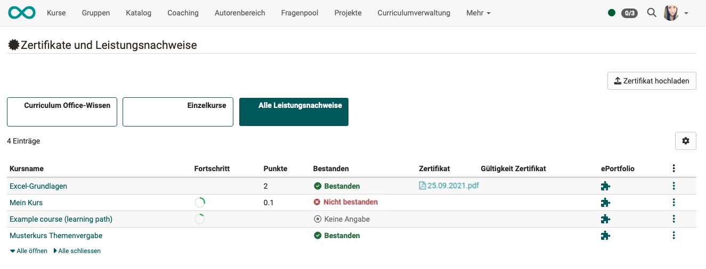

# Persönliche Werkzeuge: Leistungsnachweise

{ class="aside-right lightbox"}

Ein Leistungsnachweis ist eine Bestätigung einer erfolgten Leistungskontrolle.
In OpenOlat können Leistungsnachweise für unterschiedliche Assessment Kursbausteine erbracht werden z.B. für absolvierte Tests, abgegebene und bewertete Aufgaben usw.. 

{ class="shadow lightbox"}

Als Bestätigung für den Besuch eines Kurses bzw. der Erreichung von bestimmten kursbezogenen Aktivitäten kann ausserdem ein [PDF-Zertifikat](../learningresources/Course_Settings_Assessment.de.md#certificate) ausgestellt werden. Ein Zertifikat kann auch ohne die Verwendung eines Leistungsnachweises ausgestellt werden.

## Wer vergibt Leistungsnachweise?

Kursbesitzer:innen legen in ihren Kursen fest, ob OpenOlat Leistungsnachweise erstellen und die Übersicht anzeigen soll. Die Aktivierung erfolgt in der Administration -> Einstellungen im [Tab Bewertung](../learningresources/Course_Settings_Assessment.de.md). 

## Wo sieht man die Leistungsnachweise?

User finden ihre Leistungsnachweise, und sofern aktiviert auch ihre erhaltenen [Zertifikate](../learningresources/Course_Settings_Assessment.de.md#certificate), sowohl im jeweiligen Kurs in dem der Leistungsnachweis bzw. das Zertifikat ausgestellt wurde als auch gesammelt im persönlichen Menü. 

### Leistungsnachweise im Persönlichen Menü

Die Anzeige im Persönlichen Menü eignet sich um einen schnellen Überblick über alle bereits in OpenOlat erhaltenen, persönlichen Leistungsnachweise und Zertifikate zu erhalten. So kann man schnell zu den einzelnen Leistungsnachweisen und Zertifikaten  navigieren und weitere Informationen erhalten. Aktivieren Sie in der Übersicht alle für Sie relevanten Spalten z.B. Punkte, Bestanden, Zertifikat. 

Klicken Sie auf das ePortfolio Icon um ein einen Leistungsnachweis als Element im  [Media Center](../personal_menu/Media_Center.de.md) zu speichern und so auch in Ihren [Portfolio](../personal_menu/Portfolio.de.md) Mappen einbinden zu können.
So können Zusammenstellungen von Leistungsnachweisen für unterschiedliche Zwecke kombiniert und auch bestimmten Personen zugänglich gemacht werden. 

!!! info  "Info"

    Bitte beachten: Leistungsnachweise und Zertifikate werden erst angezeigt, wenn bereits Leistungen erbracht wurden und wenn diese auch bewertet und die Sichtbarkeit für den User freigegeben wurde. Ausgestellte Zertifikate können auch heruntergeladen werden.

**Externe Zertifikate**

OpenOlat User können auch extern erworbene Zertifikate in OpenOlat hochladen, um ihr Profil zu vervollständigen. Nutzen Sie hierfür den Button "Zertifikat hochladen" (sofern vom Administrator aktiviert). 

{ class="shadow lightbox"}

### Leistungsnachweis im Kurs anzeigen

Wurde in einem Kurs der Leistungsnachweis aktiviert finden Teilnehmende in der Toolbar unter "Mein Kurs" den Link zu ihrem Leistungsnachweis. Klickt man auf den Link erhält man einen Überblick über die bewertbaren Kursbausteine des Kurses mit ihrem jeweiligen aktuellen Bewertungsstatus.

!!! info "Hinweis"

    Der Link zum Leistungsnachweis erscheint im Kurs erst dann, wenn im Kurs mindestens ein bewertbarer Kursbaustein existiert, und der Kursteilnehmer bzw. die Kursteilnehmerin bereits mindestens eine Bewertung erhalten hat. Dies kann z.B. der Lösungsversuch eines Tests sein oder die Bewertung einer Aufgabe.

## Weitere Informationen

[Leistungsnachweise in Kursen](../learningresources/Course_Settings_Assessment.de.md#leistungsnachweis) 
[Zertifikate](../learningresources/Course_Settings_Assessment.de.md#certificate) 
[Bewertungssysteme in OpenOlat: Noten](../../manual_admin/administration/Assessment_translate_points_in_grades_admin.de.md) 
[Badges in den persönlichen Werkzeugen](OpenBadges.de.md) 
[Badges im Bewertungswerkzeug](../learningresources/OpenBadges.de.md) 
[Badges in der eAssessment-Administration](../../manual_admin/administration/e-Assessment_openBadges.de.md) 
[Testquittung erstellen](../learningresources/Test_settings.de.md#tab-optionen) 
[Testquittung validieren](../learningresources/Assessing_tests.de.md#korrekturwerkzeug) 
[Rezertifizierung](../learningresources/Course_Settings_Assessment.de.md#recertification)

