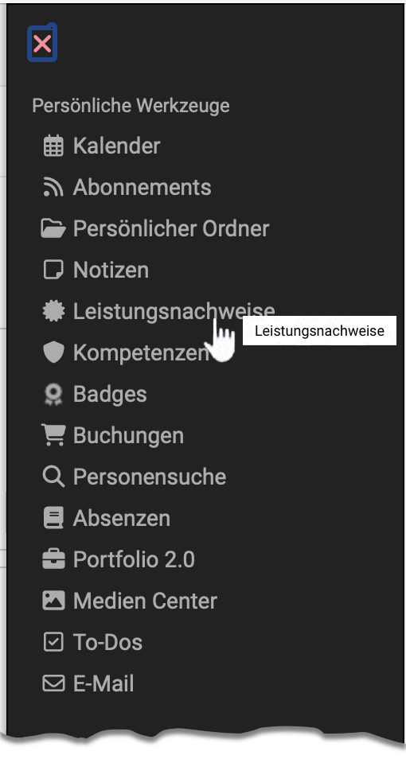
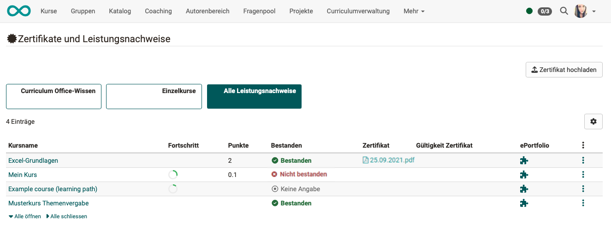
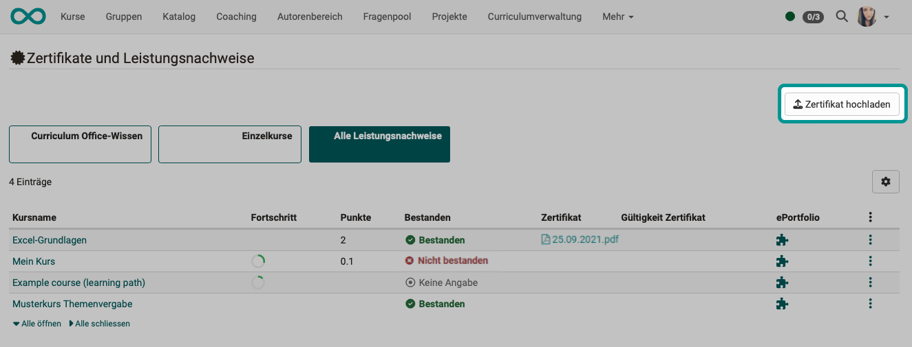

# Personal tools: Evidence of Achievements

{ class="aside-right lightbox"}

A performance record is a confirmation that a performance check has been carried out.
In OpenOlat, evidences of achievement can be issued for

* completed tests
* submitted and evaluated tasks
* and more

A [PDF certificate](../learningresources/Course_Settings_Assessment.md#course-certificate) can also be issued as confirmation that a course has been attended or that certain course-related activities have been completed. A certificate can also be issued without the use of a transcript of records.

{ class="shadow lightbox"}

## Who awards certificates of achievement?

The course authors determine in their courses whether OpenOlat should create performance records.

## Where can I see the performance records?

Course participants can see their certificates of achievement collectively in their personal menu if they are attending courses with evidences of achievement, have already completed achievements and if these have also been assessed. 

If a [certificate](../learningresources/Course_Settings_Assessment.md#course-certificate) is provided in a course in addition to the transcript of records, you can also view and download this in the individual view of the relevant transcript of records.

## View evidence of achievement in the course

In the course settings (in the "Assessment" tab), authors can activate the option ["Use evidence of achievement"](../learningresources/Course_Settings_Assessment.md).

As a result, the "Evidence of achievement" option appears in the top right-hand corner of the "My course" toolbar. Course participants will find an overview of the assessable course elements of the current course with their current assessment status.

!!! info "Note"

    The link to the evidence of achievement only appears in the course if at least one assessable course element exists in the course and the course participant has already received at least one assessment. This can be, for example, the attempted solution to a test or the assessment of an assignment.

## Storage of evidence of achievement

If you as the author:in switch off the "Use evidence of achievement" function, your course participants will no longer see any evidence of achievement. However, the evidence of achievement will not be lost, it will simply no longer be displayed. If you reactivate the evidence of achievement, all current data will be available again. If you delete a course with existing evidence of achievement, users can still view their evidence of achievement in the personal menu.

## External certificates

OpenOlat users can also upload externally acquired certificates to OpenOlat to complete their profile. The "Upload certificate" button is located in the personal menu under the "Evidence of achievement" tab (if activated by the administrator).

{ class="shadow lightbox"}

## Further confirmation

[Certificates of achievements](../learningresources/Course_Settings_Assessment.md#evidences-of-achievement) 
[Certificates](../learningresources/Course_Settings_Assessment.md#course-certificate) 
[Bewertungssysteme in OpenOlat: Noten](../../manual_admin/administration/Assessment_translate_points_in_grades_admin.md) 
[Badges in den persönlichen Werkzeugen](OpenBadges.md) 
[Badges im Bewertungswerkzeug](../learningresources/OpenBadges.md) 
[Badges in der eAssessment-Administration](../../manual_admin/administration/e-Assessment_openBadges.md) 
[Testquittung erstellen](../learningresources/Test_settings.md#tab-options) 
[Testquittung validieren](../learningresources/Assessing_tests.md#grading-tool) 
[Rezertifizierung](../learningresources/Course_Settings_Assessment.md#recertification)
