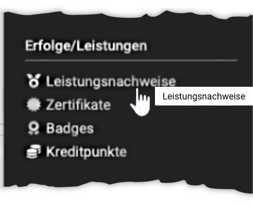

# Personal tools: Evidence of Achievements {: #evidence_of_achievements}

{ class="aside-right lightbox"}

A performance record is a confirmation that a performance check has been carried out.
In OpenOlat, proof of performance can be provided for various assessment course elements, e.g. for completed tests, submitted and assessed tasks, etc. 

{ class="shadow lightbox"}

A [PDF certificate](../learningresources/Course_Settings_Assessment.md#certificate) can also be issued as confirmation that a course has been attended or that certain course-related activities have been completed. A certificate can also be issued without the use of a transcript of records

## Who awards certificates of achievement? {: #who_awards}

The course authors determine in their courses whether OpenOlat should create performance records.

Activation takes place in Administration -> Settings in the [Assessment tab](../learningresources/Course_Settings_Assessment.md). 

[To the top of the page ^](#evidence_of_achievements)

---

## Where can I see the the evidence of achievements? {: #where}

Users can find their certificates of achievement, and if activated also their received [certificates](../learningresources/Course_Settings_Assessment.md#certificate), both in the respective course in which the certificate of achievement or certificate was issued and also collected in the personal tool menu. 

### Evidence of achievement in the personal tools {: #where_in_pers_tools}

The display in the personal menu is suitable for obtaining a quick overview of all personal evidences of achievement and certificates already received in OpenOlat. This allows you to quickly navigate to the individual evidences of achievement and certificates and obtain further information. Activate all the columns relevant to you in the overview, e.g. Points, Passed, Certificate. 

Activate "ePortfolio" to transfer an evidence of achievement to your [Portfolio](../personal_menu/Portfolio.md). In a first step, the evidence of achievement is added to their personal ["Media Center"](../personal_menu/Media_Center.md) and can be inserted from there as a content element in a portfolio. In this way, compilations of evidences of achievement can be combined for different purposes and also made accessible to specific persons. 

!!! info  "Info"

    Please note: Evidences of achievement and certificates are only displayed if achievements have already been made and if these have also been evaluated and the visibility has been released for the user. Certificates issued can also be downloaded.

**External certificates**

OpenOlat users can also upload externally acquired certificates to OpenOlat to complete their profile. The "Upload certificate" button is located in the personal menu under the "Evidence of achievement" tab (if activated by the administrator).

{ class="shadow lightbox"}

[To the top of the page ^](#evidence_of_achievements)

---

## View evidence of achievement in the course {: #where_in_course}

If the transcript of records has been activated in a course, participants will find the link to their transcript of records in the toolbar under "My course". If you click on the link, you will get an overview of the assessable course elements of the course with their current assessment status.

!!! info "Note"

    The link to the evidence of achievement only appears in the course if at least one assessable course element exists in the course and the course participant has already received at least one assessment. This can be, for example, the attempted solution to a test or the assessment of an assignment.

[To the top of the page ^](#evidence_of_achievements)

---

## Further information {: #further_information}

[Evidences of achievements >](../learningresources/Course_Settings_Assessment.md#evidence_of_achievement) 
[Certificates >](../learningresources/Course_Settings_Assessment.md#certificate) 
[Assessment systems in OpenOlat: Grades >](../../manual_admin/administration/Assessment_translate_points_in_grades_admin.md) 
[Badges in the Personal Tools >](OpenBadges.md) 
[Badges in the Assessment Tool >](../learningresources/OpenBadges.md) 
[Badges in the eAssessment administration >](../../manual_admin/administration/e-Assessment_openBadges.md) 
[Create test receipt >](../learningresources/Test_settings.md#tab-options) 
[Validate test receipt >](../learningresources/Assessing_tests.md#grading-tool) 
[Recertification >](../learningresources/Course_Settings_Assessment.md#recertification)

[To the top of the page ^](#evidence_of_achievements)
